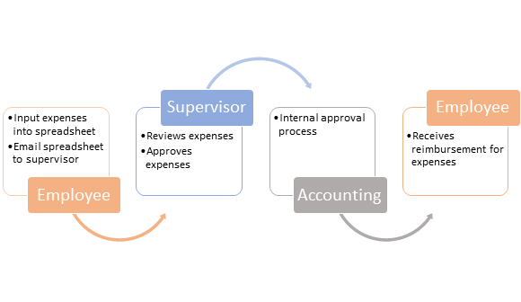

For this module's scenario, you are an employee of Contoso. Contoso has been using a Microsoft Excel workbook to track employee expenses. When an employee embarks on a business trip, they enter their travel expenses into a spreadsheet and then email the completed spreadsheet to their supervisor. After the supervisor has approved the expenses, they will send the spreadsheet by email to the accounting department, which has its own internal approval process. Finally, the employee will receive a reimbursement.

> [!div class="mx-imgBorder"]
> 

Contoso has encountered a few issues with this process. First, the process must be communicated with employees whenever they travel because employees travel infrequently and document storage and travel policies aren't always easy to find. Second, the presence of a travel expense sheet and a local business expense sheet has caused confusion with employees and has created more data entry when the incorrect form is used. The current process is lengthy, and if changes need to be made, version control becomes difficult.

Contoso needs a new solution that can:

-   Be accessed online, preferably on a mobile device so that employees can record expenses as they occur.

-   Provide an in-depth explanation of the process of gathering expenses.

-   Ensure that employees in all departments are looking at the most up-to-date version of expenses.

-   Lock down expense details during the approval process.

-   Alert supervisors of approvals automatically.

-   Send approved expenses automatically to accounting.

-   Allow employees to view the status of their expenses any time.

Based on these requirements, you've decided that a canvas app is the best solution. While you can use many different data sources to store your data, you'll use Microsoft Dataverse for this module's scenario. Dataverse already has access to your users and works with canvas apps seamlessly.

While many potential solutions exist in Microsoft Power Platform, using a canvas app has many benefits, as explained in the following table.

|     Benefit                  |     Explanation                                                                                                                                                                                                                                                                 |
|------------------------------|---------------------------------------------------------------------------------------------------------------------------------------------------------------------------------------------------------------------------------------------------------------------------------|
|     Customizable             |     Canvas   apps allow for numerous customizations, including branding your app and adding   logic for your processes.                                                                                                                                                            |
|     Expandable               |     Due   to the customizability of canvas apps, you can build on your solution   at a later date. For example, you could expand this solution to include all   expenses and not just travel expenses.                                                                   |
|     Data source   options    |     Canvas apps can access hundreds of different   data sources. For this solution, you'll use Microsoft Outlook and Dataverse, but many more options are available for you to choose from. It's the best way to interact with and   edit data from multiple sources.                                 |
|     Simple   to learn          |     Canvas   apps use Excel-like formulas in building. If you can use Excel, you   can build an app. Additionally, you can add and move around controls manually, without using formulas, by using the drag and drop canvas in   the building studio.    |
|     Unique                   |     No   two canvas apps are alike; they allow developers to   express their creativity and build individual apps.                                                                                                                                        |

Now that you have chosen the appropriate path to build your solution, you can explore the complete solution so that you have an idea of what you will be building in this learning path.
