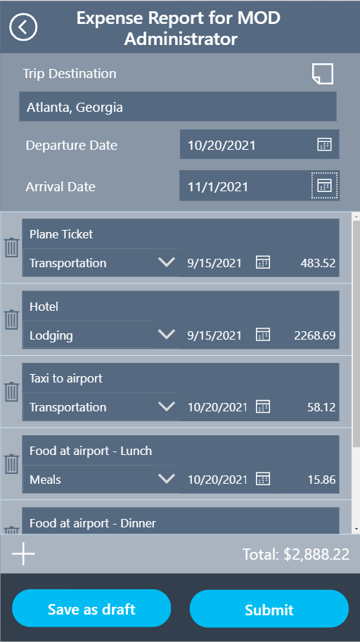
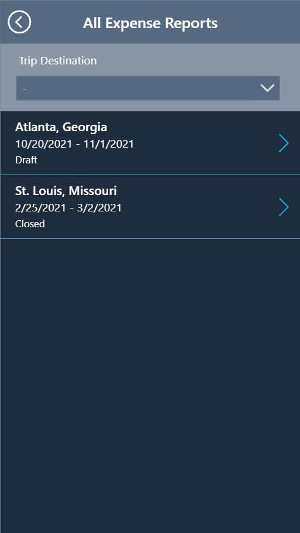

Now that you have chosen to use a canvas app, we need to understand the various pieces of the complete solution to visualize as you move forward into building out and designing the app.

**Welcome Screen:** This screen will allow users to choose the direction of their time in the app. They can create new expense reports, review submitted reports, or pick up a previous draft.

> [!div class="mx-imgBorder"]
> 

**Expense Report Screen:** This screen will show the details of an expense report. This could be to create a new expense report, edit a draft report, or view the details of an older report.

> [!div class="mx-imgBorder"]
> 

**Multiple Expense Reports Screen:** This will allow employees to choose from existing expense reports to edit or view individual reports. Employees will only see their own reports in our solution, but you can easily add a supervisor or accounting filter so employees can see other reports they may need to approve.

> [!div class="mx-imgBorder"]
> 

With the endless possibilities in Power Apps, we can certainly add more screens and functionality, but we'll focus on these three screens to lay a learning foundation for you. As a challenge, try to take this solution and add more functionality once you've completed the scenario.
