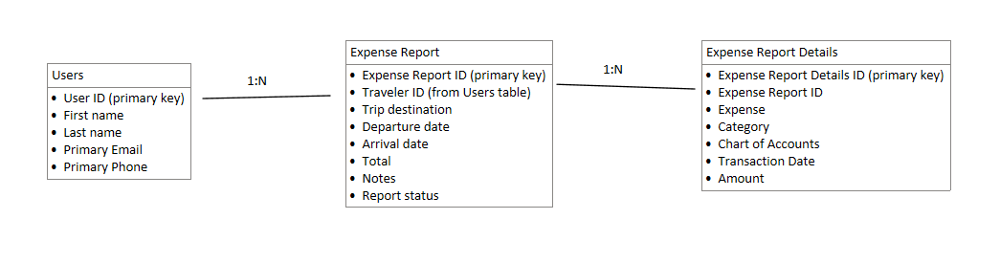

One of the biggest stumbling blocks to users translating their process from an excel spreadsheet to a canvas app is the data model. We become accustomed to thinking about data in the way we have always know it and it can be difficult to realize that way may not work with the newer technology. In this scenario, we're tracking expenses. We have information that we need for every trip expense report and information for each of the individual expenses. We may be tempted to put all of those in a single table since the report itself exists in a single spreadsheet, but that wouldn't optimize our solution.

Here's one way you could build this out in a single table:

**Table Name:** Expense Report

**Columns:**

-   Traveler First Name

-   Traveler Last Name

-   Traveler Email

-   Trip Destination

-   Departure Date

-   Arrival Date

-   Expense

-   Category

-   Chart of Accounts

-   Transaction Date

-   Amount

-   Total

This would work, but we would repeat the same information like the traveler name and email and the trip details. Instead, we could focus on making the information that stays constant the focus of the line like the below:

**Table Name:** Expense Report

**Columns:**

-   Traveler First Name

-   Traveler Last Name

-   Traveler Email

-   Trip Destination

-   Departure Date

-   Arrival Date

-   Expense 1

-   Category 1

-   Chart of Accounts 1

-   Transaction Date 1

-   Amount 1

-   Expense 2

-   Category 2

-   Chart of Accounts 2

-   Transaction Date 2

-   Amount 2

-   Expense 3

-   Category 3

-   Chart of Accounts 3

-   Transaction Date 3

-   Amount 3

-   Total

This data setup doesn't repeat any information, but we still see a problem. Now, we're limiting the number of expense items you can list in a single report. Even if we added several dozen columns to cover expense items, you still have a limit, and you get a table that can be confusing and difficult to work with.

Instead, consider the following setup:

**Table Name:** Expense Report

**Columns:**

-   Expense Report ID

-   Traveler First Name

-   Traveler Last Name

-   Traveler Email

-   Trip Destination

-   Departure Date

-   Arrival Date

-   Total

**Table Name:** Expense Report Details

**Columns:**

-   Expense Report ID

-   Expense

-   Category

-   Chart of Accounts

-   Transaction Date

-   Amount

By breaking the expense report into two tables, we have a clean data setup that doesn't repeat information or limit the number of expense items you can add. You can relate the tables together using the ID field of the primary table, which you can store on the details table. This table relationship is known as a parent/child relationship. The Expense Report table is the parent, containing a single record or item for each report, and the Expense Report Details table is the child, containing lots of records for each report.

While calling it a parent/child relationship helps us understand how these tables relate, you may hear other terms to classify relationships such as a one-to-many (1:N), one-to-one (1:1), or many-to-many (M:N). In this example, we have a one-to-many relationship, with one record in our Expense Report table relating to many records in our Expense Report Details table. Referring to relationships in this way helps us to quickly and easily understand how tables relate to one another making a larger data model.

As our solution grows, we may add more tables with different relationships to expand functionality in our application. In addition, all the tables will need an identity column, sometimes referred to as a primary key. Here's what our final data model may look like:

> [!div class="mx-imgBorder"]
> 

You can see that a User's table has been added. This is so a user doesn't have to enter information that the system will already know or enter their information every time they have a new expense report. A status field has also been added so that travelers will know where their expense report is in the approval process. You can expand even further to have an approvals table to track the time and date of various approvers or add more types of expenses, but we won't be covering that during this learning path.
