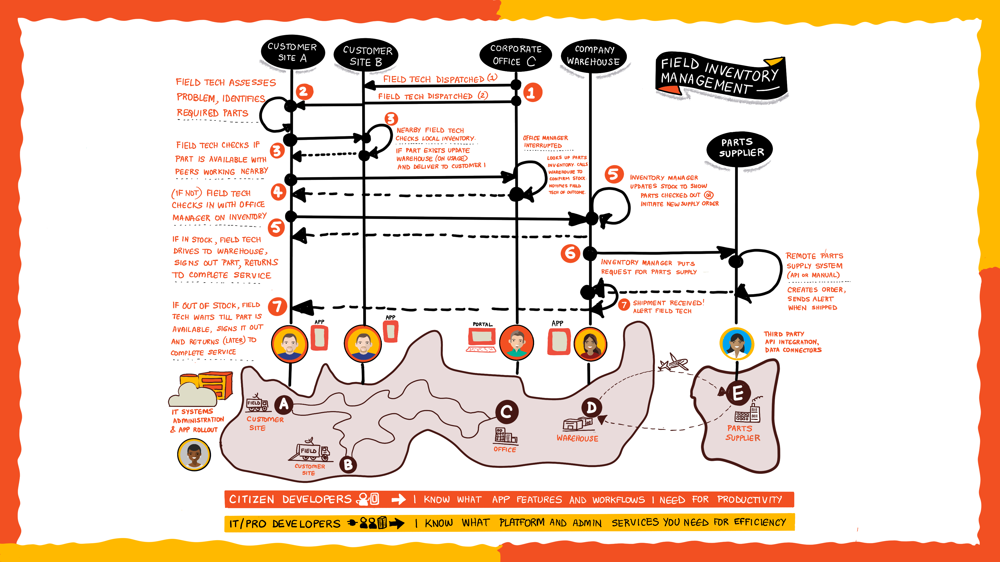

One way to increase the tech intensity for VanArsdel Heating and Air Conditioning is to have people from various departments work together to create software applications to solve business problems. The apps are written by business professionals or Citizen Developers tailored to their exact needs and supported by data and functionality provided by Professional Developers. Together the Citizen and Professional Developers form a Fusion Development Team.

The VanArsdel Fusion Development is trying to solve a problem they refer to as "The Field Inventory Management System".

As the newest employee at VanArsdel you get "volun-told" to take notes as Caleb, the lead field technician describes an inefficient workflow that costs him and his team meany hours each day.

## The Field Inventory Management System

- While performing a repair service in the field, Caleb discovers he needs a part that he does not have on his truck.
- He'll sometimes call another technician if they're nearby to see if they have the part that he can pick up from them.
- Otherwise, he'll travel back to the central warehouse to pick it up, and fill out a piece of paper indicating the part has been removed.
- If the part is not in stock at the warehouse, Caleb fills out another piece of paper to indicate the part needs to be ordered.
- Caleb and his team would be able to visit more customers per day if not for the time they spend traveling to pick up parts.

Malik, the office manager, lets Caleb know that a lot of the time the field technicians call Malik and ask him to check the warehouse inventory. It might save the technicians time, but it interrupts Malik's workday and his other responsibilities.

Maria, who leads up supply chain management, nods her head in agreement and tells the team how this Field Inventory Management System process affects her team:

- In their haste to get back to the customer and finish the repair, many times Caleb's team will forget to indicate they removed a part from the warehouse, thus the inventory count is off. This means Maria's team needs to do manual inventory audits.
- Maria also has to check the piece of paper indicating which parts to order several times per day to make sure parts are ordered and stock kept up to date.
- Maria uses a legacy web application developed by Kiana to keep VanArsdel's internal warehouse inventory up to date and order any needed parts from vendors.

Kiana immediately speaks up and says that it's been on IT's backlog to rewrite the web application that keeps VanArsel's internal warehouse inventory up to date, but other requests have taken priority.

The team decides that the Field Inventory Management System is the first problem they'll solve.

As you finish your notes, you can't help but wonder how these folks from very different departments who have different ways of doing their jobs will form a team to solve this problem. After all, to increase tech intensity the technology will need to be easy to use for each team in their unique situation and they'll need to _want_ to use it. And VanArsdel as a whole needs to trust it - the business depends on it.
