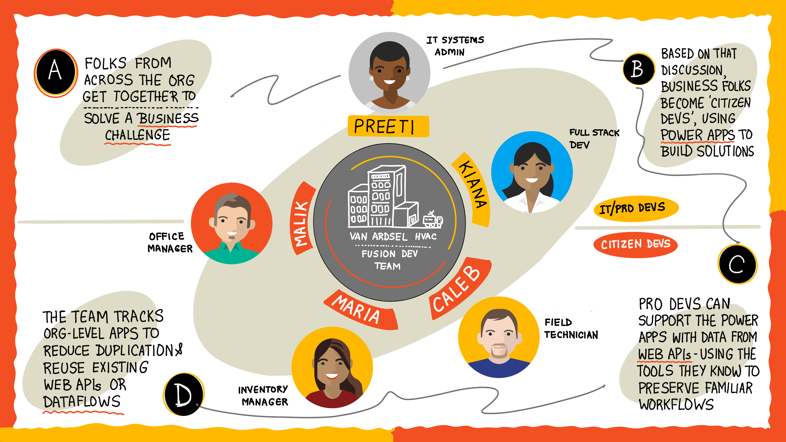

Fusion Development Teams create better software, faster by empowering Citizen Developers, or business professionals, to create applications that solve unique problems alongside and supported by their Professional Developer peers.

The Field Inventory Management System problem involves folks from the field technician, inventory management, and software development teams.

The way Caleb, Maria, and Kiana organize themselves is instructive in how many Fusion Developments can and do work.

## Development process

"Here's the interesting thing about Power Apps," Maria started off with, "you do not need to really know anything about software development in order to create an amazing app that solves a specific business problem."

She continued, "In fact, I'd say the trickiest part is knowing when and how to ask for help. When the Power Apps framework doesn't supply the functionality to build the app and how to get the software development team involved."

Kiana reiterated, "So even though Citizen Developers build Power Apps, they still need help from us Professional Developers."

"Exactly." Maria answered. "In fact, it's common for Pro Devs to create Power Apps themselves to quickly replace legacy systems too."

"But a lot of the time what will happen is that Citizen Developers will get data from certain types of web services... what are they called?"

"Web APIs?", Kiana said.

"Yes, Web APIs!" Maria exclaimed. "Citizen Developers may reuse existing web APIs to get data to build their Power Apps or work with the Professional Developers to create new web APIs. Regardless the Professional Developers still do what they do best using the language and tools they know the best. And here's the coolest part, if Power Apps doesn't supply a control for the user interface, there's a way for a Professional Developer to build one."

Kiana nodding her head then said, "So it sounds like Professional Developers are integral to building Power Apps and Fusion Development teams then."

## Team organization

Caleb chimed in, "I'm going to be honest - this still sounds like a really laborious job and the application might not be that great if we have to build one for all the needs of all the teams at once."

"That's the thing," Maria answered. "Each business professional - or Citizen Developer, if you will - can build their own app that's perfect for their own needs. So we're building many small apps that are perfect for our jobs. When we're in this team we just need to be sure we're not duplicating efforts and that we communicate exactly what we need to Kiana and Preeti over in IT."

Caleb walked towards the whiteboard again, "You know how I like to sum things up with bullet points, so here's what I'm hearing Fusion Development Teams are":

- Folks from across the organization get together to solve a business problem
- Based on that solution, business professionals, Citizen Developers, use Power Apps to create software applications perfect for their needs
- Professional Developers support those Power Apps with data from web APIs using the tools they know the best, keeping their existing workflow
- The team keeps track of individual apps developed apps to not duplicate efforts and find out about and reuse existing web APIs

## Solving the Field Inventory Management System problem

The team settles on the following for their first app using the Fusion Development Team process:

- Ability to select a warehouse and see its part inventory
- Ability to adjust part inventory at any warehouse

While this sounds pretty straightforward, it will give the team practice at having Citizen Developers create a Power App application powered by a web API that returns warehouse locations and part inventory.

The finished Power App will be able to be used by Maria's or Caleb's team. Even better, Kiana's team already has web APIs developed to support everything.

"Well," Kiana says, "now that we know _what_ we want to do, what's the first step in doing it?"

"I think we should build out a Power App" Maria answers, "who wants to join me?"

Both you and Kiana raise your hands.
