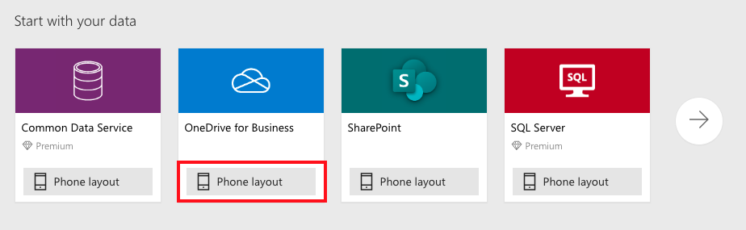
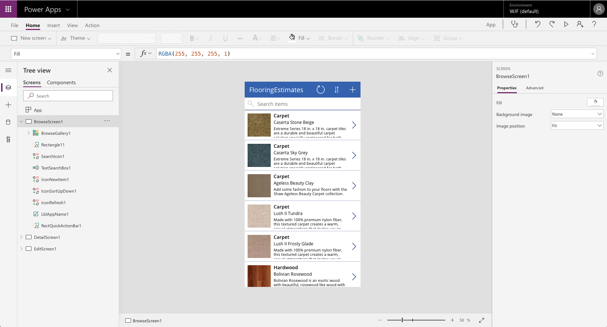
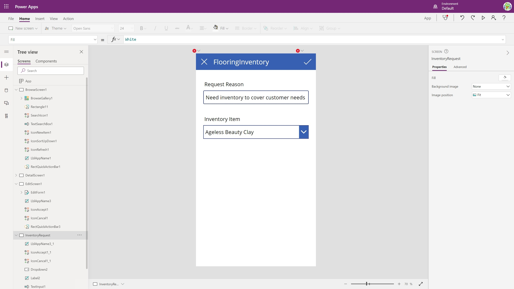
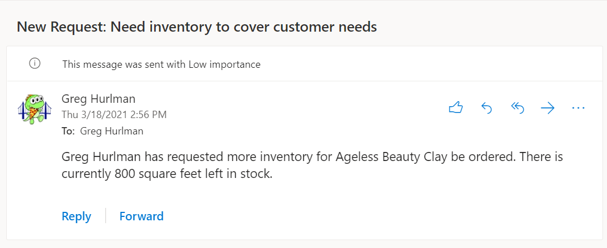

In this unit, you'll create a mobile app to help which people in the field will use to check inventory and order parts if necessary. We'll be using Excel as a data source to stand in as "dev data" to build the app without having to connect to existing systems like Microsoft SQL Server or Salesforce just yet.

There are hundreds of data connectors that Power Apps can connect to out of the box, for lots of Microsoft products and services and for 3rd party services too. If there is no connector for what you need, a developer can build a custom connector to make that connection.

> [!NOTE]
> Power Apps requires either an Microsoft 365 license or a free trial. Learn more about your licensing options. [Microsoft products include Microsoft Power Apps and Power Automate.](/powerapps/administrator/pricing-billing-skus/?azure-portal=true)

## Connect to a data source

To connect to a data source, use the following procedure:

1. Download the [Flooring Inventory workbook](https://github.com/MicrosoftDocs/mslearn-developer-tools-power-platform/blob/master/power-apps/understand-low-code/FlooringInventory.xlsx?raw=true) and save it to OneDrive for Business.

1. Go to [https://make.powerapps.com](https://make.powerapps.com) and sign in with your organizational account.

1. In the left pane, select **Apps**.

1. Select **+ New app** and then **Canvas** from the drop-down menu.
1. For the **OneDrive for Business** data source, select **Phone layout**.

    

    Generated apps are always based on a single list or table, but you can add more data to the app later. The next three steps explain how to connect to the Excel workbook.

1. Under **OneDrive for Business**, select **Create**.  
1. Under **Connections**, select **OneDrive for Business** and browse to the file location.
    You might need to select **New Connection** to see the **OneDrive for Business** connection.
1. Under **Choose an Excel file**, select the **FlooringInventory.xlsx** file.
1. Under **Choose a table**, select the **FlooringEstimates** table.
1. Select **Connect** on the bottom right.

Power Apps generates the app by inspecting your data and matching it with Power Apps capabilities so that you get a working app as a starting point.

## Preview the generated app

Your new three screen app now opens in Power Apps Studio.

[](../media/powerapps-full-screen.png#lightbox)

Select **Play** :::image type="icon" source="../media/powerapps-arrow.png"::: in the upper-right corner to practice using the app. Notice that it includes all the data from the table and provides a good default experience.

All apps that are generated from data have the same set of screens that you can view from the Screens pane:

* **Browse screen** - This screen appears by default. In it, you can browse, sort, filter, and refresh the data from the data source. In the browse screen, you can add items to the data source by selecting the plus icon (**+**).
* **Details screen** - The details screen shows all information about a single item. In this screen, you can open an item to edit or delete it.
* **Edit/create screen** - In this screen, you can edit an existing item or create a new one.

## Explore the generated app

Select the **(X)** icon in the upper-right corner to return the app to edit mode. Notice that the app, even while in edit mode, is actively running, as if in watch mode for a traditional application. As you make changes to control properties and Power Fx formulas, the app will automatically respond to those changes, even in edit mode.

> [!NOTE]
> To temporarily switch to preview mode while in edit mode, hold down the **Alt** key on your keyboard. Note that when you're holding down that key, if you select the app, it will act as it is in preview mode. When you release the key it will automatically spring back to edit mode and you can select your app to select controls normally.

## Add the inventory request screen

The generated app includes a screen for adding rows of data by repurposing the data edit screen, but our app will instead use the **(+)** icon in the app to give the user a way to request more inventory be added to the warehouse by the home office.

1. Select the **EditScreen1** control in the left-side Tree View panel's control tree.

1. Select the **...** on the right side of where EditScreen1 is now highlighted, and select **Duplicate screen**.

1. Right-click **EditScreen1_1** on the tree view, and select **Rename**. Type in **InventoryRequest** for a new name for the screen, and select **Enter** to save it.

1. Select **BrowseScreen1** in the tree view to go back to the first screen, and select the **(+)** icon to select it.

1. Choose the **OnSelect** property from the dropdown list next to the formula bar, replace the contents of the formula bar with this:

    ```powerapps
        Navigate(InventoryRequest, None)
    ```

1. Hold down the ALT key, and select the **(+)** icon to test the Navigate function you just wrote; the app should load the InventoryRequest screen you created a moment ago.

1. Now select **EditForm1_1** in the tree view, and press the **Delete** key to delete the control.

### Add controls to the new screen

1. Select the **+** icon on the left side of the screen to bring up the **Insert** panel.

1. Select **Text Label**, and select **Text Input** to add one of each type of control to the screen.

1. Drag the two controls on the screen so they are below the header, and are aligned with the center of the screen. Note how Power Apps will help guide you to line things up with each other as you drag the controls around.

1. Select the label on the app screen to select it and in the right-side **Properties** panel, change the **Text** property value to say **Request Reason**.

1. Select the textbox on the app screen to select it and in the right-side **Properties** panel, change the **Default** property to say **Need inventory to cover customer needs**.

1. Select **Text label** in the **Insert** panel to add another label to the screen

1. Use the search box on the **Insert** panel to search for **Drop**. Select **Drop Down** to add a dropdown list box to the app.

1. Click and drag both controls to line up with the other controls and each other, and change the text on the new label to say **Inventory item**.

1. Select the drop down control to select it, and in the right-side properties panel, select the **Items** property's dropdown and select **FlooringEstimates**. Then, select the **Value** property's dropdown and select **Name**.

1. Select the **Items** property label, and note that the cursor focus is now in the formula bar, with the Items property selected.

1. Sort the items by name by entering the following formula:

    ```powerapps
        Sort(FlooringEstimates, Name, Ascending)
    ```

    [](../media/studio-with-errors.jpeg#lightbox)

### Fix the errors and add a data connection

1. Select the **✖** icon. Note that the icon's OnSelect property is shown in the formula bar. Change the formula to just say `Back()`.

1. Select the data icon :::image type="icon" source="../media/powerapps-data-icon.png"::: on the left side of the screen to bring up the **Data** panel. Note that the FlooringInventory connection that we started the app with is listed there.

1. Select **➕ Add data** to open the connection search panel and search for **Office 365 Outlook**.

1. If you already have a connection defined, select that to add it. If no connection is listed, select **Add connection**. When the panel for the new connection pops open on the right side, select **Connect** to add the connection.

1. Select the ✔ icon in the header of your app. Note that the OnSelect property for the icon has been selected for the formula bar.

1. Change the icon's OnSelect formula to the formula below. This formula will send an email to yourself, asking for more inventory to be ordered.

```powerapps
Office365Outlook.SendEmailV2(
    User().Email,
    "New Request: " & TextInput1.Text,
    User().FullName & " has requested more inventory for " &
        Dropdown1.Selected.Name & " be ordered. There is currently " &
        Dropdown1.Selected.InventoryInSquareFeet & " square feet left in stock."
);
Back()
```

> [!NOTE]
> To add more than one statement in an event, use a semicolon (;) to separate them.



## Save and publish your app

To make your app visible on the phone, it needs to be saved and published. Select **File**, **Save as**. Replace the current title "App" with **Flooring Inventory**, and then select **Save**. You will see a green check mark when all changes are successfully saved. You can now open the app on your phone.

The first time you save a new app, it is automatically published, making the version you just saved "live". After that first save, additional saves do not automatically go live, but are just saved as new versions. In the future, you will need to select the **Publish** button that shows up on the save screen after you have clicked **Save**.

## Install the app on your device

To see how the app runs on mobile, install the Power Apps Mobile app on your phone. When building an app, you should test it in the same form factor as your users.

1. Download Power Apps Mobile from the app store for the platform that you want to use.
  
    * [For Google Play](https://aka.ms/PowerAppsApp/GooglePlay)
    * [For the Apple App Store](https://aka.ms/PowerAppsApp/GooglePlay)

2. Sign in by using your username and password.

3. On your phone or tablet, run the **Flooring Inventory** app in Power Apps Mobile. If you do not want to install the app, you can run it in a browser.

4. If you do not see the Flooring Inventory app, then in your Power Apps Mobile app, select the hamburger menu in the top left of the screen and toggle on **Show non-production apps**.
