Now that you understand what custom connectors are and how their
lifecycle works, you can learn how to build custom connectors using a
Postman collection.

Postman is an app for making HTTP requests. Postman collections help
you organize and group related API requests. Collections can make custom
connector development faster and easier if you don't have an OpenAPI
definition for your API. For more information about collections, see
[Creating
collections](https://www.getpostman.com/docs/postman/collections/creating_collections).

Create a Postman collection for a custom connector
--------------------------------------------------

There are some prerequisites needed to create a Postman collection for a
custom connector:

-   [Postman](https://www.getpostman.com/apps) app

-   [API
    key](https://docs.microsoft.com/connectors/custom-connectors/index#get-an-api-key)
    for the Cognitive Services Text Analytics API

### Create an HTTP request for the API

1.  In Postman, on the **Builder** tab, select the HTTP method, enter
    the request URL for the API endpoint, and select an authorization
    protocol.


| **Parameter**   | **Value** |
| :---------------| :------------------------------------------------------------------------------|
| HTTP method     | "POST" |
| Request URL     | "<https://westus.api.cognitive.microsoft.com/text/analytics/v2.0/sentiment>" |
| Authorization   | "No Auth" (you specify an API key in the next step) |

2.  Enter key-value pairs for the request header. For common HTTP
    headers, you can select from the drop-down list.

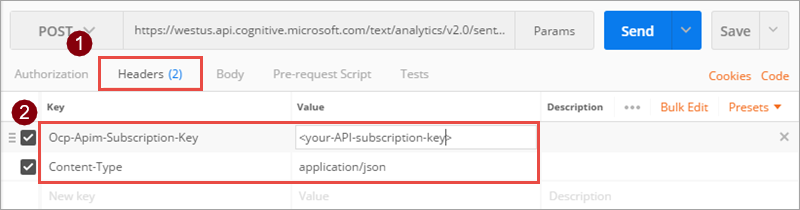

| **Parameter**        | **Value**            |
| :------------------- | :------------------- |
| Headers              | Key: “Ocp-Apim-Subscription-Key” Value: your-API-subscription-key, which you can find in your Cognitive Services account Key: “Content-Type” Value: “application/json” |

3.  Enter content that you want to send in the request body. To check
    that the request works by getting a response back, select **Send**.
    
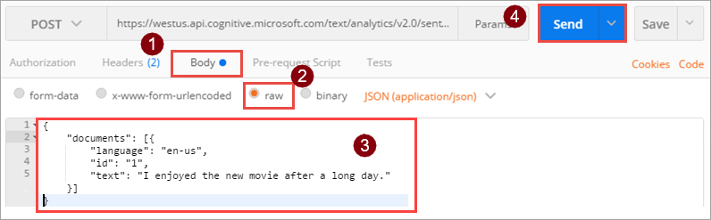

```json
{
“documents”: [{
“language”: “en-us”,
“id”: “1”,
“text”: “I enjoyed the new movie after a long day.”
}]
}
```
4.  The response field contains the full response from the API,
    including the result or an error, if any occurred.

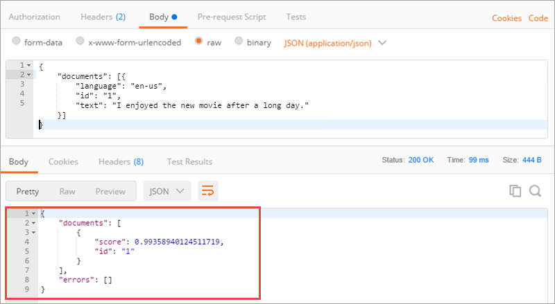

For more information about HTTP requests, see
[Requests](https://www.getpostman.com/docs/postman/sending_api_requests/requests).

### Save the collection

1.  Select **Save**.

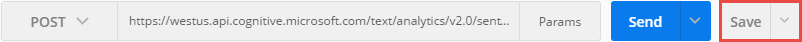

2.  Under **Save Request**, enter a request name and a description. The
    custom connector uses these values for the API operation summary and
    description.


 | **Parameter**         | **Value** |
 | :---------------------| :----------------------------------------------------------------------------------------------------------------------------------------------------------|
 | Request name          | "DetectSentiment" |
 | Request description   | \"The API returns a numeric score between 0 and 1. Scores close to 1 indicate positive sentiment, while scores close to 0 indicate negative sentiment.\" |

3.  Choose **+ Create Collection** and provide a collection name. The
    custom connector uses this value when you call the API. Select the
    check mark, which creates a collection folder, then choose **Save to
    SentimentDemo**.

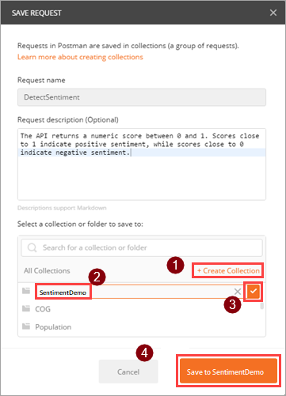

 | **Parameter**     | **Value** |
 | :-----------------| :-----------------| 
 | Collection name   | "SentimentDemo" |

### Save the request response

Now that you've saved your request, you can save the response. That
way, the response appears as an example when you load the request later.

1.  Above the response window, select **Save Response**.

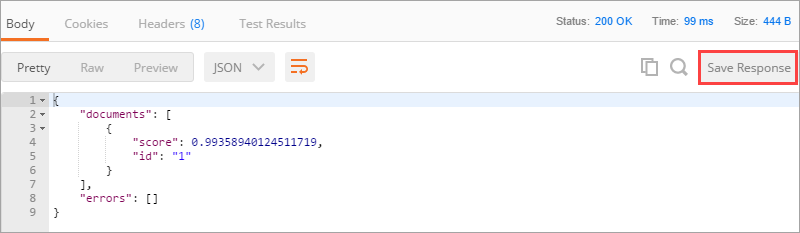

Custom connectors support only one response per request. If you save multiple responses per request, only the first one is used.

2.  At the top of the app, provide a name for your example response, and
    select **Save Example**.

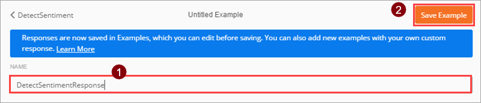

If your API had additional features, you would continue to build your
Postman collection with any additional requests and responses.

Export the Postman collection
-----------------------------

You can now export the collection as a JSON file, which you will then
import using the custom connector wizard. However, before you export the
collection, remove the content type and security headers - these were
required to make API requests, but they are handled differently in the
custom connector.

1.  Under **Headers**, hover over each header, and choose the **X** next
    to the header to remove it. Select **Save** to save the collection
    again.
    
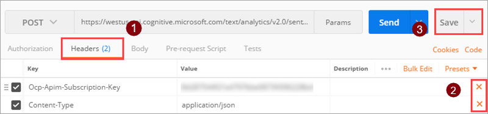

2.  Select the ellipsis (**...**) next to the collection, and then
    choose **Export**.
    
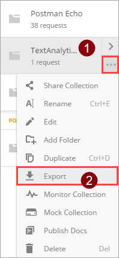

3.  Select the **Collection v1** export format, select **Export**, then
    browse to the location where you want to save the JSON file.

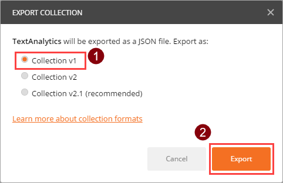

Create a custom connector from the Postman collection
-----------------------------------------------------

You created the Postman collection and now want to use it to create a
custom connector. Before proceeding, there are some prerequisites needed
to create the custom connector from the Postman collection created earlier:

-   Download the Postman collection you created

-   An [API
    key](https://docs.microsoft.com/connectors/custom-connectors/index#get-an-api-key)
    for the Cognitive Services Text Analytics API

-   A
    [PowerApps](https://docs.microsoft.com/powerapps/signup-for-powerapps)
    subscription

Import the Postman collection
-----------------------------

Now you're ready to work with the Postman collection you created earlier. 
The collection contains most of the required information.
You can review it and update it as you go through the custom connector
wizard. You need to import the Postman collection for PowerApps and Power Automate.

### Import the Postman collection for PowerApps and Power Automate

1.  Go to
    [powerapps.com](https://powerapps.microsoft.com/)
    or
    [flow.microsoft.com](https://flow.microsoft.com/) and sign in.

2.  In the upper-right corner, select the gear icon and then select
    **Custom connectors**.
    


3.  Choose **Create custom connector**, then select **Import a Postman collection**.

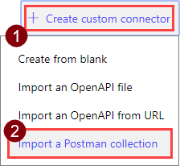

4.  Enter a name for the custom connector, then navigate to the Postman
    collection that you created, and select **Continue**.
    


 | **Parameter**            | **Value** |
 | :------------------------| :-----------------|
 | Custom connector title   | "SentimentDemo" |

The wizard imports the collection then converts it to an OpenAPI definition named generatedApiDefinition.swagger.json.

Update general details
----------------------

This example shows the Power Automate user interface, but the
steps are similar same across all three technologies. However, any
differences will be pointed out.

1.  On the **General** page, review the imported information from the
    Postman collection, including the API host and the base URL for the
    API. The connector uses the API host and the base URL to determine
    how to call the API.
    
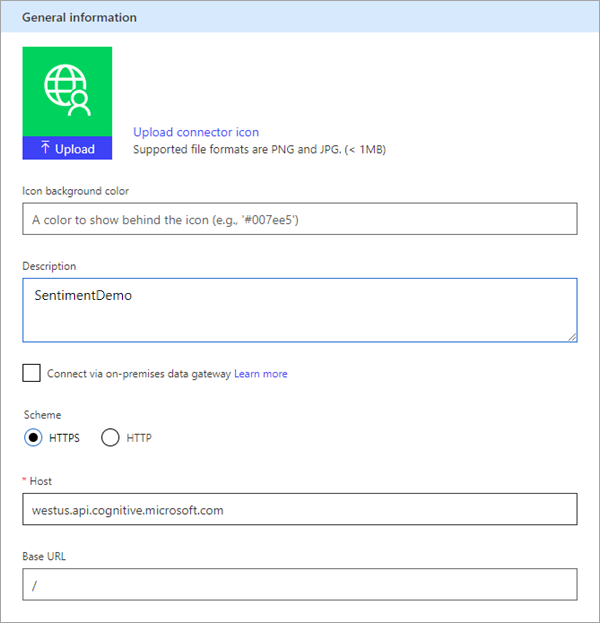

2.  Update the description to something meaningful. This description
    displays in the custom connector's details, and it can help others
    decide if the connector would be useful to them.

 | **Parameter**   | **Value** |
 | :---------------| :---------------------------------------------------------------------------------------------------------------------|
 | Description     | \"Uses the Cognitive Services Text Analytics Sentiment API to determine whether the text is positive or negative.\" |

Specify the authentication type
-------------------------------

There are several options available for authentication in custom
connectors. For this tutorial, the Cognitive Services APIs use API key
authentication.

1.  On the **Security** page, under **Authentication type**,
    choose **API Key**.
    
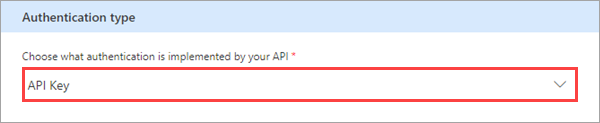

2.  Under **API Key**, specify a parameter label, name, and location.
    Specify a meaningful label, because this is displayed when someone
    first makes a connection with the custom connector. The parameter
    name and location must match what the API expects (in this case, the
    header you specified in Postman). Select **Connect**.

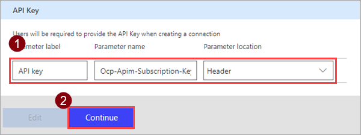

| **Parameter**        | **Value** |
| :--------------------| :-----------------------------|
| Parameter label      | "API key" |
| Parameter name       | "Ocp-Apim-Subscription-Key" |
| Parameter location   | "Header" |

3.  At the top of the wizard, make sure the name is set to
    \"SentimentDemo\", then select **Create connector**.

Review and update the connector definition
------------------------------------------

The custom connector wizard gives you a lot of options for defining how
your connector functions, and how it is exposed in PowerApps, Microsoft
Flow, and Azure Logic Apps. The next section explains the user interface (UI) and covers a few options, but you are also encouraged to explore this on your own.

### Review the UI and definition

Before you learn about the specific steps on the **Definition** page,
here's a review of the user interface.

1.  This area displays any actions, triggers (for Logic Apps and
    Power Automate), and references that are defined for the connector.
    In this case, the DetectSentiment action from the Postman collection
    is displayed. There are no triggers in this connector, but you can
    learn about triggers for custom connectors in [Use webhooks with
    Azure Logic Apps and Microsoft
    Flow](https://docs.microsoft.com/connectors/custom-connectors/create-webhook-trigger).
    
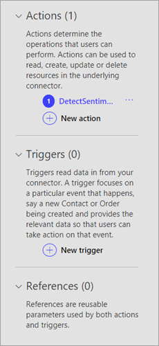

2.  The **General** area displays information about the action or
    trigger currently selected. This information comes from the Postman
    collection. You can edit the information here, including
    the **Visibility** property for operations and parameters in a logic
    app or flow:

-   **none** - Typically displayed in the logic app or flow.
-   **advanced** - Hidden under an additional menu.
-   **internal** - Hidden from the user. 
-   **important** - Always shown to the user first.

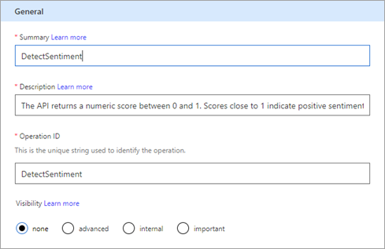

3.  The **Request** area displays information based on the HTTP request
    included in the Postman collection. In this case, the
    HTTP *verb* is **POST**, and the URL is
    "/text/analytics/v2.0/sentiment" (the full URL to the API is
    "[https://westus.api.cognitive.microsoft.com/text/analytics/v2.0/sentiment](https://westus.api.cognitive.microsoft.com/text/analytics/v2.0/sentiment)").
    
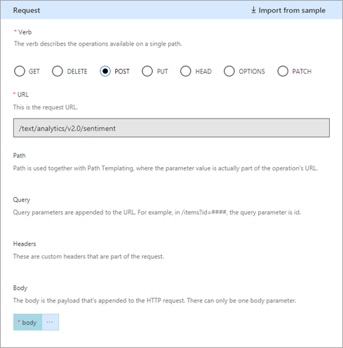

4.  The **Response** area displays information based on the HTTP
    response included in the Postman collection. In this case, the only
    response defined is for "200" (a successful response), but you can
    define additional responses.

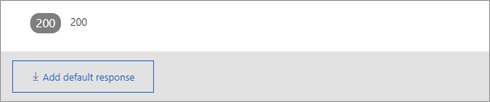

5.  The **Validation** area displays any issues detected in the API
    definition. Make sure to check this area before you save a
    connector.
    
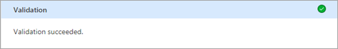

### Update the definition

Next you will change a few things so the connector is more user-friendly when someone uses it in PowerApps, Power Automate, or Azure Logic Apps.

1.  In the **General** area, update the summary to \"Returns a numeric
    score representing the sentiment detected\".

2.  In the **Request** area, select **body** then **Edit**.

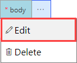

3.  In the **Parameter** area, you now see the three parameters that the
    API expects: ID, language, and text. Select **id** then **Edit**.
    
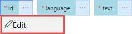

4.  In the **Schema Property** area, update values for the parameter,
    then select **Back**.

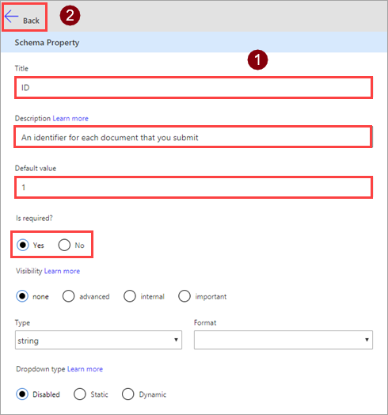

| **Parameter**   | **Value** |
| :---------------| :----------------------------------------------------|
| Title           | "ID" |
| Description     | "An identifier for each document that you submit." |
| Default value   | "1" |
| Is required     | "Yes" |

5.  In the **Parameter** area, select **language** and then select **Edit**. Repeat the process you used for ID with the following values.

| **Parameter**   | **Value** |
| :---------------| :----------------------------------------------------|
| Title           | "Language" |
| Description     | "The 2 or 4 character language code for the text." |
| Default value   | "en" |
| Is required     | "Yes" |

6.  In the **Parameter** area, choose **text** then **Edit**, and repeat
    the process you used for ID and language, with the following values.

| **Parameter**   | **Value** |
| :---------------| :--------------------------------------|
| Title           | "Text" |
| Description     | "The text to analyze for sentiment." |
| Default value   | None |
| Is required     | "Yes" |

7.  In the **Parameter** area, choose **Back** to take you back to the
    main definition page.

8.  At the top right of the wizard, select **Update connector**.

### Test the connector

Now that you\'ve created the connector test it to make sure it works
properly.

1.  On the **Test** page, choose **New connection**.

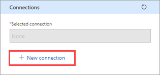

2.  Enter the API key from the Text Analytics API, then select **Create
    connection**.
    
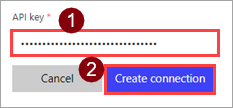

3.  Return to the **Test page**. 
In Power Automate, go back to the **Test** page. Choose the refresh icon to make sure that the connection information is updated.
        


In PowerApps, go back to the list of connections available in the current environment. In the upper-right corner, select the gear icon, then select **Custom connectors**. Choose the connector that you created, then go back to the **Test** page.


4.  On the **Test** page, enter a value for the **text** field (the
    other fields use the defaults that you set earlier), and then
    select **Test operation**.

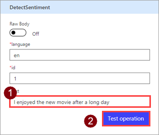

5.  The connector calls the API. You can review the response, which
    includes the sentiment score.

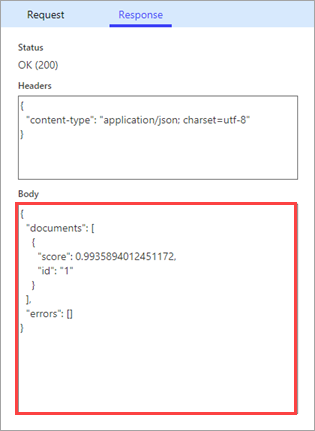
