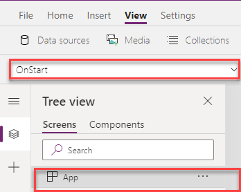
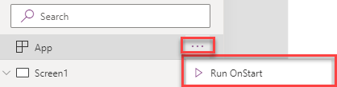
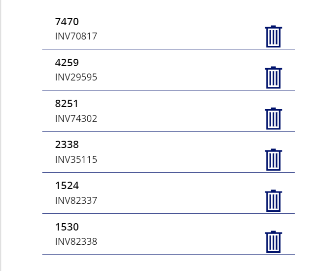
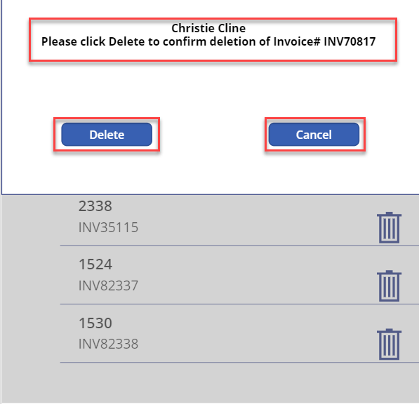

This hands-on lab shows you how to create and use Global, Contextual, and Collection functions. 

1. Sign into [Power Apps](https://make.powerapps.com/?azure-portal=true).

1. On the Home screen, select **Canvas app from blank**.

    

1. Name your app **New App**, format **Tablet** and click **Create**.

	

1. On the App Object 

    

1. Set the **OnStart** property to this property to this formula:

    ```powerappsfl
    ClearCollect(collectCustomer, 
    {CustomerNumber: 7470, 	InvoiceNumber: "INV70817"},
    {CustomerNumber: 4259, 	InvoiceNumber: "INV29595"},
    {CustomerNumber: 8251,	InvoiceNumber: "INV74302"},
    {CustomerNumber: 2338,	InvoiceNumber: "INV35115"},
    {CustomerNumber: 1524, 	InvoiceNumber: "INV82337"},
    {CustomerNumber: 1530, 	InvoiceNumber: "INV82338"}

    );
    Set(varUserDisplayName, User().FullName)
    ```

1. Click the **ellipsis (…)** and Select **Run OnStart** this will run the **OnStart** formula you just entered and populate the collection.

    

1. Select the **Insert** tab and add **Gallery**, set its **Items** property to **collectCustomer**.

    Make the below changes to the **Gallery**:

        Layout: Title and subtitle
        Height: 650 
        Title label **Text** property to ThisItem.CustomerNumber
        Delete the NextArrow icon 

1. In the Gallery, Select the **Title** label and **Insert** tab to add an **Icon** select the **Trash can** icon. Move the Trash icon to the right side of the gallery.

    Your Gallery will now include the Trash can icon.

    

1. Select the **Trash icon** and the below formula to its **OnSelect** property:

    ```powerappsfl
    Remove(collectCustomer,ThisItem)
    ```
1.  Press and hold **Alt Key**, and select the first **Trash can** icon. 

    This will delete the selected row from the collection. While this process works, you probably want to give a warning message that the row will be deleted. 

	Now let's create a popup warning to inform the user about the deletion and give them an option to cancel.

1. First change the **OnSelect** of the **Trash can** icon to the below:
    ```powerappsfl
    UpdateContext({varPopup:true})
    ```
1. To create the Popup, Click on the screen and Select the **Insert** tab to add an **Icon** select the **Rectangle** icon from the list. 

1. Make the below changes to the **Rectangle** icon:

        Name: rectangle_backgrd
        Size: 744 (width) X  720 (height)
        Fill: RGBA(166, 166, 166, .50)

1. Add another **Rectangle** icon and make the below changes:

        Name: rectangle_foregrd
        Size: 744 (width) X 348 (height)
        Fill: RGBA(255, 255, 255, 1)
        BorderThickness: 1

1. Select the **Insert** tab and add **Text**

1. Make the below changes to the **Text** label:

        Name: lbl_popup
        Font size: 15
        Font weight: Bold
        Text alignment: Center

1. Set the lbl_popup **Text** to the below formula:

    ```powerappsfl
    varUserDisplayName & "
    Please click Delete to confirm deletion of Invoice#" & " " & Gallery1.Selected.InvoiceNumber
    ```

 1. Select the **Insert** tab and add **Button** , Name: button_Delete, set its **Text** property to Delete

 1. Set the Delete **Button** **OnSelect** property to the below:
 
    ```powerappsfl
    Remove(collectCustomer,LookUp(collectCustomer,CustomerNumber=Gallery1.Selected.CustomerNumber));
    UpdateContext({varPopup:false})
    ```

 1. Select the **Insert** tab and add **Button**, Name: button_Cancel, set its **Text** property to Cancel

 1. Set the Cancel **Button** **OnSelect** property to the below:

    ```powerappsfl
    UpdateContext({varPopup:false})
    ```

 1. While holding down the Ctl-key Select the following controls:

        rectangle_backgrd
        rectangle_foregrd
        lbl_popup
        button_Delete
        button_Cancel

1. Right-Click Select **Group** set the **Visible** property of Group1 the below:

        varPopup

	You have created a popup box that will delete the selected Customer from the gallery. 

	Let's test the Delete function.

1.  Press and hold **Alt Key**, and select the **Trash can** icon for  invoice# INV70817. 

     

1. Click the **Delete** button, INV70817 is removed from the gallery.

1. Now Press and hold **Alt Key**, and select the **Trash can** icon for  invoice# INV29595

1. This time Click **Cancel**, the popup window closes and INV29595 remains in the gallery.

Now you have created a dynamic collection, created a global variable and created a pop-up that uses a contextual variable.


    
