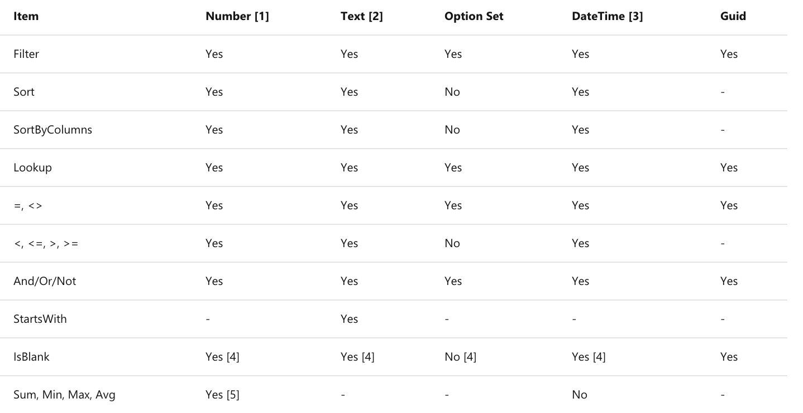

Determining when delegation will and will not happen is a combination of several variables. The first thing to consider is the data source. The following table shows the different functions and whether they support delegation for Common Data Service. In this table, **Yes** means the data source does the processing across all of the records, **No** means the data source returns only the first 500 (default) records to Power Apps, and Power Apps then processes the function locally.

>

1.	Numeric with arithmetic expressions (for example, Filter(entity, field + 10 > 100)) aren't delegable. Language and TimeZone aren't delegable.
2.	Doesn't support Trim[Ends] or Len. Supports other functions such as Left, Mid, Right, Upper, Lower, Replace, Substitute, etc.
3.	DateTime can be delegated except for DateTime functions Now() and Today().
4.	Supports comparisons. For example, Filter(EntityName, MyCol = Blank()).
5.	The aggregate functions are limited to a collection of 50,000 records. If needed, use the Filter function to select 50,000 records from a larger set before using the aggregate function.

Review [Common Data Service](https://docs.microsoft.com/connectors/commondataservice/) for more information about the Common Data Service as a data source and it’s delegable functions.

The table above is only for supported delegable functions if you are using the Common Data Service as a data source. But what if you are using a different data source, like SharePoint or SQL?   

## Other data sources: SharePoint and SQL

If you are using SharePoint and or SQL as a data source, you will want to review the supported delegable functions and associated documentation for these data sources. Remember, as we stated at the beginning of this module, depending on the data source your using the supported delegable functions will vary.  Every data source is going to be slightly different as to what is delegable and what is non-delegable. It’s highly recommended that before you begin the app building process, to first review the different data sources, so you will have a better understanding of what’s supported and also any limitations. Every Power Apps solution will have specific business requirements and it’s important to make sure the data source will support those requirements with the functions you need, for the amount of data you will have.

Additionally, if you are using the Filter or LookUp function, then you also will use a predicate. This is what allows you to perform the evaluation part of the formula. For example, FirstName = "Rob" is using the = predicate. Some data sources do not support some predicates. For example, Salesforce does not support the IsBlank predicate. This means that while the formula Filter(SalesforceCustomers, Name = "Contoso") is delegable, the formula Filter(SalesforceCustomers, IsBlank(Name)) is not delegable.

## The Column type can also factor in

One other thing to consider is that the column type can also affect whether delegation is possible. Complex columns, like a SharePoint lookup column, are not delegable. These columns have deeper logic and are only processable locally by Power Apps. The good news is that if you use a complex column Power Apps will provide visual warning indicators so you can correct the issue and build your app as appropriately. That visual warning indicator is the key to identifying any delegation issues in your Power App. If you see a blue underline anywhere in your formula bar, this is Power Apps way of letting you know there is a delegation issue with your formula and all of your records may not be returned until this is corrected. In the next section you will learn more about delegation warnings, limits, and how to work around these if you ever run into a delegation issue.