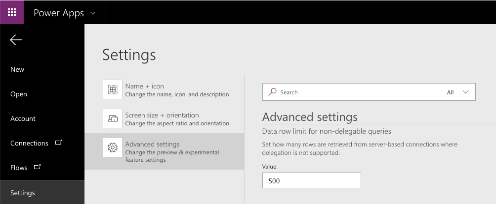

Power Apps uses visuals to help you, the app maker, understand when
delegation is occurring. The maker portal also has one setting you can
adjust to increase the amount of data returned when delegation is not
possible.

Delegation warnings
-------------------

Anytime you use a non-delegable function, Power Apps underlines it with a
blue line and displays a yellow warning triangle as shown below.


This gives you a clear visual indicator that delegation is not
happening, which means you may not be seeing all of your data. It is
important to understand a couple of things about this visual indicator.

- Power Apps will provide this warning regardless of the size of your
    data source. Even if your data source only has a few items
    and delegation isn't technically causing you a problem (remember the
    first 500 items are returned by default and processed locally) the
    warning will still show. The warning appears anytime that your formula is
    not delegated.

- The warning indicator only processes through the first thing that causes delegation. Notice in the above screenshot that only the underlined field "FirstName" is in blue. That is because it was the first item that caused delegation. "LastName" would also cause delegation in this scenario. This can be confusing because people try to troubleshoot what is the difference between FirstName and LastName instead of the real issue, which is the Search function. If you encounter this confusion, rearrange your formula. This will validate and whichever field is first will show the issue.


- This visual indicator is only present when you are in the maker
    portal, building the app. When a user is running the app, they will
    not receive any notification that delegation is not occurring and
    that they may only be seeing partial results. Keep this in mind when
    designing your app and build accordingly.

Changing the number of records returned when delegation isn't available
-----------------------------------------------------------------------

When a formula cannot delegate to the data source, for any
reason, then by default Power Apps retrieves the first 500 records from
that data source and the processes the formula locally. Power Apps does
support adjusting this limit from 1 to 2000. You can adjust this in the Advanced
settings.

1.  From the Maker portal, select **File** in the upper-left corner.

2.  In the left-most menu, select **Settings**.

3.  Under **App settings**, select **Advanced settings**

4.  Set the Data row limit for non-delegable queries for any value
    between 1 to 2000.

5.  After you have set the limit, select the **arrow** in the upper left to
    save your change and return to the Maker portal.



There are two primary reasons that you might want to adjust this limit.

- To increase the limit if you are working with data where 500
    records aren't enough, but less than 2000 is. For example, if you
    have a customer list and you know you will never have more than 1000
    customers, then you could design your app to ignore delegation and
    always return all 1000 records.

- To decrease the limit to 1 or 10 to help with testing. If you
    are running into scenarios where you are not sure if a non-delegable
    function is causing problems with your app, you can lower the limit
    and then test. If you set the limit to 1 and your gallery is
    only presenting one record, you know that you had a non-delegable
    function. This speeds up your troubleshooting process.

Non-delegable functions
-----------------------

In the previous unit, you learned about the functions that are delegable and how they relate to the various data sources. These other functions, not covered in that unit, are not delegable. The following are notable functions that do not support delegation.

-   First, FirstN, Last, LastN

-   Choices

-   Concat

-   Collect, ClearCollect

-   CountIf, RemoveIf, UpdateIf

-   GroupBy, Ungroup

All of these functions are not delegable, so by adding them to a formula you might take a previously delegable function and make it not delegable, as seen in the previous example.

Partially supported delegable functions
-----------------------

The Table shaping functions below are considered to be partially delegable. This means, formulas in their arguments can be delegated. However, the output of these functions is subject to the non-delegation record limit.

-   AddColumns

-   DropColumns

-   ShowColumns

-   RenameColumns

A common pattern is to use AddColumns and LookUp to merge information
from one table into another, commonly referred to as a Join in database
parlance. For example:

```
AddColumns( Products, "Supplier Name", LookUp( Suppliers,
Suppliers.ID = Product.SupplierID ).Name )
```

Even though Products and Suppliers may be delegable data sources and
LookUp is a delegable function, the AddColumns function is partially
delegable. The result of the entire formula will be limited to the first
portion of the Products data source.

Because the LookUp function and its data source are delegable, a match
for Suppliers can be found anywhere in the data source, even if it\'s
large. A potential downside is that LookUp will make separate calls to
the data source for each of those first records in Products, causing much chatter on the network. If Suppliers is small enough and doesn't
change often, you could cache the data source in your app with a Collect
call when the app starts (using OnVisible on the opening screen) and do
the LookUp to it instead. 
