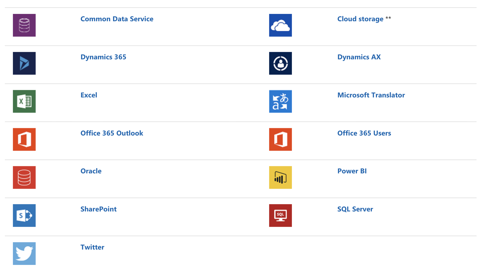

In Microsoft Power Apps, you use data sources to connect to and store your data. You can access data within the Office 365 ecosystem in locations such as Microsoft Dataverse, SharePoint, SQL Server, and other on-premises sources; Azure or other cloud services; a web API; or any of more than 200 built-in connectors.

This graphic shows the most common data sources.

> [!div class="mx-imgBorder"]
> 

The Power Apps Per app plan or Power Apps Per user plan provides access to
premium connectors, such as these examples:

- Dataverse (database)

- SQL Server

- Salesforce

- DocuSign

- MailChimp

- Oracle

- ServiceNow

- Workday HCM

## Tabular or action-based data sources

Data sources provide data as either actions or one or more tables. Some data sources, such as Dataverse, SharePoint, and SQL Server provide your data in a structured table. With table data sources, you can easily
display the data in a gallery or a form. In Power Apps, you can use multiple functions for working with tables of data.

Other data sources, such as the Office 365 Users connector or Project Online, are action-based. When you connect to these data sources, you can run different actions by using various functions. Generally, you must explicitly connect these functions to controls to interact with them. They don’t work automatically like tabular data sources. For example, this function connects to Office 365 and queries user data.

```
Office365Users.SearchUser()
```

In contrast, this Office 365 function updates your profile data.

```
Office365Users.UpdateMyProfile({aboutMe:"I love Power Apps"})
```

## Custom connectors

You can create a custom connector to query any web API if no built-in connector suits your needs. You don't need to write C\# code to create a custom connector. You can create your connector with just a few steps by using a Postman or OpenAPI file. For more information, see [Custom connectors for canvas apps](/powerapps/maker/canvas-apps/register-custom-api/?azure-portal=true). The remainder of this learning path discusses how to add a data source,
display data in a gallery, build data sources by using collections, and work with large data sets efficiently by understanding delegation.
