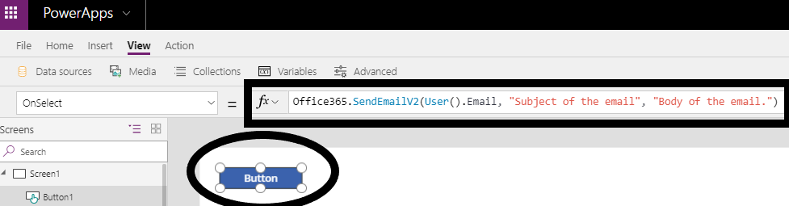

To begin, add a data source to your app. In PowerApps, there are multiple ways
to add a data source. For example, when you add a gallery or a
form to the screen, you can use that interface to choose an existing
data source or add a new one. Sometimes you must add a data source for a
control to complete an action. For example, adding a data source to a
button to send an email.

Add a tabular data source such as a SharePoint list
---------------------------------------------------

Add tabular data sources by following the same steps as in the previous
procedure, or from the properties of a control. In this example, you'll
add a SharePoint Online list as a data source to your app from a gallery
control.

1.  On the **Insert** tab, select **Gallery**, and then select the
    option for a vertical gallery.

2.  In the properties pane, select the drop-down menu for the **Items**
    property.

3.  In the list that appears, select **Add a data source**.

    

4.  In the **Data** pane, select **New connection**.

5.  Scroll through the list until SharePoint appears, and then select
    it.

6.  At the bottom of the **Data** pane, click **Create**.

	> In order to connect to an on-premises SharePoint server, you need to have selected the on-premises data gateway.

7.  When prompted, perform either of these steps:

    -   Select a SharePoint site from the **Recent sites** list.

    -   Type or paste the site's URL, select **Go**, and then select the
        list that you want to use.

8.  Select **Connect**.

You have connected to your SharePoint list, and you can display the data
in the gallery control.

Add an action data source such as Office 365 Outlook
----------------------------------------------------

You can use this method to add any data source. After it is added, it
will be available throughout your app.

1.  In PowerApps Studio, select the **View** tab.

2.  In the ribbon, select **Data sources**.

3.  In the **Data** pane, select **Add data source**.

	> 

4.  In the **Data** pane, select **New connection**.

5.  Scroll through the list until Office 365 Outlook appears, select it,
    and then select **Create**.

6.  After your data source is added, close the **Data** pane by
    selecting the close icon (X) above **Add data source**.

Now the Office 365 Outlook data source is available for use in your app.

To send an email, add a button control to your app, and set its
**OnSelect** property to the highlighted formula:

This formula will do the following.

| **Formula argument** | **Formula input**     | **Notes**       |
| :------------------- | :------------------:  |:----------------|
| To                   | User().Email          | The current user is the person to whom the email will be sent. |
| Subject              | "Subject of the email"|             |
| Body                 | "Body of the email"   |              |

This is an important concept to understand about data sources. Some data sources,
such as SQL Server, use stored credentials that are shared by all users
of the connector. Others, such as CDS for Apps, SharePoint, and other
Office 365 connectors, use the user's credentials. For example, every
user who uses an app based on data in a SharePoint list needs the
appropriate permissions in SharePoint to interact with that data.

In the next unit of this module, you'll learn more about the gallery
control and how to display your data. 
