In this exercise, you’ll work with external data in your canvas app.

You’ll need to download the [spreadsheet](https://github.com/MicrosoftDocs/mslearn-developer-tools-power-platform/blob/master/power-apps/shape-data/shape-data-learn.zip) to complete this exercise. Select download once the link opens. Extract the Excel spreadsheet and upload the spreadsheet to your own OneDrive.

## Add a data source

1. Sign into [Power Apps](https://powerapps.microsoft.com/).

1.  Create a new Power Apps Canvas app from blank and call it *ExternalData.* Select the **Tablet** format.

1.  Make sure you’ve added the Excel sheet (link above) to your OneDrive.

1.  On the **Insert** tab, select **Gallery**, and then select the option for a vertical gallery.

1.  In the properties pane on the right, select the drop-down menu for the **Data source** property.

1.  In the Search box, type **OneDrive for Business** and select **OneDrive for Business** from the list. You could have also expanded Connectors and scrolled through all the available connectors until you found the **OneDrive for Business** connector.

	> [!div class="mx-imgBorder"]
	> 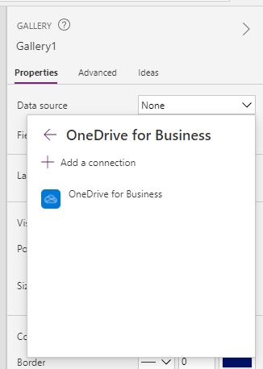

1.  Select **+ Add a connection**.

1.  At the bottom of **OneDrive for Business**, select **Connect**.

1.  When prompted to **Choose an Excel file,** navigate to where you stored the Excel file you downloaded in Step 3 and select it.

1. Check the **Items** table and then select **Connect**.

	> [!div class="mx-imgBorder"]
	> 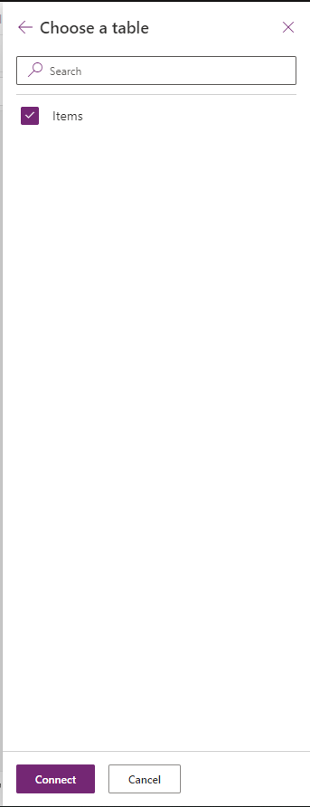

You’ve connected to your **Excel** table in **OneDrive for Business**, and you can display the data in the gallery control.

## Display and interact with your data in a gallery

1.  Select the gallery you’ve added.

1.  In the properties pane on the right, select the drop-down menu for the **Layout** property.

1.  Select the **Image, title, subtitle, and body** layout.

1.  In the properties pane on the right, select the Edit button for the **Fields** property and set the following points:

    -   **Body1**: Description

    -   **Image2**: Image

    -   **Subtitle2**: UnitPrice

    -   **Title2**: Name

	> [!div class="mx-imgBorder"]
	> 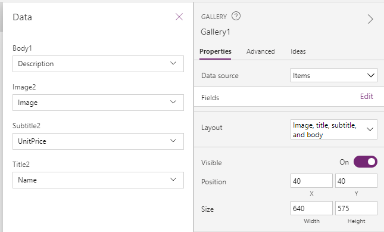

1.  Select the X towards the right of **Data** to exit

1.  On the gallery, select the price in the first row.

1.  In the formula bar, make sure Text is Selected and type the following:

    ```powerappsfl
    "$" & ThisItem.UnitPrice
    ```

	> [!div class="mx-imgBorder"]
	> 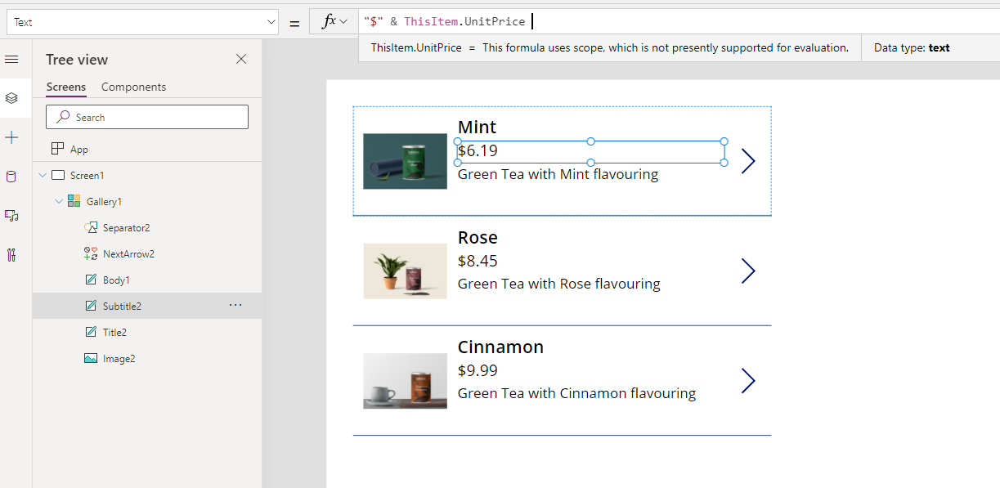

1.  On the gallery, select the image in the first row.

1.  In the properties pane on the right, select the drop-down menu for the **Image Position** property.

1. Select **Fill** and you’ll see that the image now fills up the space.

You’ve now configured and interacted with the data in your gallery.

## Moving data between collections and data sources

1.  On the **Insert** tab, select **Button** and position your button underneath your gallery.

1.  Change the text on the button to **Add to Collection**.

1.  Select the button, and in the formula bar, replace OnSelect value of **false** with this expression:

    ```powerappsfl
    Collect(ItemsCollection, Items)
    ```
    
    **ItemsCollection**: Refers to the Collection name

    **Items**: Refers to the Data Source name

    **Collect**: Will copy all records from the **Items** into the **ItemsCollection** collection

	> [!div class="mx-imgBorder"]
	> 

1.  Select the **Preview** button in the top right of the Power Apps editor to enter preview mode. Select the **Add to Collection** button. Select the **X** in the top right to close out of preview mode.

1.  On the **View** tab, select **Collections** and then select **ItemsCollection**. You’ll then see that all records from Items data source have been added into the **ItemsCollection** collection.

## Explore other functions that can be used with Collections

1.  On the **Insert** Tab, select **New Screen** and then select **Blank**.

1.  On the **Insert** Tab, select **Data Table** and position it next to the gallery.

1.  In the formula bar, make sure Items is selected and then enter the following expression:

	> [!div class="mx-imgBorder"]
	>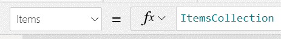

    This means that the Data Source for the table is the **ItemsCollection** collection and not the **Items** table in the Excel sheet.

1.  In the properties pane on the right, select the **Edit fields** button for the **Fields** property.

1.  Select **+ Add field**.

1.  Select all available fields and then select **Add**.

	> [!div class="mx-imgBorder"]
	> 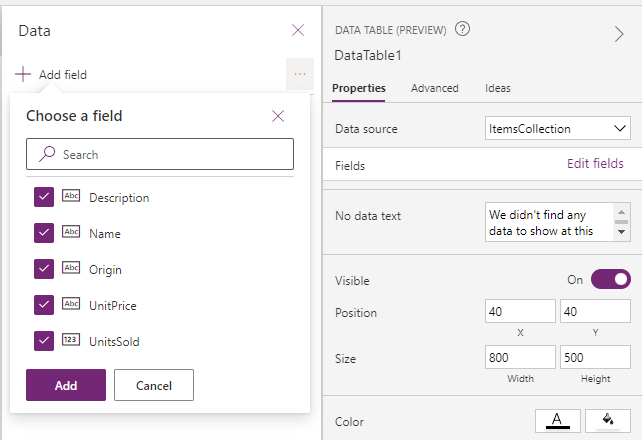

1.  Select the X towards the right of **Data** to exit.

1.  On the **Insert** tab, select **Button** and position your button underneath your table. Repeat this process four times.

1.  Change the text on all four buttons to **Add Column, Drop Column, Show Column, Rename Column** respectively.

1. Select the **Add Column** button.

1. Update the formula bar to this expression:

    ```powerappsfl
    Collect(AddCollection, AddColumns(ItemsCollection, "Revenue", UnitPrice * UnitsSold))
    ```

    Here, we’ve created a new collection called *AddCollection*, which copies all data from the *ItemsCollection* collection but in addition we use the *AddColumns* function to add a new column called *Revenue, which is calculated as UnitPrice * UnitsSold.

1. Select the **Drop Column** button.

1. Update the formula bar to this expression:

    ```powerappsfl
    Collect(DropCollection, DropColumns(ItemsCollection, "UnitPrice"))
    ```
    Here, we’ve created a new collection called *DropCollection*, which copies all data from the *ItemsCollection* collection but in addition we use the *DropColumns* function to remove the UnitPrice Column.

1. Select the **Show Column** button.

1. Update the formula bar to this expression:

    ```powerappsfl
    Collect(ShowCollection, ShowColumns(ItemsCollection, "Name"))
    ```
    Here, we’ve created a new collection called *ShowCollection*, which copies all data from the *ItemsCollection* collection but in addition we use the *ShowColumns* function to only show the *Name* column.

1. Select the **Rename Column** button.

1. Update the formula bar to this expression:

    ```powerappsfl
    Collect(RenameCollection, RenameColumns(ItemsCollection, "Name", "Product"))
    ```
    Here, we’ve created a new collection called *RenameCollection*, which copies all data from the *ItemsCollection* collection but in addition we use the *RenameColumns* function to rename the *Name* column to *Product.*

1. Select the **Preview** button in the top right of the Power Apps editor to enter preview mode. Select all four buttons. Select the **X** in the top right to close out of preview mode.

1. On the **View** tab, select **Collections** and then select each of the additional collections you’ve created to see what effect the functions had.

	> [!div class="mx-imgBorder"]
	> 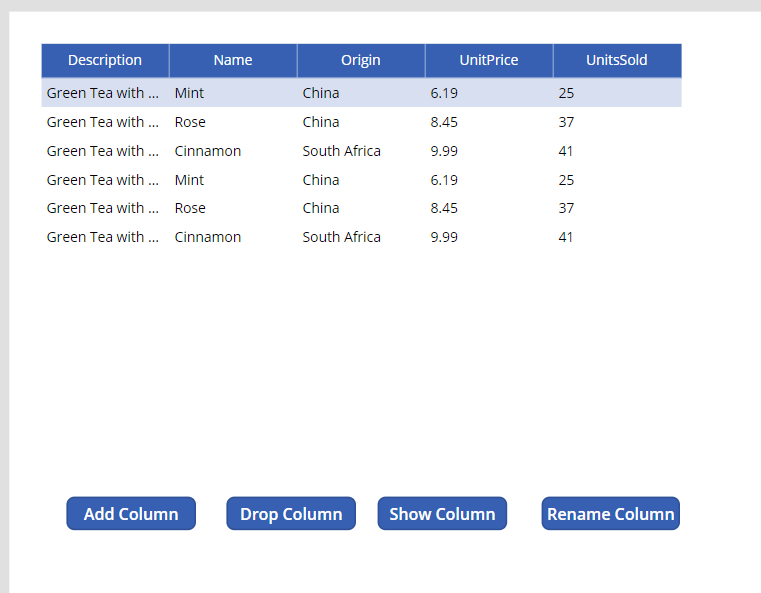

## Work with the Patch function

1.  On the **Tree View** panel on the left, go back to the first screen by clicking on **Screen 1**.

	> [!div class="mx-imgBorder"]
	> 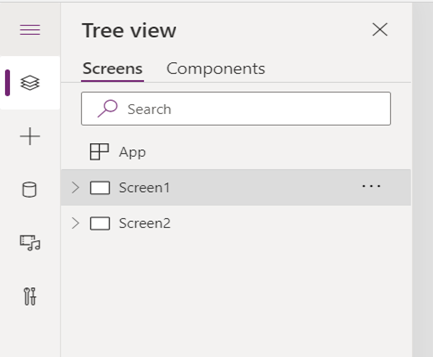

1.  On the **Insert** tab, select **Label** and then rename label to *Name*. Then position the label next to the gallery.

1.  Repeat the same step above but this time, rename the label to *New Description*.

1.  On the **Insert** tab, select **Input** and then select **Text Input.** Repeat this step and position both Text Inputs next to the labels made above. Your screen should now look like this:
   
	> [!div class="mx-imgBorder"]
	> 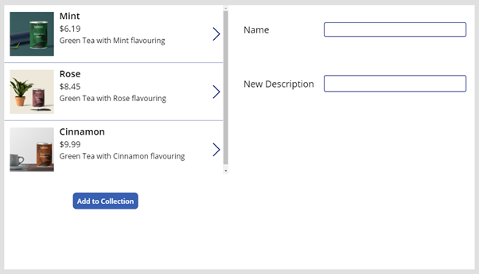

1.  On the **Insert** tab, select **Button** and position your button underneath your Labels. Change text on Button to *Update*.

1.  Select the Text Input next to the *Name* label.

7.  In the formula bar, make sure you have the **Default** property selected and then change the expression to the following:

	> [!div class="mx-imgBorder"]
	> 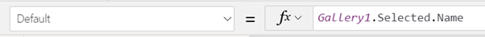

    This will display the **Name** property of the Date Source record whenever you select it in the gallery. You can test this by running the application, clicking on each item in the gallery and seeing that the text in the input changes upon each click.

1.  Repeat steps 6 and 7 for the Text Input next to the New Description label. The formula bar expression will look like this:

	> [!div class="mx-imgBorder"]
	> 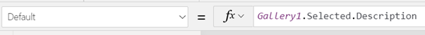

1.  Select the **Update** button.

1. Update the formula bar to this expression:

    ```powerappsfl
    Patch(Items,First(Filter(Items, Name = TextInput1.Text)), { Description: TextInput2.Text })
    ```
    
Let's recap what we've done.

**Patch** - Allows us to *modify* or create a record in your data source.

**First(Filter**...) - We use this to filter the data source by Name.  The name is from the Text Input named TextInput1. If you’ve  renamed your Text Input, then you would need to update the expression  accordingly.

Once the matching record is found, it updates the description based on  what you have written in the *New Description* text input.

Test this by running the application. Select one of the items in the gallery and edit the description. Select **Update**. The description in the gallery changes to the new description.
