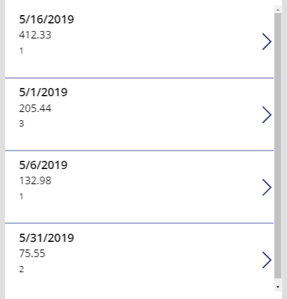
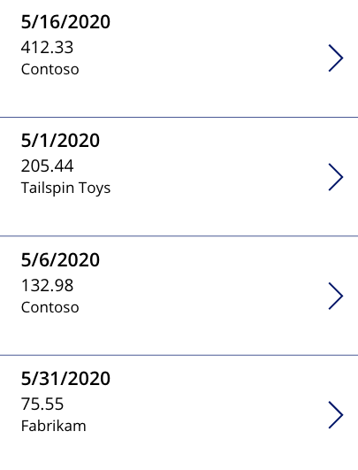

As you would expect, Power Apps has all of the functions and controls that you need to build and utilize relationships in your apps. In most apps, there are two primary ways that relationships are used. The first is the scenario discussed in the previous module, storing data in multiple tables and then using relationships to connect the data back together. In this unit, you will learn how to connect a customer and an invoice table.

The second common use of relationships is to query the parent from the child record. For this example, you will learn how to query the customer name when you are directly looking at the invoice record.

Connecting a parent and child table in Power Apps
------------------------------------------------

In this example, you will walk through how to reference a parent and
child relationship using the Power Apps filter and a LookUp function.

The Customer table is the parent in this relationship. That is because
one customer can have many invoices. Notice there is no reference in the
Customer table to the Invoice table. For this example, the data source
name for this table is CustomerTable. The table looks like the
following.

| ID | CustomerName   | CustomerPhoneNumber |
| :- | :--------------|:--------------------|
| 1  | Contoso       | 513-555-1212         |
| 2  | Fabrikam      | 206-555-1313         |
| 3  | Tailspin Toys | 404-555-1414         |

The Invoice table is the child in this relationship. For this example,
the data source name for this table is InvoiceTable. The table looks
like the following.

| ID | InvoiceDate | InvoiceDescription| InvoiceAmount | CustomerID |
| :--| :-----------| :-----------------| :-------------| :----------|
| 1  | 5/16/2019   | Parts             | 412.33        | 1          |
| 2  | 5/1/2019    | Service           | 205.44        | 3          |
| 3  | 5/6/2019    | Travel            | 132.98        | 1          |
| 4  | 5/31/2019   | Parts             | 75.55         | 2          |

In Power Apps use the Gallery control to display the contents of the
Customer table. You do this by using the following steps:

1.  Insert a **Gallery** control onto your canvas.

2.  Set the **Items** property to **CustomerTable**.

The Gallery will display a list of all of the customer records in the
table. This is **Gallery1**.

To display the full contents of the InvoiceTable, use the following
steps:

1.  Insert a **Gallery** control onto your canvas.

2.  Set the **Items** property to **InvoiceTable**.

This Gallery will display a list of all of the invoice records in the
table. This is **Gallery2**.

Now to display only the invoices for the customer selected in Gallery1, you need to
modify the items property of Gallery2.

1.  Set the **Items** property of **Gallery2** to:

> Filter(InvoiceTable, CustomerID = Gallery1.Selected.ID)

The formula will do the following.

  | **Formula Argument** | **Formula Input**                 | **Notes** |
  | :--------------------| :---------------------------------| :-----------------------------------------------------------------------------------------------------------------------------------------------------|
  | source               | InvoiceTable                      |  |
  | logical_test        | CustomerID = Gallery1.Selected.ID | CustomerID is the column name from the InvoiceTable. Gallery1.Selected.The ID is the value of the ID column for the selected record in the gallery. |

Now, Gallery2 will only display the invoice records for the selected
customer in Gallery1.

Looking up information stored in the parent from the child
----------------------------------------------------------

The previous example looked showed how to go from the top down. Sometimes
you need to go from the bottom up. For example in the InvoiceTable, if
you are looking at the record for the invoice with an ID of 2, then you
know that it is associated with the customer with the ID of 3. This is different
if you want to know the customer's name or phone number. To do this in
Power Apps, you can use the **LookUp** function.

The **LookUp** function allows you to query a data source for a single
record that meets the evaluation criteria. In this example, you will use
the same tables as the previous example, but you will start with a blank
screen to avoid confusion.

To display the full contents of the InvoiceTable, use the following
steps:

1.  Insert a **Gallery** control onto your canvas.

2.  Set the **Items** property to **InvoiceTable**.

3.  Set the **Layout** to Title, Subtitle, and body.

4.  In the **Data** pane set **Title** to **InvoiceDate**, **Subtitle** to 
    **InvoiceAmount**, and **Body** to **CustomerID**.

This Gallery will display a list of all of the invoice records in the
table. This is **Gallery3**.

Showing the ID value for each customer does not provide help for the app
user. To display the customer name, instead of the ID, do the following.

1.  In **Gallery3**, click the label for **Body** and set the **Text** property
    to:

> LookUp(CustomerTable, ID = ThisItem.CustomerID, CustomerName)

The formula will do the following:

| **Formula Argument**  | **Formula Input**        | **Notes** |
| :---------------------| :------------------------| :----------------------------------------------------------------------------------------------------------------------------------------------------|
| source                | CustomerTable            |  |
| logical_test         | ID = ThisItem.CustomerID | The ID is the column name from the CustomerTable. ThisItem.CustomerID is the value of the CustomerID column for the current record in the gallery.|
| result                | CustomerName             | This is the column that will be returned for the records that matched the logical_test.|

After making that change, Gallery3 is much more user-friendly.

Performance Notes
------------------------------------------------

The previous example is used to demonstrate the
concept of looking up from the child to the parent. There can be
performance ramifications of doing lookups from within a Gallery. In
this example, the data source would be queried 4 times by the LookUp
function, one for each record in the InvoiceTable. If the Invoice table
had 100s of records, then the LookUp would execute 100s of times. Be
sure to consider the performance ramifications before implementing data
source calls in a Gallery.

A better option to consider for this scenario is using a collection or
other means to query and store all of the customer records and then
perform your lookup against the collection. For additional information about data performance, see the blog post on [Performance considerations with Power Apps](https://powerapps.microsoft.com/blog/performance-considerations-with-powerapps/).

In the next unit, you will learn how Common Data Services removes all of the
issues associated with related data by automatically drilling down for you.
