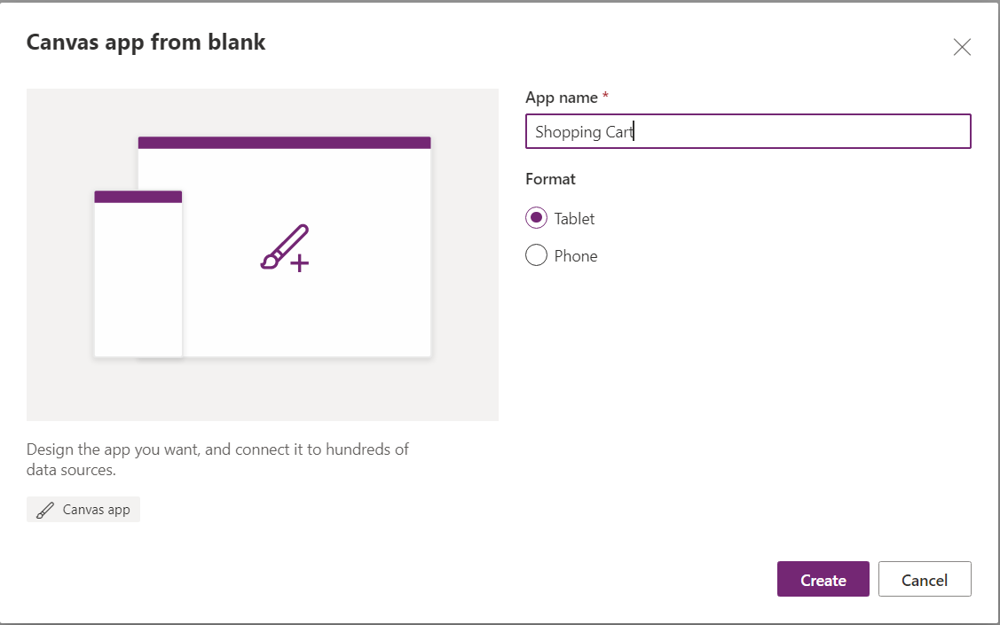
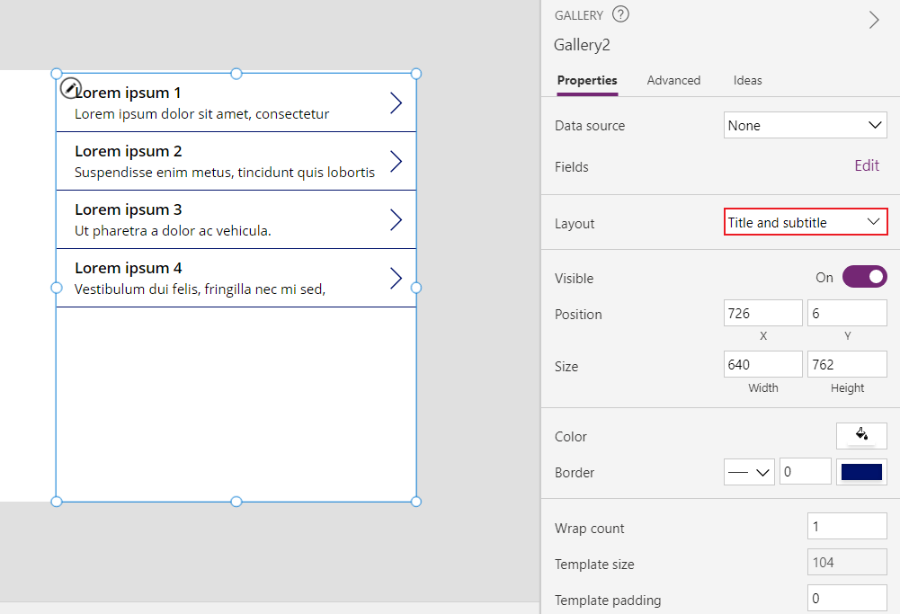
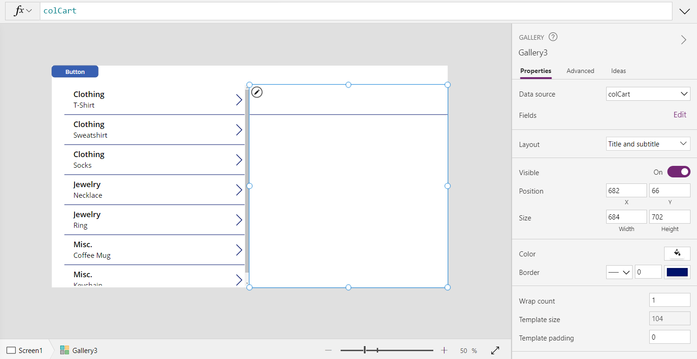
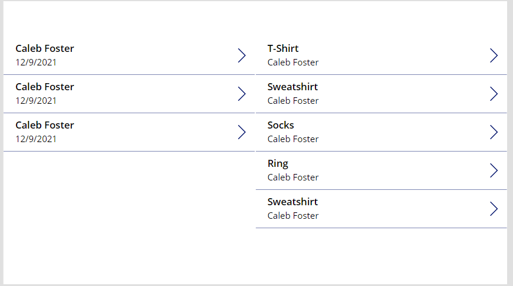

In this exercise, you'll learn how to access related data and how to create related records in multiple tables. For this example we'll be using [collections](/powerapps/maker/canvas-apps/create-update-collection/?azure-portal=true), which will only temporarily store your data. If you want a solution that saves to Dataverse or SharePoint, use the [patch](/powerapps/maker/canvas-apps/functions/function-patch/?azure-portal=true) function.

For this exercise, we're going to create a shopping cart. We'll be using a parent table (the receipt header), a child table (the receipt line items), and a products table (reference table). The relationships will look like so:


1. To start, open [make.powerapps.com](https://make.powerapps.com/?azure-portal=true).

1. Select **Canvas app from blank**.

1. Name the app **Shopping Cart**, select **Tablet**, then select **Create**.

    

1. Now select **Insert** and select **Button**.

1. In the **OnSelect** property of this button, put the following code:

    ```powerappsfl
    ClearCollect(Products,
     {ID:1, Name:"T-Shirt", Category: "Clothing"},
     {ID:2, Name:"Sweatshirt", Category: "Clothing"},
     {ID:3, Name:"Socks", Category: "Clothing"},
     {ID:4, Name:"Necklace", Category: "Jewelry"},
     {ID:5, Name:"Ring", Category: "Jewelry"},
     {ID:6, Name:"Coffee Mug", Category: "Misc."},
     {ID:7, Name:"Keychain", Category: "Misc."}
    )
    ```

1. Hold the **Alt** Key and select the button. The collection titled **Products** has now been created.

1. Add a **Vertical Gallery** to the screen, change the **Layout** to **Title and Subtitle**.

    

1. Set the **Items** property of the gallery equal to **Products**.

1. Set the **OnSelect** property of the gallery equal to:

    ```powerappfl
    Collect(colCart, ThisItem)
    ```

1. Move the **Gallery** to the far left side of the screen and add a second **Gallery**, with the **Layout** set to **Title and subtitle**. **Delete** the icon in the **Gallery**.

1. Set the **Items** property of this **Gallery** to **colCart**.

    

1. **Alt-select** the **Icon** on the first created **Gallery**. The second **Gallery** should now have an item in it. You can continue **Alt-selecting** the items in the first gallery to populate the second.

1. Now add a second **Button**. Set the OnSelect property to the following formula:

    ```powerapps fl
    Collect(
      ReceiptHeader,
       {
            ID: If(
                IsEmpty(ReceiptHeader),
                1,
                Last(ReceiptHeader).ID + 1
            ),
            Name: User().FullName,
            Date: Today()
        }
    );
    ForAll(
        colCart,
        Collect(
            ReceiptLineItems,
            {
                ID: If(
                    IsEmpty(ReceiptLineItems),
                    1,
                    Last(ReceiptLineItems).ID + 1
                ),
                ProductID: ThisRecord.ID,
                ReceiptHeaderID: Last(ReceiptHeader).ID
            }
        )
    );
    Clear(colCart)
    ```

1. This code will collect once to the **ReceiptHeader** table, since we only need to collect the user details once. Then for every item in **colCart**, it will add a line item to **ReceiptLineItems**. This line item will include an autonumbered ID field, the ID of the newly created **ReceiptHeader** record, and the ID of the product in colCart. It will then clear **colCart**, since it will be submitted.

1. **Alt-select** that button, and then create a **New Screen** so we can begin to see how this data will look.

1. Go to your new screen and add two **Galleries**, formatted the same way as the two on our last page. Set the **Items** property for the first **Gallery** to **ReceiptHeader** and for the second **Gallery** to the following:

    ``` powerappsfl
    Filter(ReceiptLineItems, ReceiptHeaderID=Gallery4.Selected.ID)
    ```

1. On the first **Gallery**, change the **Text** property of the **Subtitle** to **ThisItem.Date**.

1. On the second **Gallery**, change the **Text** property of the **Title** to the following:

    ``` powerappsfl
    LookUp(ShoppingCart, ID=ThisItem.ProductID).Name
    ```

1. Change the **Text** property of the **Subtitle** to the following:

    ``` powerappsfl
    LookUp(ReceiptHeader, ID=ThisItem.ReceiptHeaderID).Name
    ```

1. You now have a functioning order history page. You can select a **Receipt Header** on the left-hand side to see the line items from that receipt on the right.


