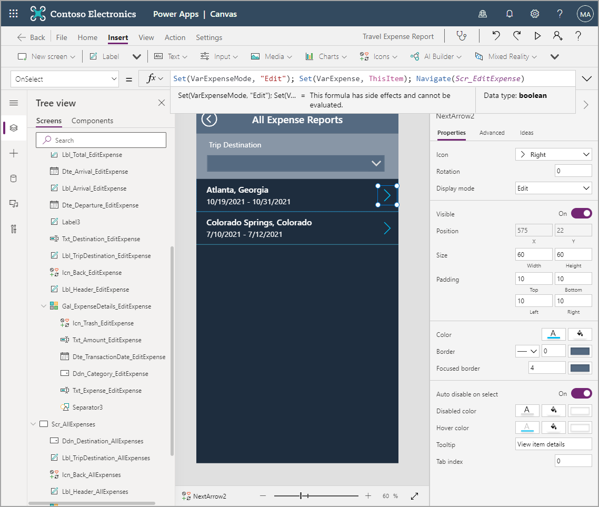
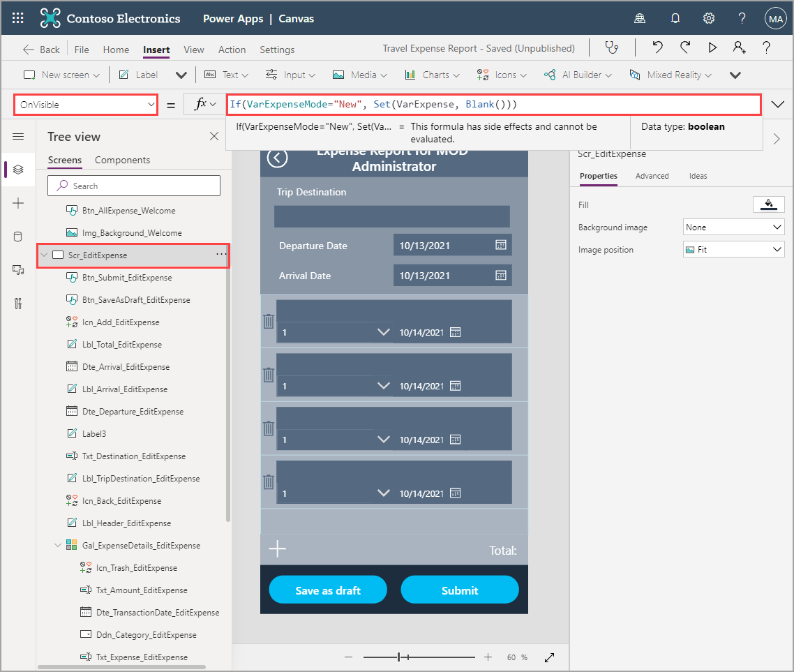
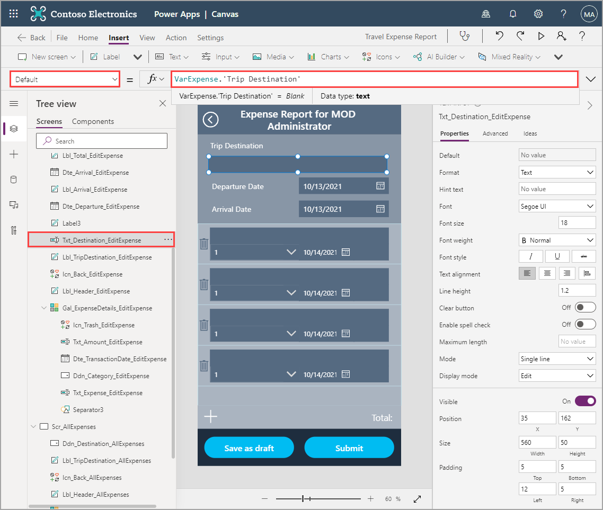
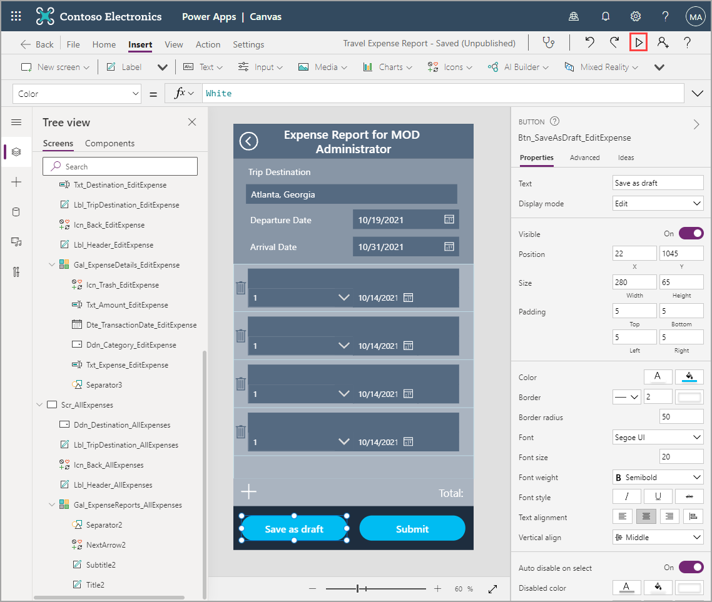
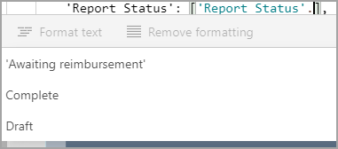
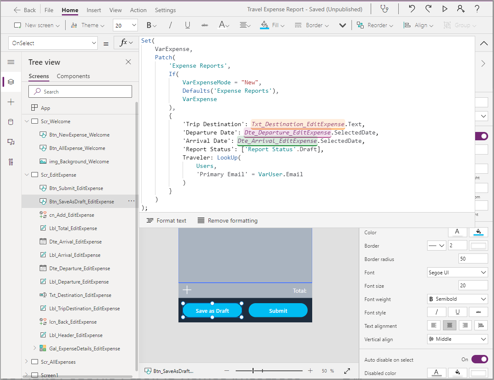

With our data setup, we need to write to not only one, but two tables on this screen. We'll learn the concepts of writing to a data source by writing the parent table first: the **Expense Report** table. As another consideration, this screen doesn't only need to write new records. It also needs to edit existing drafts, and show information for expense reports that have already been submitted. For this, we need to tell the fields which record is being edited or displayed. We also need to tell it whether to create a new record altogether. To do this, we'll need a couple of variables.

## Use variables to control data flow

1. From the **Tree view**, select the **Scr_Welcome**.

1. Select **Btn_NewExpense_Welcome** button and add to the existing **OnSelect** property code. To run functions one after the other, they need to be separated by a semicolon, so after the **Navigate()** function, add `;Set(VarExpenseMode, "New")`. Don't forget you can format the text to be cleaner.

   The OnSelect property should now look like this:

   > [!div class="mx-imgBorder"]
   > [](../media/on-select.png#lightbox)

   What this does is, besides navigating screens as before, you're also creating a variable to tell you that a new record needs to be created.

   Let's do the same for **Scr_AllExpenses**.

1. From the **Scr_AllExpenses** screen, select the **NextArrow** in **Gal_ExpenseReports_AllExpenses**.

1. Update the **OnSelect** property with the following code, **Set(VarExpenseMode, "Edit"); Set(VarExpense, ThisItem); Navigate(Scr_EditExpense)**

   The OnSelect property should now look like this:

   > [!div class="mx-imgBorder"]
   > [](../media/next.png#lightbox)

   This time we're not only setting a variable to tell you to edit an existing record. We're also setting a variable to tell you which record needs to be edited, and navigating to the next screen.

   Let's get back to the **Scr_EditExpense** to see these variables in action.

1. Set the **OnVisible** property of **Scr_EditExpense** to `If(VarExpenseMode="New", Set(VarExpense, Blank()))`. This will ensure that the fields don't hold any data from a previous record. You could do this on the button on your welcome screen, but the point of learning is to discover different ways of doing things. You may notice that this If statement only has a true value. If only a true value is defined and the condition is false, nothing happens.

   > [!div class="mx-imgBorder"]
   > [](../media/on-visible.png#lightbox)

   With the variables in place, we can reference existing data and then clear it out.

1. For **Txt_Destination_EditExpense**, set the **Default** property to `VarExpense.'Trip Destination'`

   > [!div class="mx-imgBorder"]
   > [](../media/default.png#lightbox)

   Let's take a moment and test this out.

1. From the **Scr_AllExpenses** screen, select the **Next** arrow (Right icon) for a record. You can do this by holding down the **Alt** key or putting the app in Play mode. You should see a destination if you're navigating from Scr_AllExpenses and a blank field if you're navigating from Scr_Welcome.

1. Navigate back to the **Scr_EditExpense** screen and modify the **DefaultDate** property for **Dte_Departure_EditExpense** to be **VarExpense.'Departure Date'**.

1. Modify the **DefaultDate** property for **Dte_Arrival_EditExpense** just as you did previously set this one to **VarExpense.'Arrival Date'**.

Remember, if you're having trouble finding a property for a control, all of the properties can always be found on the Toolbar, Properties dropdown or in the Properties pane.

After setting those properties, you should see the dates behave exactly as the destination field. Put the app in Play mode to test the functionality so far.

   > [!div class="mx-imgBorder"]
   > [](../media/play.png#lightbox)

The app is looking good! It's time to start configuring the app logic for writing data from the app back to our tables.

## Configure app logic

In our scenario, and many real-world scenarios, users will need the functionality to Add new items and Edit existing items. We also want to include the functionality for users to Save as draft. This functionality allows them work on an item over multiple days or sessions, before Submitting for approval. But that is enough discussion, let's get to work on adding this functionality!

1. Still on the **Scr_EditExpense** screen, select **Btn_SaveAsDraft_EditExpense** and change the **OnSelect** property to the following:

   ```powerappsfl
   Set(
   VarExpense,
   Patch(
      'Expense Reports',
      If(
         VarExpenseMode = "New",
         Defaults('Expense Reports'),
         VarExpense
      ),
      {
         'Trip Destination': Txt_Destination_EditExpense.Text,
         'Departure Date': Dte_Departure_EditExpense.SelectedDate,
         'Arrival Date': Dte_Arrival_EditExpense.SelectedDate,
         'Report Status': ['Report Status'.Draft],
         Traveler: LookUp(
               Users,
               'Primary Email' = VarUser.Email
         )
      }
   )
   )
   ```

If you're unsure about what this code is doing, don't worry. It's the most complex piece we've done so far in this learning path. To help you better understand, here's a little breakdown of what's happening.

First thing we're doing is using the **Set()** function. This sets VarExpense to include any changes we make including the new unique identifier if a new item is being created.

The **Patch()** function allows you to write to a data source by defining:

- **The source**: 'Expense Reports'
- **The record to be altered**: `If(VarExpenseMode="New",Defaults('Expense Reports'),VarExpense)`
- **What needs to be written**: `{'Trip Destination':Txt_Destination_EditExpense.Text,'Departure Date':Dte_Departure_EditExpense.SelectedDate,'Arrival Date':Dte_Arrival_EditExpense.SelectedDate,'Report Status':['Report Status'.Draft],Traveler:LookUp(Users,'Primary Email'=VarUser.Email)}`

The record to be written is wrapped in an **If()** statement that looks at the **VarExpenseMode** variable. If the item is **New**, you use `Defaults('Expense Reports')` but if the record already exists in your table you can use **VarExpense** to update the existing item since it holds all the information Dataverse needs to understand which record is being edited or updated.

The item information can get a little difficult, but that is a significant reason for changing your control names to something that makes more logical sense. The text and date fields such as **Trip Destination** and **Departure Date** are fairly easy to write. You reference the control in which the information is entered, and then dig deeper in that control to find the exact information, such as 'Text' for a text input or 'SelectedDate' for a date picker. The last two fields get a little more complicated.

As you likely remember from creating the fields, **Report Status** is a choice field and **Traveler** is a lookup to the User table. Choice fields in Dataverse require a table of data, which simply means to you need to add square brackets **[]** around the table. Inside the square brackets, you write the field name again to fetch the possible choices, dig deeper with the period, and Power Apps will provide you with the list of choices available.

   > [!div class="mx-imgBorder"]
   > [](../media/report-status.png#lightbox)

For the final field, **Traveler**, we're finding the logged-in user in the Users table using a **LookUp()** function. The LookUp() function takes the data source *Users* and finds the first record in that table that fits the condition `'Primary Email' = VarUser.Email`. For this reason, it's important to use a field that will be unique, like email.

Hopefully, that helps to provide a bit more detail and clarification around what we just did. As we continue throughout this module, take your time. If needed, try breaking down the code into smaller pieces. That will help with learning and ultimately becoming a better Power Apps Developer.

   > [!div class="mx-imgBorder"]
   > [](../media/save-draft.png#lightbox)

Congrats, the **Save as draft** functionality is done!
