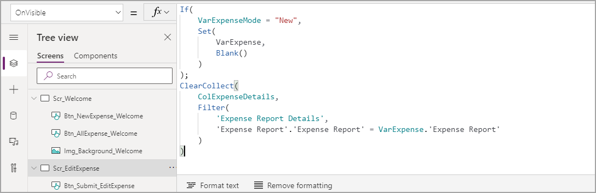
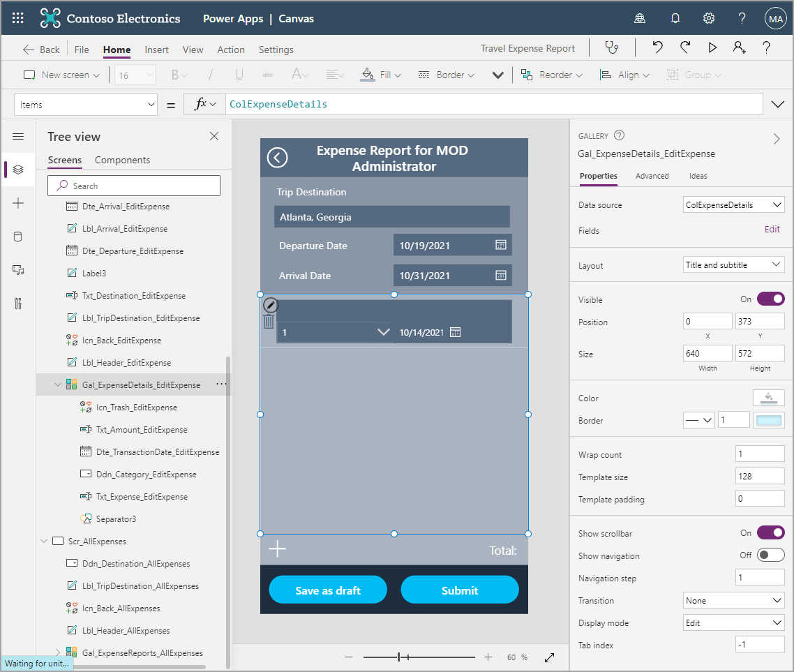
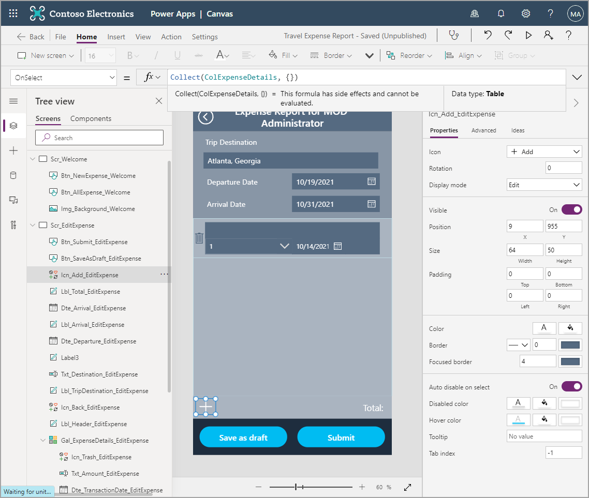
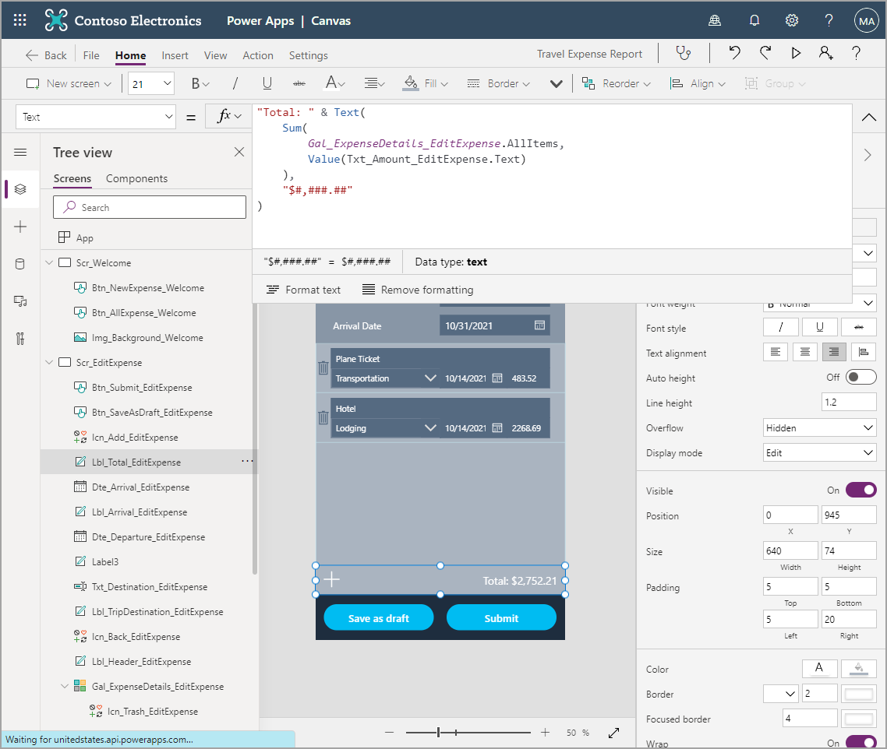
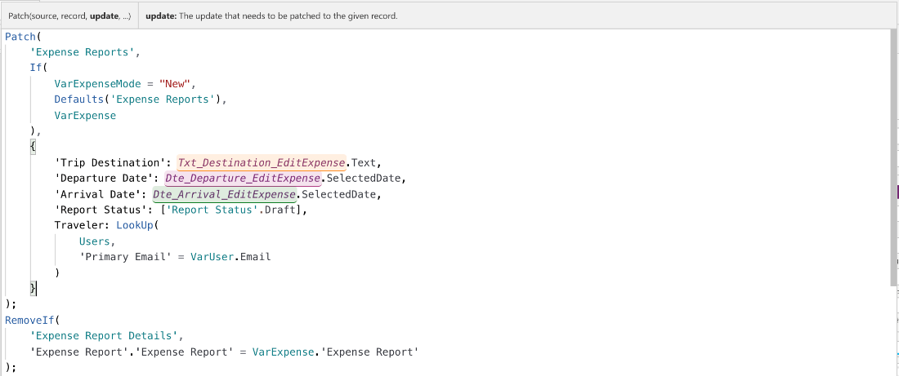
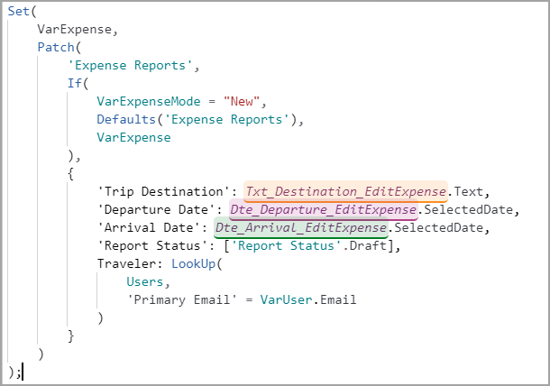
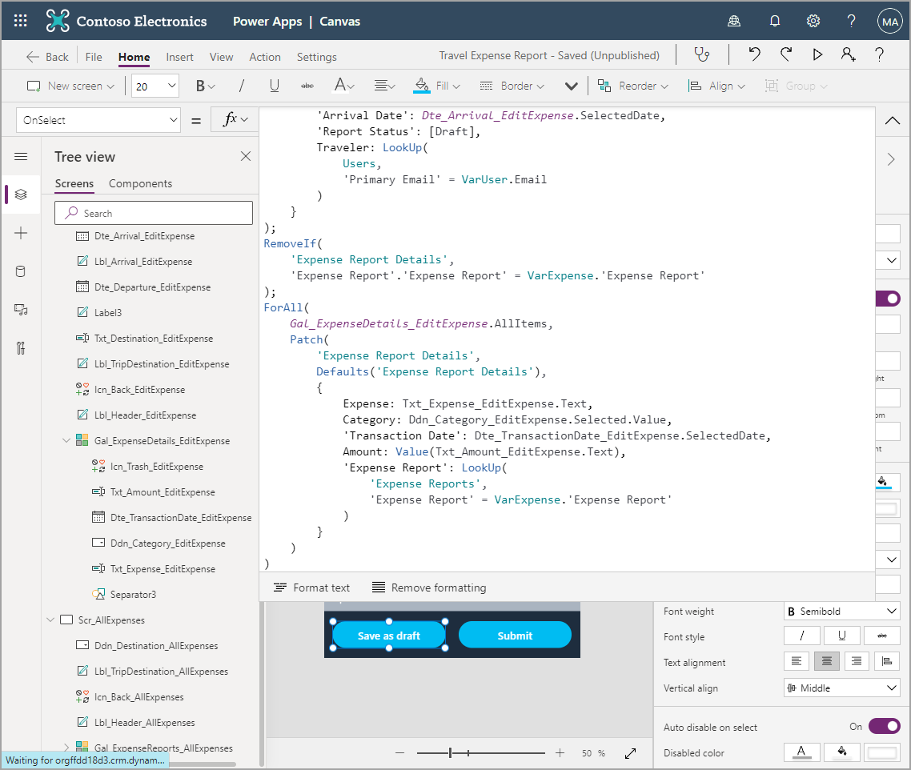

We've come a long way, but we're not done yet. There's still the matter of the expense details, or the individual transactions that add to the expense report. This is slightly more complex as we have to write many different lines at once, so let's begin.

Instead of connecting directly to the data source like with Gal_ExpenseReports_AllExpenses, we're going to store the information in a Collection. A Collection is a special type of variable that stores a table of data instead of a single record or value. It stores this table for later use in the app. To that end, let's get started on implementing this functionality.

1. From the Tree view, go to the **Scr_EditExpense** screen and select the **OnVisible** property.

1. Add the following code onto the existing code:

    ```powerappsfl
    ; ClearCollect(
        ColExpenseDetails,
        Filter(
            'Expense Report Details',
            'Expense Report'.'Expense Report' = VarExpense.'Expense Report'
        )
    )
    ```

   **ClearCollect()** is a function to clear out any previous records and begin a new collection. This is important so that we don't just add on new expense details from other expense reports.

   **ColExpenseDetails** is the name of our collection. Just like with variables, this name can be anything. But it's a good idea to have a pattern and name it something you can recall easily.

   The last portion shows what is being collected, a filtered version of **Expense Report Details**. The filter logic uses the lookup field **Expense Report** in the details table and digs further to the GUID (globally unique identifier) which is also called **Expense Report**.

   It's being compared against the expense report held in the variable **VarExpense**, which you use to dig deeper to uncover the GUID or the field **Expense Report**. The fact that the GUID has the same name as the table in Dataverse can get confusing. When in doubt, go look at your columns in Dataverse.

   Your completed OnVisible code should look like this:

   > [!div class="mx-imgBorder"]
   > [](../media/expense-variable.png#lightbox)

   With this new collection created we can use it to populate our **Gal_ExpenseDetails_EditExpense** gallery.

1. Change the **Items** property of **Gal_ExpenseDetails_EditExpense** to **ColExpenseDetails**.

   > [!div class="mx-imgBorder"]
   > [](../media/items.png#lightbox)

   You don't have any details yet, but we can add them with **Icn_Add_EditExpense**.

1. Set the **OnSelect** property for the Add icon to `Collect(ColExpenseDetails, {})`.

   As mentioned above, **Collect()** adds on to an existing collection, so this will add a new line. The curly brackets denote a blank item.

   > [!div class="mx-imgBorder"]
   > [](../media/icon.png#lightbox)

1. Hold down the **Alt** key or open the app in **Play** mode to add a couple of blank lines to your collection.

   Now we need to point to the correct fields in the gallery, just as we did in the gallery in the All Expenses screen.

1. Start with **Txt_Expense_EditExpense** and change the **Default** property to `ThisItem.Expense`.

1. Update the **Items** property of **Ddn_Category_EditExpense** to `["Meals","Lodging","Transportation","Other"]`.

   As mentioned in the last unit, square brackets define a table. This allows us to hard code choices, another way to handle options in a canvas app with Dataverse as the back end. This field was defined as text and not a choice field, so we'll just write the selected value from the drop down.

1. Update the **Default** property of **Ddn_Category_EditExpense** to `ThisItem.Category`.

1. Update the **DefaultDate** property of **Dte_TransactionDate_EditExpense** to `ThisItem.'Transaction Date'`.

1. Update the **Default** property of **Txt_Amount_EditExpense** to `ThisItem.Amount`.

1. Finally, change the **OnSelect** property of **Icn_Trash_EditExpense** to `Remove(ColExpenseDetails, ThisItem)`.

   The function **Remove()** can remove items from collections or data sources. Be careful to specify the correct record if you're using **Remove()** with a data source.

   Once you've finished the logic for the gallery, take a few minutes to test the functionality by adding, deleting, and editing the lines in your gallery.

   After you've completed testing the latest updates and functionality, there's just a couple more things we need to do before rolling this out to our users.

   Let's take a look at the Total field now, remember earlier we stated we were going to configure this field later in the module, well that time has come.

1. On **Lbl_Total_EditExpense**, add onto the **Text** property so that it reads `"Total: " & Text(Sum(Gal_ExpenseDetails_EditExpense.AllItems, Value(Txt_Amount_EditExpense.Text)), "$#,###.##")`

   > [!div class="mx-imgBorder"]
   > [](../media/total.png#lightbox)

   Notice how we used **Text()** once again to format our field the way we wanted it to display. The new function we used was **Sum()**.

   The **Sum()** function can take several numbers or a table of data and a specific field in that table and sums (or adds) each line of the field together. **Sum()** will only accept a number, so we had to wrap the text field in the **Value()** function, which simply converts a Text format to a number value.

   As long as your collection isn't empty, you should be seeing a new Total value in the **Lbl_Total_EditExpense** label. And when you add, edit, or remove items from the collection, the Total will recalculate in real time.

   The final thing we need to take care of is writing to the data source. Let's start with our **Save as draft** button.

1. On the **Btn_SaveAsDraft_EditExpense** button, add the following code to the **OnSelect** property (after existing code):

    ```powerappsfl
    ; RemoveIf(
        'Expense Report Details',
        'Expense Report'.'Expense Report' = VarExpense.'Expense Report'
    );
    ForAll(
        Gal_ExpenseDetails_EditExpense.AllItems,
        Patch(
            'Expense Report Details',
            Defaults('Expense Report Details'),
            {
                Expense: Txt_Expense_EditExpense.Text,
                Category: Ddn_Category_EditExpense.Selected.Value,
                'Transaction Date': Dte_TransactionDate_EditExpense.SelectedDate,
                Amount: Value(Txt_Amount_EditExpense.Text),
                'Expense Report': LookUp(
                    'Expense Reports',
                    'Expense Report' = VarExpense.'Expense Report'
                )
            }
        )
    )
    ```

Screenshots below show the entire formula bar code. Take a moment to review and confirm your code matches.

   > [!div class="mx-imgBorder"]
   > [](../media/formula-1.png#lightbox)

   > [!div class="mx-imgBorder"]
   > [](../media/formula-2.png#lightbox)

   > [!div class="mx-imgBorder"]
   > [](../media/formula-3.png#lightbox)

Let's break down what's going on here. First we use a new function, **RemoveIf()**, which is similar to **Remove()** but deletes all records that follow a condition rather than a single record.

Be careful to specify a condition or you may end up deleting all of your records in a table. In our scenario, we're deleting and recreating all of the expense details. So we don't have to add any logic about lines that are edits versus lines that are new. You may notice this is the same condition as the filter we used to create the expense details collection.

Next is the function **ForAll()**. This function loops through a table of data, in this case `Gal_ExpenseDetails_EditExpense.AllItems`, and runs code on each line in the table. The code being run for this table is the **Patch()** statement.

We broke down the **Patch()** statement last time, but let's do it again. Below is the patch statement isolated from the rest of the code:

```powerappsfl
Patch(
        'Expense Report Details',
        Defaults('Expense Report Details'),
        {
            Expense: Txt_Expense_EditExpense.Text,
            Category: Ddn_Category_EditExpense.Selected.Value,
            'Transaction Date': Dte_TransactionDate_EditExpense.SelectedDate,
            Amount: Value(Txt_Amount_EditExpense.Text),
            'Expense Report': LookUp(
                'Expense Reports',
                'Expense Report' = VarExpense.'Expense Report'
            )
        }
    )
```

As stated previously, **Patch()** is the function that writes directly to a data source. So, the first thing you need to define is the data source you want to edit, in this case '**Expense Report Details**'.

The next line defines the specific record in the data source you're editing. If you're creating a new line, which we're doing here, you use the function **Defaults()** and the name of the data source.

Everything in the curly brackets **{}** specifies which fields you're editing, and what you're writing to those fields. You can see from the line below that the field being edited is **Expense** and you're writing `Txt_Expense_EditExpense.Text`, that is, the text from the text input named **Txt_Expense_EditExpense**.

`Expense: Txt_Expense_EditExpense.Text`

The same thing happens on the next three lines with minor changes depending on the control referenced. On the **Amount** line, the text is wrapped in a **Value()** function that converts the text to a number for Dataverse.

The final field being written to is '**Expense Report**'. This field is a lookup to maintain the relationship between the **Expense Reports** and **Expense Report Details** tables. Just as we did with the Users table, we need to go find the correct record in the parent table (**Expense Reports**) to write this lookup field. To do this, we use the **LookUp()** function.

   > [!div class="mx-imgBorder"]
   > [](../media/save-draft-complete.png#lightbox)
