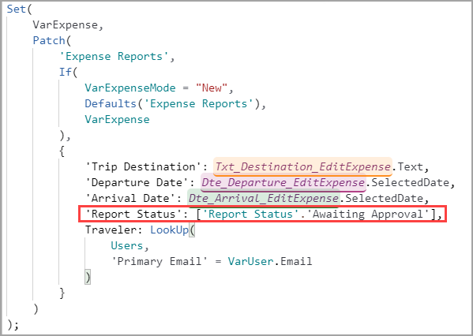
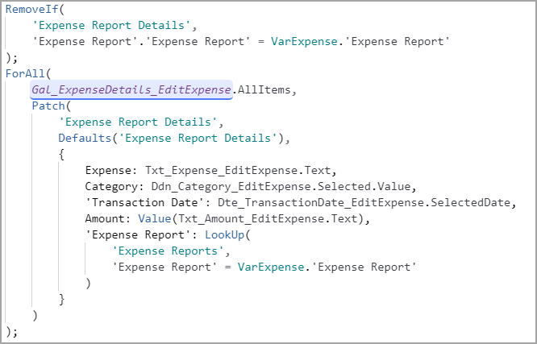
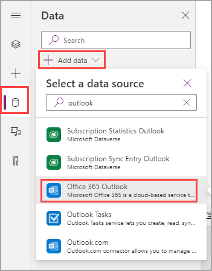

> [!VIDEO https://www.microsoft.com/videoplayer/embed/RWQjJY]

Our next challenge to tackle is the **Submit** button and configuring that functionality. Fortunately, there are only a few minor differences between the **Save as draft** button logic and the **Submit** logic.

1. Copy the Patch() statement from the OnSelect property of **Btn_SaveAsDraft_EditExpense.**

1. Select **Btn_Submit_EditExpense** and paste the copied code in the **OnSelect** property.

1. Update the `'Report Status':['Report Status'.Draft]` portion of code to be `'Report Status':['Report Status'.'Awaiting Approval']`

    It should look like this:

   > [!div class="mx-imgBorder"]
   > [](../media/updated.png#lightbox)

   The rest of the code is still valid, and doesn't need to be modified. Since we don't need the logic for switching status or any edit versus new logic for the details, you can copy the **RemoveIf()** and **ForAll()** code to the **Submit** button as well.

   > [!div class="mx-imgBorder"]
   > [](../media/formula-3.png#lightbox)

   The only other action you need to take is to notify the supervisor (or whomever you would like). To add the extra functionality for notifying someone when an expense report is submitted, we're going to add the Office 365 Outlook data source and a few more lines of code.

1. On the left pane, select the **Data** tab and then select **Add data**.

1. Search for "**Outlook**" and then select **Office 365 Outlook**.

   > [!div class="mx-imgBorder"]
   > [](../media/add-data.png#lightbox)

   It will ask you to choose a connection or add a new one. This simply signs into your account. If you've already created a connection, use that one. Many new developers make a new connection for every app, which can get messy.

   Now that you've added Outlook as a data source, go back to your **Tree** view.

1. Add the following code to the end of your **OnSelect** property for **Btn_Submit_EditExpense**:

    ```powerappsfl
    ; Office365Outlook.SendEmailV2(
        VarUser.Email,
        "An Expense Report is Ready for Review",
        VarUser.FullName & " has submitted a new expense report for your review. Please visit the expense report app to see the details."
    )
    ```

    > [!NOTE]
    > Don't forget the semicolon at the beginning before starting your new function.

The function we're using here is calling Outlook as a data source. Outlook is a function-based data source, meaning you use it to call functions instead of returning tabular data like with Dataverse.

This function allows you to send an email from Power Apps simply by pressing a button. The information this function needs is:

- **Who is receiving the email**: `VarUser.Email`
- **The subject line**: `"An Expense Report is Ready for Review"`
- **The body of the email**: `VarUser.FullName & " has submitted a new expense report for your review. Please visit the expense report app to see the details."`

You can see in the body how we're combining text as we did for the dates on the All Expenses screen. You may also notice that the recipient for this email is the logged-in user, which is common for testing.

In production, you would need a way to tell who the supervisor of the logged-in user is. If your company keeps this information in your Azure Active Directory, you can connect it as a data source and find the supervisor. Otherwise, you may need a table to look up a user's manager or send all approvals to one person.

You can expand this email to include a lot more information. As a practice, try referencing some other fields to add more detail to your email.
