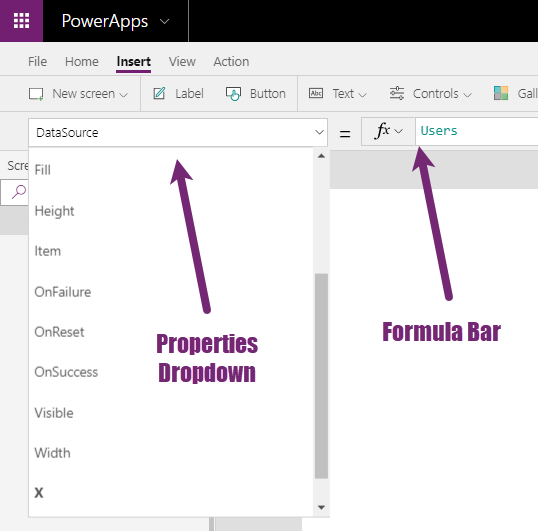

The **Form** control is used to work with an individual record
from a data source. Forms can be used to view, edit, and create records.

There are two types of form controls: **Edit Form** and **Display Form**. 
The **Edit Form** has the View, Edit, and New form modes. While
the **Display Form** only has the View form mode.

There is an added benefit of the **Form** control for the app maker.
When you add a **Form** control to your canvas, a panel helps you
add your data source, modify the view, choose the columns to be
displayed, and more. Forms are a very powerful addition to your
PowerApps skillset. Note, forms work with all data sources except collections.

Properties of a control
-----------------------

This section is not unique to the **Form** control but serves as a
reminder. At the top of the screen in the PowerApps Studio is the
**Properties** drop-down menu and the **Formula** bar. Both will be referenced
throughout the remainder of this module.

