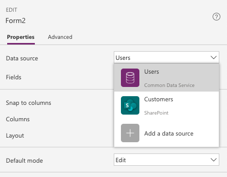
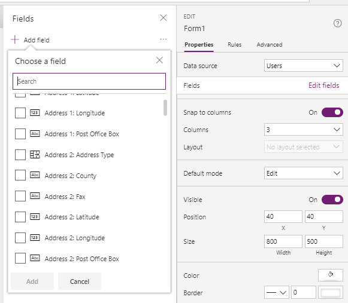
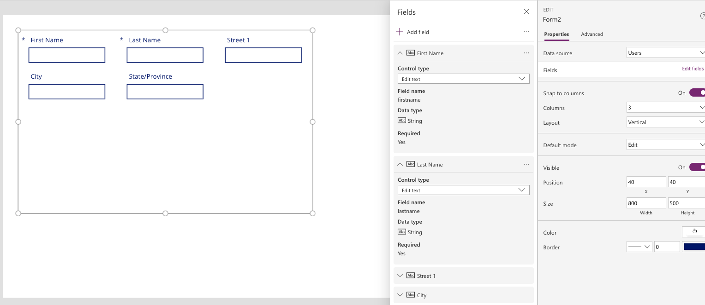
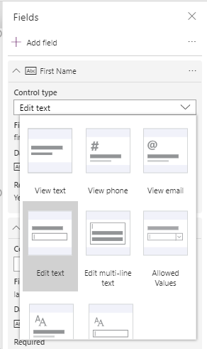
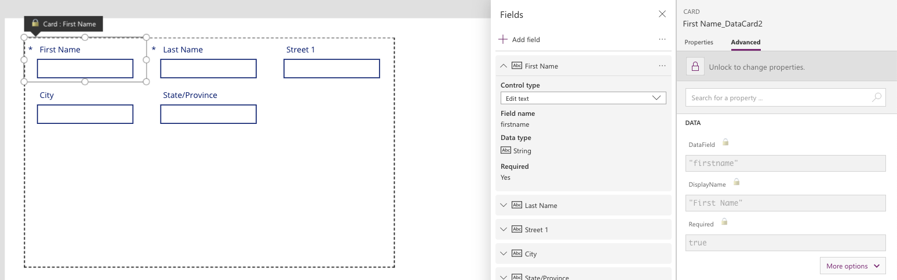
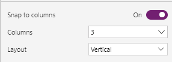
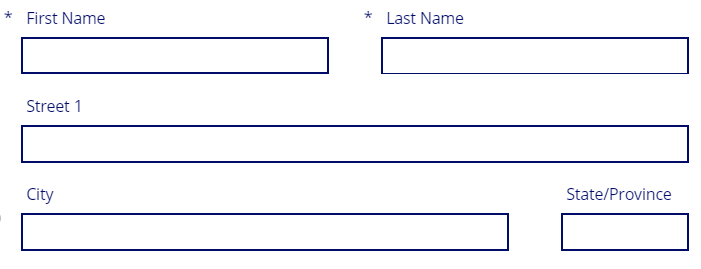
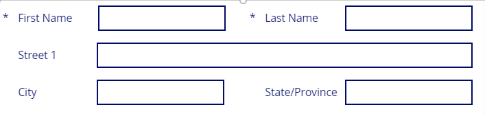

To get started with the **Edit Form** control, go to the **Insert** menu
and select **Forms**. You can choose from an **Edit** or
**Display** form. In most cases, it is recommended to choose an **Edit Form** in most. 
A **Display** form only allows you to view information and has
limited customization options. The **Edit** form allows you to do
everything that a **Display** form allows plus the form can also be used to
edit existing records and to create new records. Additionally, it is
fully customizable giving the app maker the ability to build your
solution. When in doubt, choose an **Edit** form.

After adding an **Edit Form** control to the canvas, the panel on the
right side of the screen will guide you through the configuration
process. The first step is to choose a data source. In the drop-down menu
labeled **None**, you can choose from an existing data
source or add a data source.

Adding fields
-------------

When you choose a data source, you can click on **Edit fields** and
**Add field** to select which fields you would like to display on the form.

By selecting one or more of the fields, the **Form** control will add a data
card for each field. Each card will be configured with a label to
display the field name, an input control for working with the data, and
other controls for handling error messages and required fields. The following is
an example of a form.

The **Form** control will automatically select the input control based on your field
type. For many fields, there are multiple options available. You can
change the **Control type** by clicking the drop-down menu for the field's
card and selecting one of the other options.

Note that when changing control types, additional configuration
may be required. For example, if you change a **Text** field from the
**Edit text** control type to **Allowed Values** you might need to
configure the values in the drop-down list. Before you can customize the
drop-down control inside the card, you will need to unlock the card.

Customizing a card
------------------

To unlock a card, select the card in the form and then from the **Card**
pane select **Advanced**. Click the **lock** icon. The card is now a
custom card, which allows you to modify all of the settings.

If after working with the custom card you decide that you want to return to
the original settings, you can delete the custom card and add the field
back to your form again. To do this, select the entire form,
click **Properties** on the **Edit** pane, click **Edit fields**, and
finding your custom card.

Select the ellipses **(...)** to the right and select **Remove**. Now you can
click **Add field** at the top and select the field again.

Designing the Form control
--------------------------

When designing a form, the first decision should be your form layout.

From the **Edit** pane you have three primary design controls: 
**Snap to Columns**, **Columns**, and **Layout**.

**Snap to columns** allows you to control if the cards on the form have
the width locked to the columns available in your form. For example,
if you choose a 4-column layout, then you can get your card and set its
width to 1, 2, 3, or 4 columns on your form. This gives you the flexibility
to provide more space for a field while working in fixed sizes.

Alternatively, you can turn off Snap to columns, and then set the
width of each card to any size you would like. The following is an example of a
drag-and-drop design of a form with a 4-column layout.

In this screenshot, **First Name** and **Last Name** are two columns,
**Street 1** is set to span all four columns, **City** uses three
columns, and **State/Province** uses one. With a few clicks of the
mouse, you can layout your forms in a logical manner. Using the 6 or 12
column layout gives you the most sizing flexibility and is preferred
over setting **Snap to columns** to **Off**.

The **Layout** option is set to **Horizontal** or **Vertical**. This will change
the default placement of the label. The following is an example of the previous
form with its Layout changed to horizontal, city and state/province set
to two columns, and some field resizing.

Additionally, you can reorder the cards by using drag-and-drop
functionality within the **Fields** pane to move fields up and down the
list. This will set the display order on your form. You can use the
ellipses **(...)** and select **Move up** and **Move down** for finer control.

Other customization options to consider that are outside the scope of
this module include:

-   Increasing or decreasing the vertical height of any card.
    Changing the height on one card will affect the whole row.

-   Adding a custom card to the form, allowing you to create blank
    space or other visual elements

Don't be afraid to try out different visual customizations to meet your
business needs. The following is an example of the previous form with some of
the design concepts applied.

Displaying a specific record in the form
----------------------------------------

Earlier in this module, you configured your form to use a data source.
Next, you need to configure the form to display the specific record that you
want to view or edit. To do this, you need to populate the **Item**
property of the form.

The two most common ways of returning a record are by connecting the
**Form** control to a **Gallery** control's selected property or by using a
**LookUp** function.

To use a **Gallery** control to specify the record, you will need to set the
**Gallery** control to use the same data source as the **Form** control. You can
confirm this by checking that the **Items** property of the **Gallery** control
is the same as the **DataSource** property of the **Form** control. Then, in the
**Item** property of the **Form** control you will set the value to be
**GalleryName.Selected.** In this example, replace "GalleryName" with
the name of your gallery. That is all that is required. Power Apps will
then display the selected record from the **Gallery** control in the **Form**
control if the **Form** control is in **View** or **Edit** mode.

If you are not using a **Gallery** control to display all of the records,
then you can use the **LookUp** function to query for the record that you
want to present in the form. An example of this is if you have stored
the record's ID in a variable named varID. Then in the **Item**
property, you would use a function such as LookUp(CustomerList, ID =
varID). This example assumes your data source is named CustomerList and
CustomerList is specified in the **DataSource** property of the **Form**
control, and the **Form** control is in **View** or **Edit** mode. 
