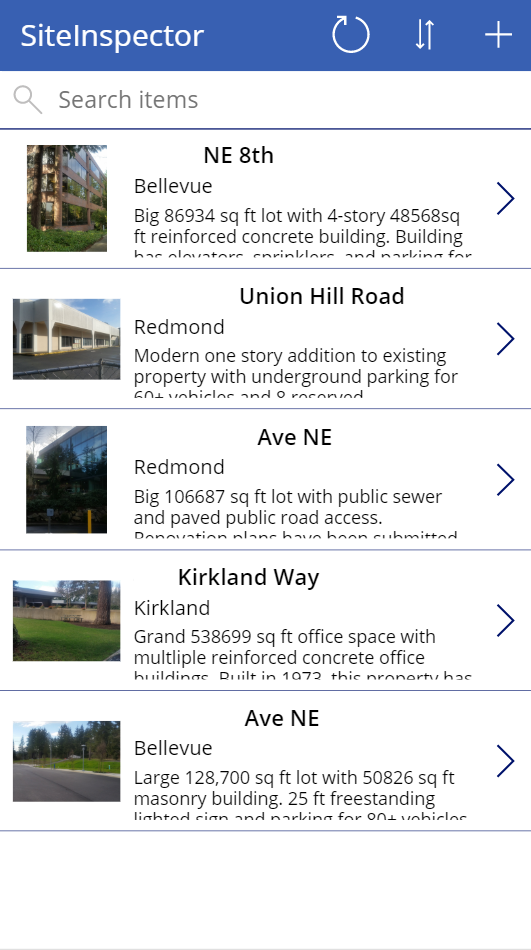
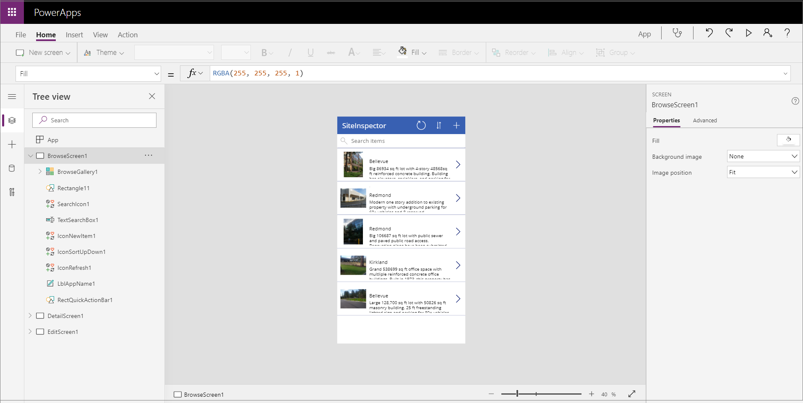
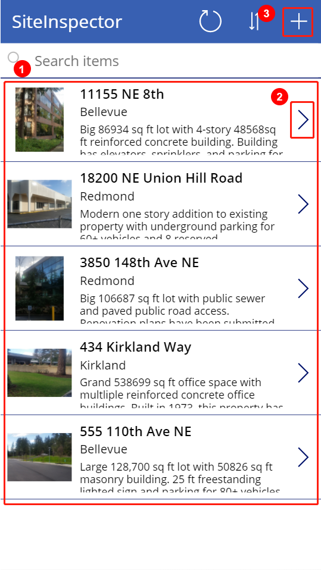
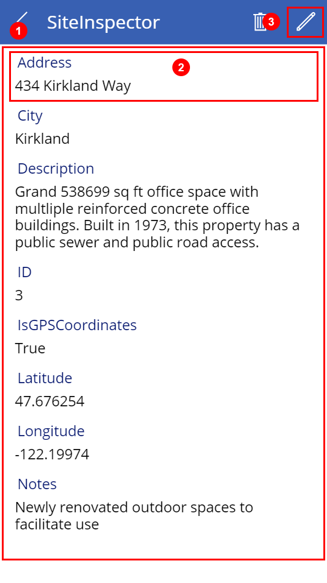
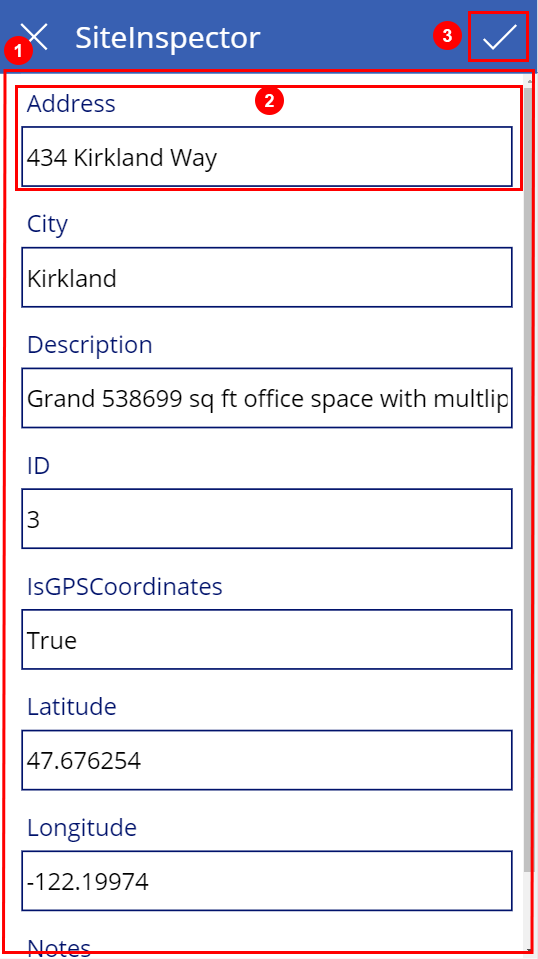
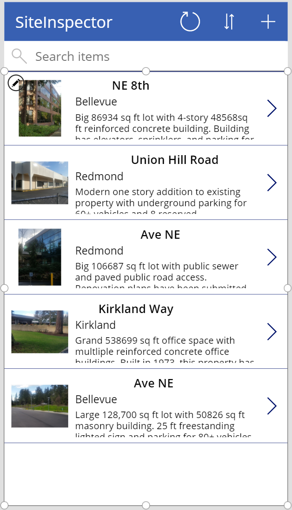
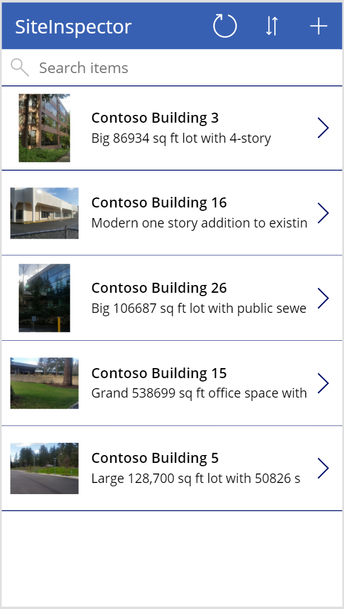
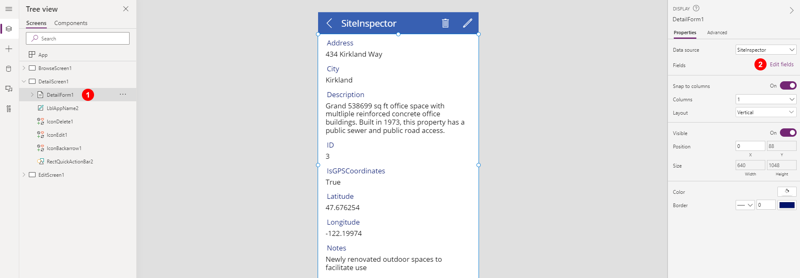
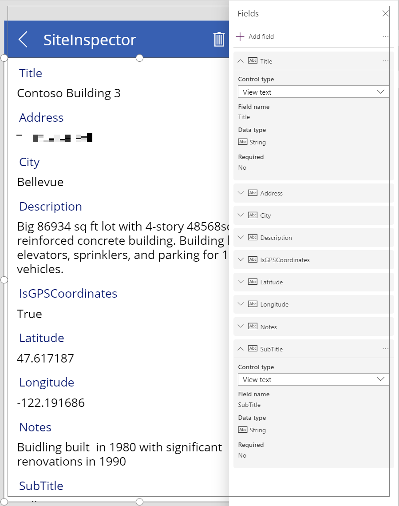
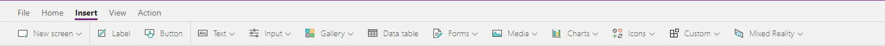

In this unit, you'll generate a mobile app where the data source is a Microsoft Excel workbook that's stored in Microsoft OneDrive for Business. This Excel workbook has a table of different buildings owned by Contoso Manufacturing. Today they must email the shared workbook between people as they travel to different locations to make updates. With a Power Apps mobile app, they will be able to view the buildings directly from their phones. In addition, they will also be able to edit the information and even add new buildings. 

This example uses Excel, but keep in mind that you can use data from many other sources, including the Common Data Service, Microsoft SharePoint, cloud services like Salesforce, and on-premises sources like Microsoft SQL Server. This gives you the flexibility to build your app from your data no matter where it lives. 

If you do not have a Power Apps account available, you can sign up for a free Power Apps Community Plan. This will allow you to learn and explore Power Apps in your own environment. For more information and to sign up go to [https://powerapps.microsoft.com/communityplan/](https://powerapps.microsoft.com/communityplan/)

## Connect to a data source

1. To connect to a data source, use the following procedure:

2. Download the [Contoso file](https://github.com/MicrosoftDocs/mslearn-build-app-solution/blob/master/downloads/Contoso-Site-Tracking.zip?raw=true), extract all of the files and save them to your OneDrive for Business.

3. Go to [https://make.powerapps.com](https://make.powerapps.com/) and sign in with your organizational account.

4. In the left pane, select **Create**.

5. Select **Other data** sources from the Start from data section.

6. Under Connections choose **OneDrive for Business**. If you don't have the connection available click New connection to create one.

7. For Choose an Excel file on the right select the **Contoso Site Tracking.xlsx** file.

8. For Choose a table click **SiteInspector** and click **Connect**.
    > [!div class="mx-imgBorder"]
    > 

Power Apps generates the app by inspecting your data and matching it with Power Apps capabilities so that you get a working app as a starting point. Generated apps are always based on a single list or table, but you can add more data to the app later.

## Explore the generated app

Your new three-screen app now opens in Power Apps Studio.

The following figure shows the main development window for Power Apps Studio, which you'll learn more about in later units.
    > [!div class="mx-imgBorder"]
    > 

Select Play [Start app preview arrow](../media/forward-arrow.png) in the upper-right corner to practice using the app. Notice that it includes all the data from the table and provides a good default experience.

All apps that are generated from data have the same set of screens that you can view from the Screens pane:

- **Browse screen** - This screen appears by default. In it, you can browse, sort, filter, and refresh the data from the data source. In the browse screen, you can add items to the data source by selecting the plus sign (**+**).

- **Details screen** - The details screen shows all information about a single item. In this screen, you can open an item to edit or delete it.

- **Edit/create screen** - In this screen, you can edit an existing item or create a new one.

To make your app visible on the phone, it needs to be saved. Select **File**, **Save as**. Replace the current title "App" with **Contoso Site Tracking app**, and then select **Save**. You will see a green check mark when all changes are successfully saved. You can now open the app on your phone.

## Install the app on your device

To see how the app runs on mobile, install the Power Apps Mobile app on your phone. When building an app, you should test it in the same form factor as your users.

1. Download Power Apps Mobile from the app store for the platform that you want to use.

2. Sign in by using your username and password.

3. On your phone or tablet, run the **Contoso Site Tracking app** in Power Apps Mobile. If you do not want to install the app, you can run it in a browser.

## Explore the app

Now that you have generated the Contoso Site Tracking app you should take a few minutes to click through the app and explore its design. Take note of how you use a Gallery to browse the records (rows) from the Excel file. Then when you click on a record you are taken to a different screen where a Form control displays the additional details. The app also includes the ability to edit those records or even make a new record. A very functional app to build upon. 

## Explore the browse screen
Each screen in the app has multiple controls, but one control takes up most of the screen space. The first screen in the app is the browse screen, which is named BrowseScreen1 by default.

Controls in the browse screen that you'll want to become familiar with include:

- **BrowseGallery1** - This control takes up most of the screen and shows data from your data source.

- **NextArrow1** - When this control is selected, it opens the details screen.

- **IconNewItem1** - When this control is selected, it opens the edit/create screen.
    > [!div class="mx-imgBorder"]
    > 

## Explore the details screen
The details screen is named **DetailScreen1** by default. Some of its controls are as follows:

- **DetailForm1** - This control contains other controls and contains a data card for each field of the record that is being displayed.

- **Title_DataCard1** - This is a card control. Each card represents a single field of the record. In this case, it shows the Title from the Site Inspector table, as shown in the previous unit.

- **IconEdit1** - When this control is selected, it opens the edit/create screen so that the user can edit the current item.
    > [!div class="mx-imgBorder"]
    >

## Explore the edit/create screen
The third screen in the app is **EditScreen1**. Some of its controls include:

- **EditForm1** - This control contains other controls and contains a data card for each field of the record that is being edited.

- **Address_DataCard2** - This is a card control that shows the address from the Site Inspector table, as shown in the previous unit.

- **IconAccept1** - When this control is selected, it saves the user's changes.
    > [!div class="mx-imgBorder"]
    >

## Customize the app
While the default screens make a useful app out of the box, you'll often want to customize a generated app to suit your needs.

The following sections cover basic changes for each screen in the app. You can do a lot more to customize an app, but the best way to start learning is to take a generated app and make common customizations. This will allow you to become familiar with the controls, layouts, and functions.

## Browse screen
The Contoso Site Tracking app already shows an image and some text for each product, but the layout could be better.
To improve the layout, use the following procedure:

1.	On the Screens pane on the left, select BrowseGallery1.
    The selection box around the gallery confirms your choice.
    > [!div class="mx-imgBorder"]
    >

2. On the right pane, open the Data pane by selecting the drop-down menu next to **Layout**.
    > [!div class="mx-imgBorder"]
    >

3. Select the layout **Image, title, and subtitle** for a cleaner look.

4. Select the **Address** of the item at the top of the gallery.
    > [!div class="mx-imgBorder"]
    >

5. Change **ThisItem.Address** to **ThisItem.Title** in the formula bar.

6. Repeat the previous two steps but change the other **Label** control to show the price of each item by setting it to **ThisItem.Description**.
   
   > [!div class="mx-imgBorder"]
   >

Changing the layout of a gallery and the types of data that it shows is that simple, and you might find that it's fun, too.

## Details screen

On the details screen, you want to change the order of the fields. The controls on this screen differ from the controls on the browse screen, so the process for changing them is also slightly different.

1. On the Tree view on the left, select **DetailScreen1 > DetailForm1**. This will change the screen shown in the studio.

2. On the right pane, select **Edit fields**.
    > [!div class="mx-imgBorder"]
    >

3. Click the **+ Add field** button at the top of the Fields section.

4. Here you can add any of the data source fields that were not added by default. Check the box next to **Title** and **SubTitle** and click **Add**.

5. Now you can rearrange the order by **clicking and holding on Title** and then **dragging** it to the **top** of the screen.

6. You can also remove fields that you don't want to display to the users like the ID column. From the list of Fields click **ID** to expand it, click the **…**, and choose **X Remove**.
    > [!div class="mx-imgBorder"]
    >

## Edit/create screen

On the screen where your users edit and create entries, you want to make it easier for them to enter information in a text box.

1. On the Tree view on the left, select **EditScreen1 > EditForm1**.

2. On the right pane, select **Edit fields**.

3. Expand **Description**. Select the drop-down arrow for the **Control type** and then select **Edit multi-line text**.
    > [!div class="mx-imgBorder"]
    >

4. A multi-line edit control will simplify your user's ability to add more than a few words in this field. You could also reorder the fields to match the order from the Details screen to give the user a more consistent experience.

A few basic steps can greatly improve the appearance and experience of using an app, and Power Apps Studio provides many options for customizing those apps.

## Controls in Power Apps

A control is a UI element that produces an action or shows information. Many controls in Power Apps are similar to controls that you've used in other apps: labels, text-input boxes, drop-down lists, navigation elements, and so on.

In addition to these typical controls, Power Apps has more specialized controls, which you can find on the **Insert** tab.
    > [!div class="mx-imgBorder"]
    >

A few controls that can add interest and impact to your apps include:

- **Galleries** - These controls are layout containers that hold a set of controls that show records from a data source.

- **Forms** - These controls show details about your data and let you create and edit records.

- **Media** - These controls let you add background images, include a camera button (so that users can take pictures from the app), a barcode reader for quickly capturing identification information, and more.

- **Charts** - These controls let you add charts so that users can perform instant analysis while they're on the road.

To see what controls are available, select the **Insert** tab, and then select each option in turn.