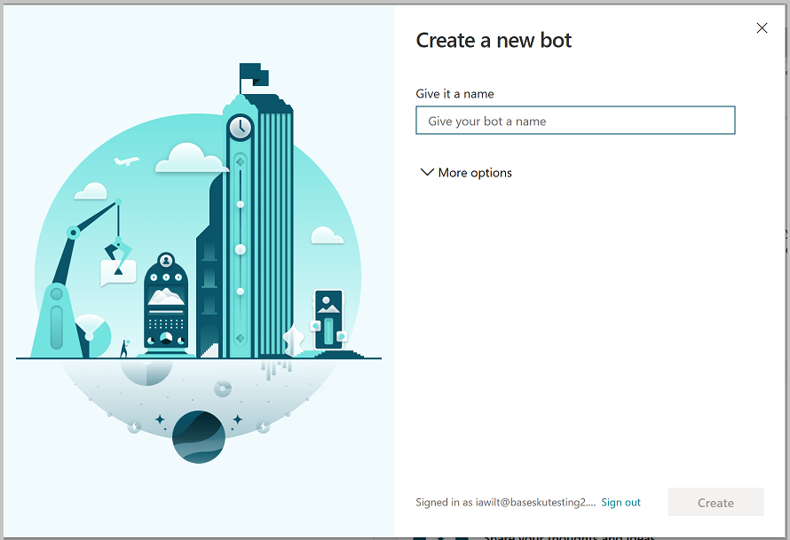
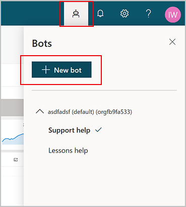
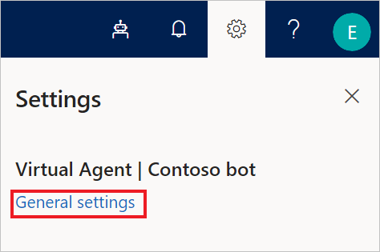

If you do not have a Power Virtual Agents set up already, go
to <https://aka.ms/TryPVA> in your browser to begin. Supported browsers include
Microsoft Edge, Chrome, and Firefox. On the website, select **Start Free**, and
then sign in with your work email address. Note that personal Microsoft accounts
are not currently supported.

1.  Next, you’ll choose a name for your chatbot. This can be something generic
    to your company or specific to the scenario you are tailoring your chatbot
    to.

    Your chatbot is created in the default Power Apps environment that was
    created for you when you signed up. For most users, this is sufficient.
    However, if you want to specify a custom Power Apps environment for your
    Power Virtual Agents, you can do so by expanding the **More options** menu
    and selecting a different environment.

    >[!NOTE]
    >Power Virtual Agents is supported only in the locations listed in the [supported data locations](https://docs.microsoft.com/power-virtual-agents/data-location) topic, with data stored in respective data centers. If your company is located outside of the supported data locations, you need to create a custom environment with **Region** set to a supported data location before you can create your chatbot.

    

2.  Once you select **Create**, the process of creating the first chatbot within
    a new environment can take up to 15 minutes. Subsequent bots will be created
    much faster.

3.  After a few minutes, you’ll land on the home page and have an opportunity to
    play around with the chatbot in read-only mode. You can't save any edits
    during this time, but you can explore the overall user interface, look at
    the topics, experiment with the preloaded User Topics and System Topics, and
    interact with your chatbot using the Test Canvas.

4.  When the chatbot creation process completes, the banner changes. You now
    have full functionality in the chatbot and can modify any User or System
    topic, test out your content changes, or deploy your bot.

## Create additional chatbots

If you have already created a chatbot, you can create a new chatbot by selecting the
icon on the title bar to open the **Bots** pane and then selecting **New bot**.

## Delete a chatbot

You can delete chatbots to remove them from your environment.

1.  Select the chatbot icon on the top menu bar, and then select the chatbot you
    want to delete.

2.  Select the **Settings** icon on the top menu bar, then select **General settings**.

    

3.  Select **Delete bot**.

You'll be asked to confirm the deletion of the bot, after which all chatbot
content is immediately deleted.

If your license has expired, you can delete your chatbot(s) by
selecting **Permanently delete your bots**.
