As mentioned earlier, a topic defines how a chatbot conversation plays out in Power Virtual Agents.

## Create a topic

1.  Go to the **Topics** tab on the side navigation pane to open the Topics
    page.

    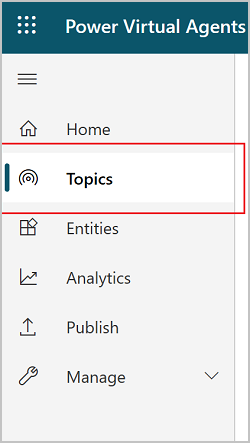

2.  On the topics page, select **New topic**.

3.  Specify a name, description, and one or more trigger phrases for the topic.

    A trigger phrase is a phrase that a customer enters in the chat window to
    start a conversation with the bot. Once the conversation is started, the
    conversation follows the path you define. You can specify more than one
    trigger phrase for a topic. You can include punctuation in a trigger phrase,
    but it is best to use short phrases rather than long sentences.

    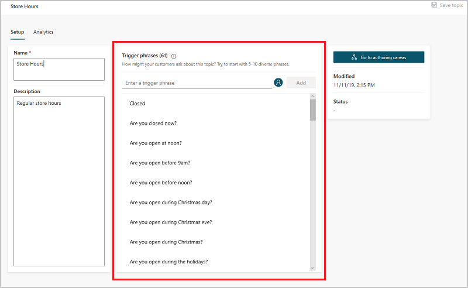

4.  Select **Save topic** to add the topic to the topics list.

> [!NOTE]
> You can have up to 1,000 topics in a bot.

## Design the topic's conversation path

1.  In the topic details for the topic you want to edit, select **Go to
    authoring canvas**.

    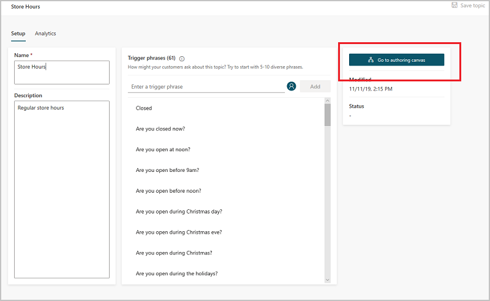

2.  Power Virtual Agents opens the topic in the authoring canvas and displays
    the topic's trigger phrases. The authoring canvas is where you define the
    conversation path between a customer and the bot.

3.  For existing or system topics, a number of nodes will automatically be
    created. You can edit these nodes just as you can for other nodes.

4.  When you create a new topic, the **Trigger phrases** node and a
    blank **Message** node are inserted for you.

5.  You can add additional nodes by selecting the **Plus** (**+**) icon on the
    line or branch between or after a node.

    

## Insert nodes

When adding a node, you can choose from five options. Each option has a specific
node or nodes that will be inserted into the conversation path.

You can:

-   Ask a question

-   Call an action

-   Show a message

-   Go to another topic

-   End the conversation

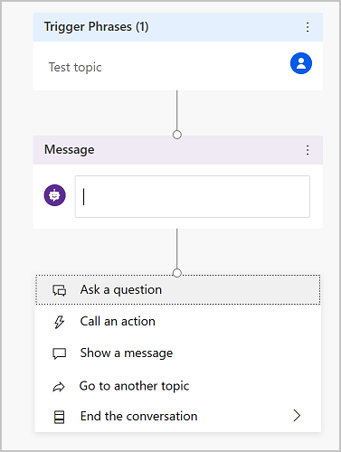

Additionally, you can **Branch based on a condition** when inserting a node
between existing nodes:

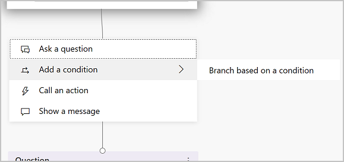

### Ask a question:

1.  To have the chatbot ask a question and get a response from the user,
    select **+** to add a node, and then **Ask a question** to add a
    new **Question** node.

    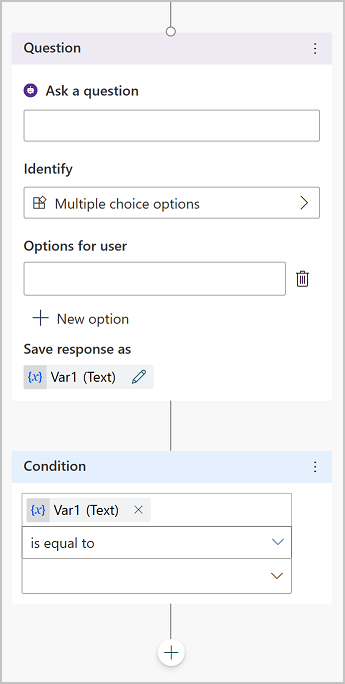

2.  Enter the question phrase in the first text box, **Ask a question**.

3.  You can choose from several options for the user’s response in
    the **Identify** field.

    These options determine what the chatbot should be listening for in the
    user's response.

    For example, they could be multiple choice options, a number, or a specific
    string.

    Choose **Multiple choice options**.

4.  Depending on what you choose in the **Identify** field, you can enter what
    options the user should have.

    For example, since you selected **Multiple choice options**, you can then enter
    the options the user can specify in the **Options for user** field. Each
    option is presented as a multiple choice button to the user, but users can
    also type in their answer in the bot.

    The conversation editor creates separate paths in the conversation,
    depending on the customer's response. The conversation path leads the
    customer to the appropriate resolution for each user response. You can add
    additional nodes to create branching logic and specify what the chatbot
    should respond with for each variable.

5.  You can save the user response in a variable to be used later.

### Call an action

You can call Power Automate flows by selecting **Call an action**.

>[!NOTE]
>Power Virtual Agents also enables you to extend your chatbot using Azure Bot Framework Skills. If you have already built and deployed bots in your organization (using Bot Framework pro-code tools) for specific scenarios, you can convert bots to a Skill and embed the Skill within a Power Virtual Agents bot.

### Show a message

1.  To specify a response from the bot, select **+** to add a node, and
    then **Show a message** to add a new **Message** node.

2.  Enter what you want the chatbot to say in the text box. You can apply some
    basic formatting, such as bold, italics, and numbering.

    You can also use variables that you have defined elsewhere in your chatbot
    conversation.

### Go to another topic

1.  To automatically have the chatbot move to a separate topic, select **+** to
    add a node, and then **Go to another topic**.

2.  In the flyout menu, select the topic the chatbot should divert to. For
    example, you might want to send the user to a specific topic about the
    closure of a store if they ask about store hours for that store.

    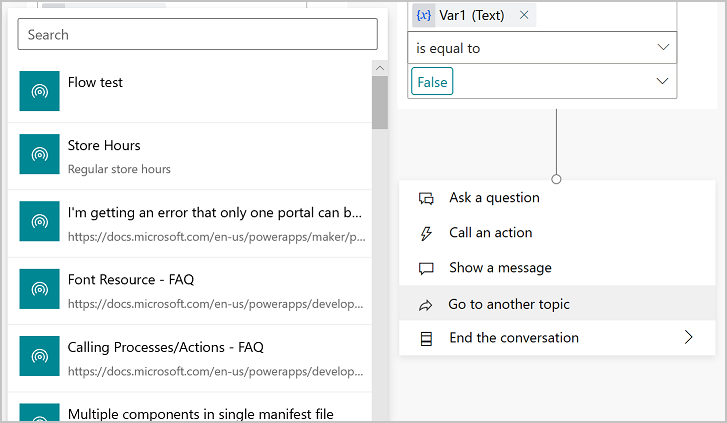

### End the conversation

When you end the conversation, you can have a survey appear that asks the user
if their question or issue was answered or resolved correctly. This information
is collected under the customer satisfaction analytics page.

You can also have the conversation handed over to a live agent if you're using a
suitable customer service portal, such as Omnichannel for Customer Service.

1.  At the end of a response that resolves the user's issue or answers the
    question, select **End the conversation**.

    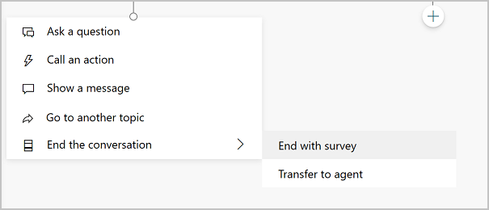

2.  To end with a customer satisfaction survey, select **End with survey**.

    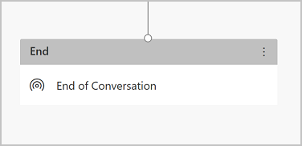

3.  Select **Transfer To Agent** to insert a hand-off node that will link with
    your [configured hand-off
    product](https://docs.microsoft.com/power-virtual-agents/configuration-hand-off-omnichannel).
    You can also enter a private message to the agent.

    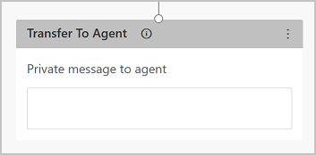

### Branch based on a condition

1.  To add branching logic based
    on [variables](https://docs.microsoft.com/power-virtual-agents/authoring-variables),
    select **+** to add a node, and then **Add a condition** and **Branch based
    on a condition**.

2.  Choose the variable you want to use to determine if the chatbot conversation
    should branch at this point. For example, if you have set up [end-user
    authentication](https://docs.microsoft.com/power-virtual-agents/advanced-end-user-authentication),
    then you might want to specify a different message if the user is signed on
    (which may have happened earlier in the conversation).

    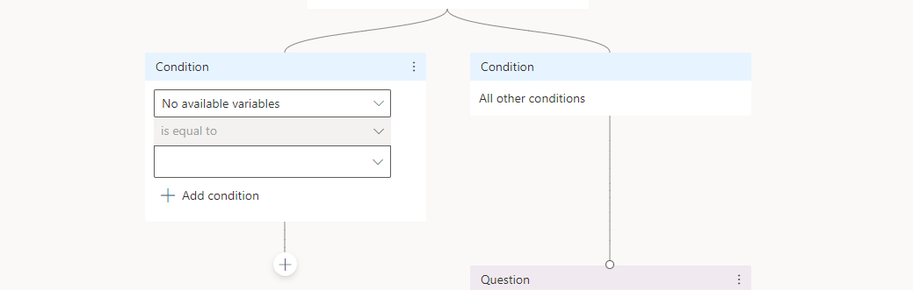

### Delete nodes

1.  Select the menu icon on the top of the node's title.

2.  Select **Delete**.

    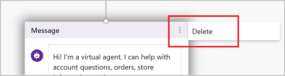
