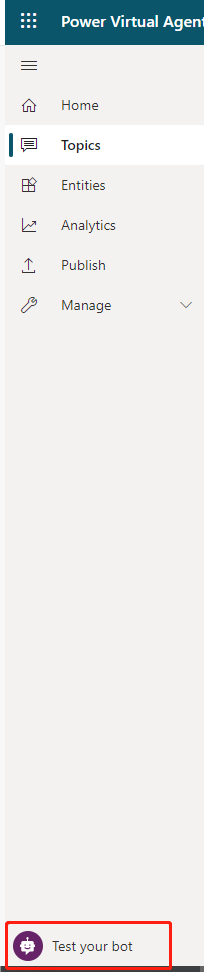
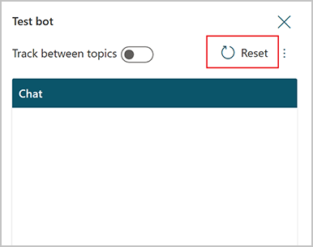
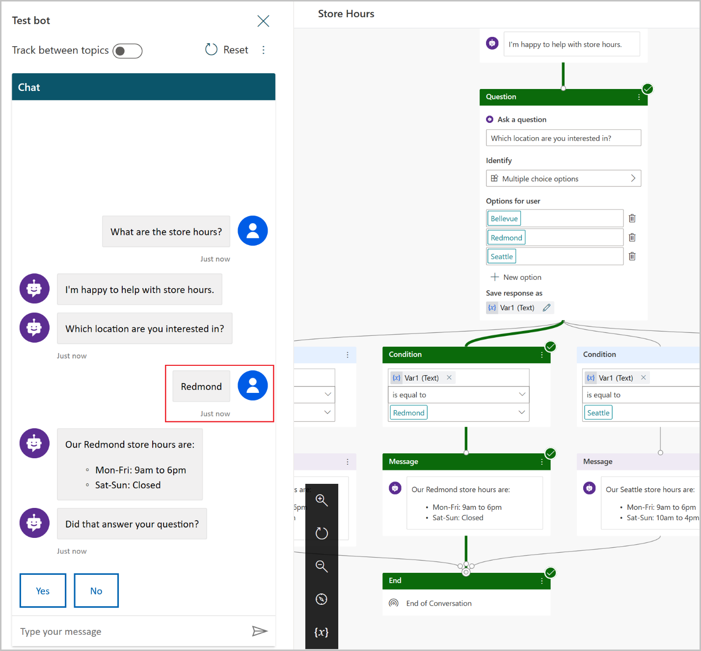
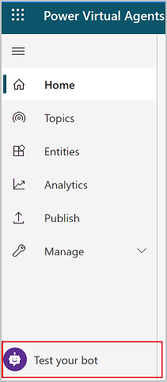
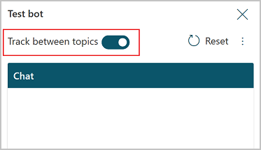

As you design your chatbot in Power Virtual Agents for Customer Service, you can
use the **Test bot** pane to see how the chatbot leads a customer through the
chatbot conversation.

To help you find and fix unexpected behavior, you can enable tracking between
topics to take you through the chatbot conversation step-by-step, and go to the
corresponding node in the authoring canvas.

## Test a topic in the Test bot pane

1.  If the **Test bot** pane is hidden, open it by selecting **Test your bot**.

    

2.  It's a good idea to select **Reset** at the top of the **Test bot** pane to
    clear previous conversations. Clearing previous conversations makes it
    easier to see the flow of the topic you want to see without getting confused
    by previous conversations.

    

3.  At the **Type your message** prompt at the bottom of the **Test bot** pane,
    enter a trigger phrase for the topic.

    The trigger phrase starts the topic's conversation and the **Test bot** pane
    displays the chatbot responses and user response choices you specified.

4.  Continue the conversation, testing that it flows as designed in the topic.

5.  Select a response in the **Test bot** pane, which will take you to the
    response in the conversation editor for that topic. The authoring canvas
    displays highlighted nodes in green.

You can return to the authoring canvas for the topic at any time to revise its
conversation path. The **Test chat** pane will automatically refresh itself when
you save changes to a topic.

## Track through the topic's conversation path

As you fine-tune your bot, it can be useful to enable tracking between topics so
you can follow through the conversation path step by step.

1.  If the **Test bot** pane is hidden, open it by selecting **Test your bot**.

    

2.  At the top of the **Test bot** pane, set **Track between topics** to **On**.

    

3.  Enter a trigger phrase for the topic you want to check, and then continue
    testing the conversation.

4.  As you move through the conversation in the **Test bot** pane, the authoring
    canvas highlights the current place in the conversation path. The authoring
    canvas displays highlighted nodes in green.

5.  To navigate to an earlier place in the conversation path in the authoring
    canvas, select it in the **Test bot** pane.

If the conversation path in the **Test your bot** pane moves from one topic to
another topic, the authoring canvas refreshes and moves between topics to the
appropriate highlighted nodes.
