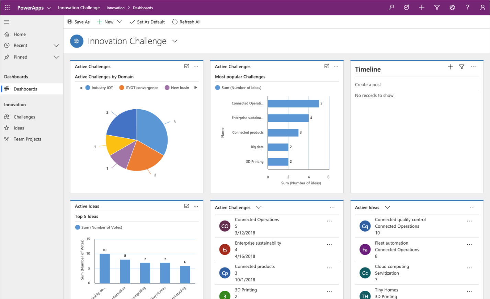

Model-driven app design is a component-focused approach to app development.
Model-driven app design does not require code, and the apps you make can be
simple or very complex. Unlike canvas app development, where the designer has
complete control over app layout, much of the layout is determined for you with
model-driven apps and largely designated by the components you add to the app.

## The approach to making model-driven apps

Model-driven apps have three design phases:

1.  Model your business data

2.  Define your business processes

3.  Build the app

### Model your business data

Model-driven design uses metadata-driven architecture so that designers can
customize apps without writing code. To model business data, you determine what
data the app will need and how that data will relate to other data. Metadata
means *data about data* and defines the structure of the data stored in Microsoft Dataverse.

### Define your business processes

Defining and enforcing consistent business processes is a key aspect of
model-driven app design. Consistent processes help ensure that your app users
can focus on their work and not worry about having to remember to perform a set
of manual steps. Processes can be simple or complex, and they often change over
time.

### Build the app

After modeling data and defining processes, you build your app by selecting and
setting up the components you need in the App Designer.

