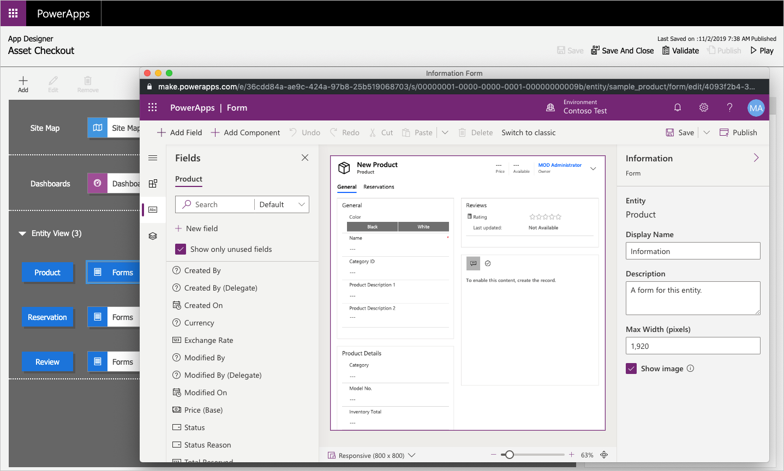
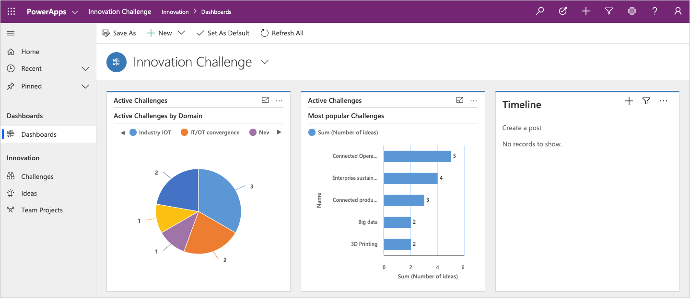

A model-driven app consists of several components that you select by using the
App Designer. The components and component properties become the metadata. Let's
look more closely at these components.

## Data

The table below shows the different data components that can make up a model-driven app which can determine what data the app will be based upon. It also shows what designer is used to create or edit the data component. 

**DATA**

| **Component**    | **Description**                                                                                                                                                                                                                                                                                                                                                                           | **Designer**    |
|------------------|-------------------------------------------------------------------------------------------------------------------------------------------------------------------------------------------------------------------------------------------------------------------------------------------------------------------------------------------------------------------------------------------|-----------------|
| Table            | Tables are items with properties that you track. Examples include contacts and accounts. Many standard tables are available. You can customize a non-system standard table (or production table). You can also create a custom table from scratch.                                                                                                                                 | Table designer |
| Column           | Columns are properties that are associated with a table and help define that table. A column is defined by a data type, which determines the type of data that can be entered or selected. Examples of data types include text, number, date and time, currency, and lookup (which creates a relationship with another table). Columns are typically used in forms, views, and searches. | Table designer |
| Relationship     | Relationships define how tables can be related to each other. There are 1:N (one-to-many), N:1 (many-to-one), and N:N (many-to-many) relationships. For example, adding a lookup column to a table creates a new 1:N relationship between the two tables and lets you add that lookup column to a form.                                                                               | Table designer |
| Choice           | This type of column shows a control that lets the user select among predefined options. Each option has a number value and a label. Choice columns can require either a single value or multiple values.                                                                                                                                                                                | Table designer |

## User interface

The table below shows the user interface components which determine how users will interact with the app and what designer is used to create or edit the component.

**USER INTERFACE**

| **Component**      | **Description**                                                                                                                                                                                 | **Designer**      |
|--------------------|-------------------------------------------------------------------------------------------------------------------------------------------------------------------------------------------------|-------------------|
| App                | Apps determine the app fundamentals, like components, properties, the client type, and the URL.                                                                                                 | App designer      |
| Site map           | A site map specifies the navigation for your app.                                                                                                                                               | Site map designer |
| Form               | Forms include a set of data entry columns for a given table. A form can be used to create a new data row or edit an existing one.                                                                         | Form designer     |
| View               | Views define how a list of rows for a specific table appears in your app. A view defines the columns shown, the width of each column, the sorting behavior, and the default filters.            | View designer     |

## Logic

The logic components determine what business processes, rules, and automation
the app will have. Microsoft Power Apps makers use a designer that is specific
to the type of process or rule they are needing.

**LOGIC**

| **Type of logic**     | **Description**                                                                                                                                                                                                                                                                               | **Designer**                   |
|-----------------------|-----------------------------------------------------------------------------------------------------------------------------------------------------------------------------------------------------------------------------------------------------------------------------------------------|--------------------------------|
| Business process flow | Business process flows walk users through a standard business process. Use a business process flow if you want everyone to handle customer service requests the same way. Or you can use a business process flow to require staff to gain approval for an invoice before submitting an order. | Business process flow designer |
| Workflow              | Workflows automate business processes without a user interface. Designers use workflows to initiate automation that does not require any user interaction.                                                                                                                                    | Workflow designer              |
| Actions               | Actions are a type of process that lets you manually invoke behaviors, including custom actions, directly from a workflow.                                                                                                                                                                    | Process designer               |
| Business rule         | Business rules apply rules or recommendation logic to a form to set field requirements, hide or show fields, validate data, and more. App designers use a simple interface to implement and maintain fast-changing and commonly used rules.                                                   | Business rule designer         |
| Flows                 | Power Automate is a cloud-based service that lets you create automated workflows between apps and services to get notifications, sync files, collect data, and more.                                                                                                                          | Power Automate                 |

## Visualization

The visualization components determine what type of data and reporting the app will show and have available and which designer is used to create or edit that component.

**VISUALIZATION**

| **Component**               | **Description**                                                                                                                                       | **Designer**                                                      |
|-----------------------------|-------------------------------------------------------------------------------------------------------------------------------------------------------|-------------------------------------------------------------------|
| Chart                       | Charts are individual graphical visualizations that can appear in a view or a form or that can be added to a dashboard.                               | Chart designer                                                    |
| Dashboard                   | Dashboards show one or more graphical visualizations in one place that provide an overview of actionable business data.                               | Dashboard designer                                                |
| Embedded Microsoft Power BI | Power BI adds embedded Power BI tiles and dashboards to your app. Power BI is a cloud-based service that provides business intelligence (BI) insight. | A combination of chart designer, dashboard designer, and Power BI |

Some examples of visualizations in a model-driven app:

