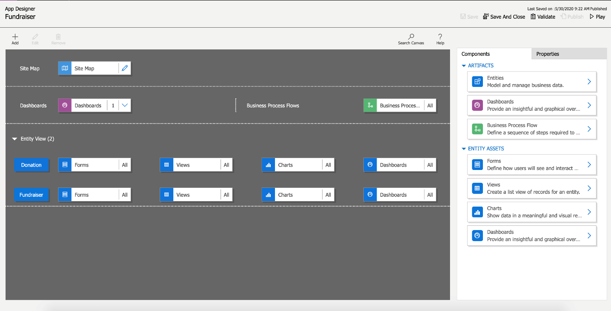
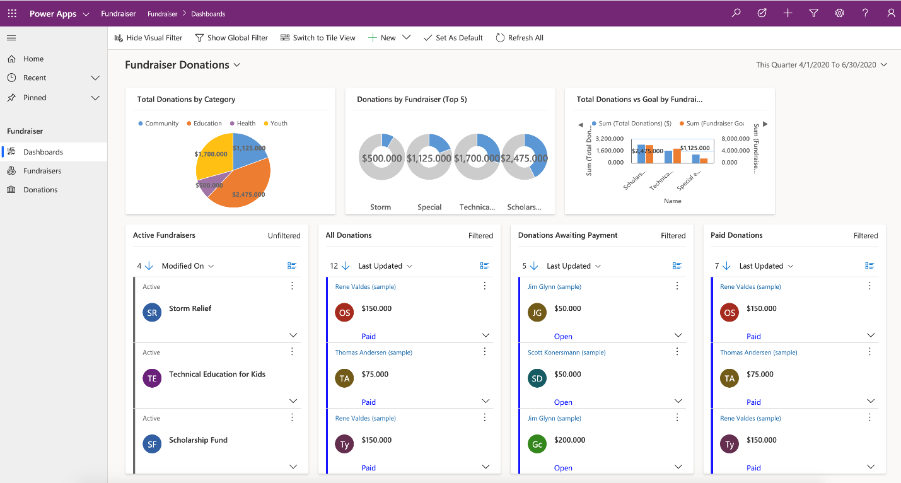
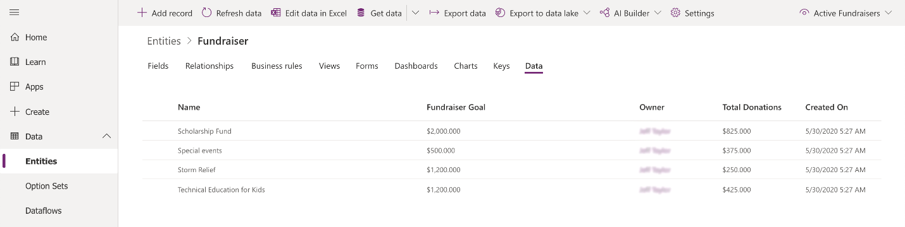
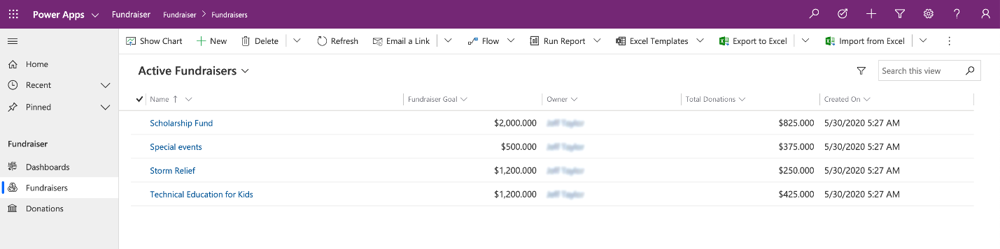
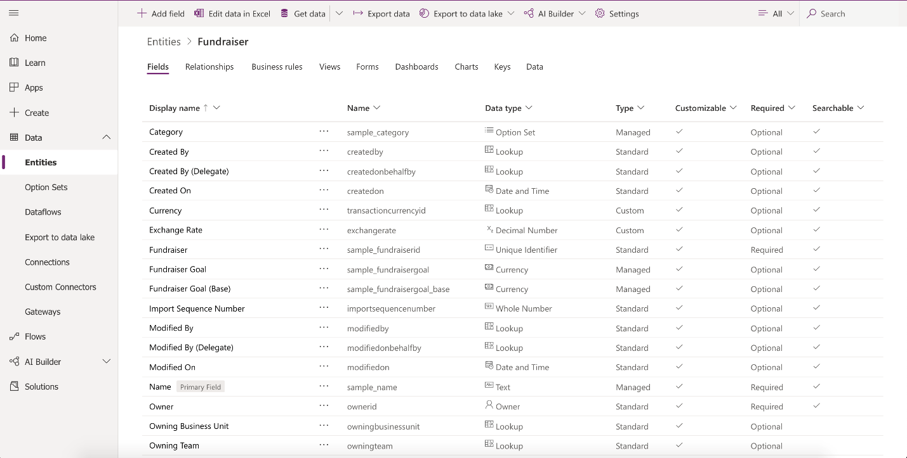

Here is a quick look at the App Designer for an example Model-driven app called
“Fundraiser.” As you can see, there are two tables: Donation and Fundraiser. Each table also contains four assets:
* **Forms** – Defining how users will see and interact with the data

* **Views** – A list view of the rows for each table

* **Charts** - Showing the data in a meaningful, visual representation

* **Dashboards** – Providing an insightful, graphical overview of the data

By selecting the Play button in the top right, the app is put into **Play mode**. 
You can see it then looks completely different and shows the data based
on the choices made in the design process.

## Understand the needs of the user

With model-driven apps, the name says it all. Your primary design goal is to get
your Microsoft Dataverse data model in order. With that in place, you can
connect Power Apps, and a model-driven app will be created for you from that
model.

Model-driven apps are created using the App Designer. You will choose the
entities, dashboards, business process flows, forms, and other components that
you want to make available in your app, and then the app will be created for
you. This means you will need to spend more time understanding what your user
needs than how it is going to look.

### Data model

As you begin the data modeling process, there are a couple of important
questions to ask yourself:

-   What type of data will your solution be storing and or collecting?

-   How will this data relate or coincide with the other data you are working with?

These questions are important when designing a model-driven application because
of how model-driven applications function. Remember, model-driven applications
use a metadata-driven architecture. This means a large portion of the
model-driven app is based on how your data is modeled, and there is no need to
write custom code to alter the app design.

You can view the app metadata by reviewing the Table in Microsoft Dataverse.

You can also view the app **Play mode** to see a preview of what the app will
look like.

In the example above, for the Fundraiser table, there are several pieces of
data being collected, such as:

* Name

* Fundraiser Goal

* Owner

* Total Donations

* Created On

As you think about your data model, also think about data types. When adding
columns to your table in Microsoft Dataverse, the data type you choose will
determine how users enter and view that in your model-driven app. Choices
show as dropdowns, currency shows with currency symbols, while decimal numbers
don’t. These little changes in the table can have a profound effect on how your
user experiences your app.

The screenshot below shows examples of columns and the different data types they
could have using the Fundraiser example again.

> [!IMPORTANT]
> If a column needs to be changed to a different data type, (i.e. text column
to a choice column), then you will need to delete that column and recreate with the
correct data type. This will cause you to lose any data associated with that
column.

### Business Logic

When incorporating business logic in your app, there are two primary options
available. You can set **Business Rules** on your Microsoft Dataverse tables
or you can build **Business Process Flows**.

With **Business Rules,** you will define behaviors at the data layer. This is
great for setting conditions for when a field is required, setting a default
value, or even showing or hiding a field based on criteria. An example could be
a table for tracking expenses. You could have a column for type of travel and
then build a business rule that dictates that if a user chooses automobile then
the mileage field is required, else it is optional. This gives you the power to
make sure you maintain data consistency in all scenarios.

**Business process flows** are used to guide users through using your app. These
workflows can provide visuals on next steps based on the status of the data and
facilitate other actions that you want to occur as the user uses the app.
Business Process Flows let you bring automation to your app and make it more of
a guided experience than just a place to enter data. If you would like to go more in-depth 
with Business Process Flows check out this additional Microsoft Learn module: 
https://docs.microsoft.com/learn/modules/work-with-business-process-flows-dynamics-365/

### Dashboards

A common output need for apps is to visualize the data. For this requirement,
you can implement dashboards with custom filters and visual graphics to tie all
this data together right in your app. When creating your dashboards, make sure
they are simple for your users to consume without overwhelming them with all the
data. Provide high-level snapshots of your data and allow them to use filters to
dive deeper into the data if needed.

### Additional third-party solutions and app accelerators

It is also important to know about the different App accelerators and
third-party solutions available to you. Depending on the industry you are in,
Health, Financial, Banking, Education, Non- Profit, Automotive, or Media,
Microsoft has released a number of accelerators or foundational components to
assist you with quickly standing up your solution. For more information,
see [Industry accelerators overview](/common-data-model/industry-accelerators?azureportal=true).
