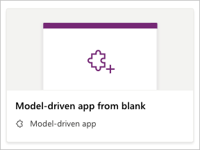
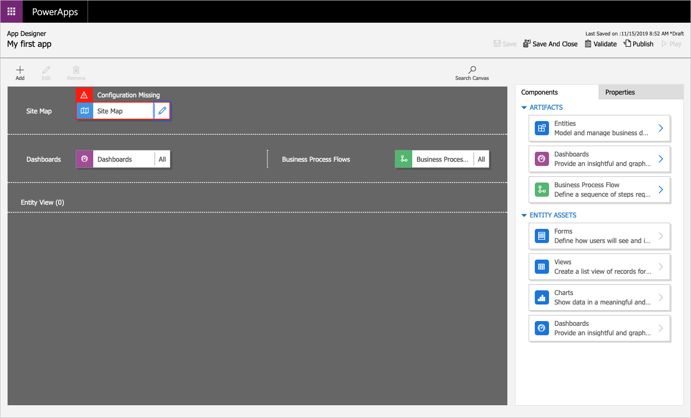
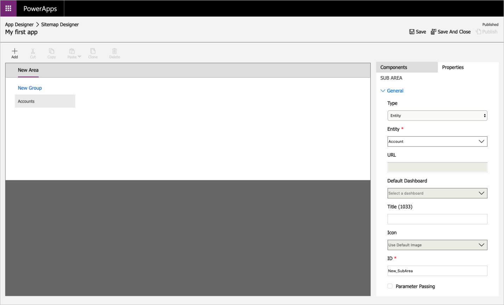
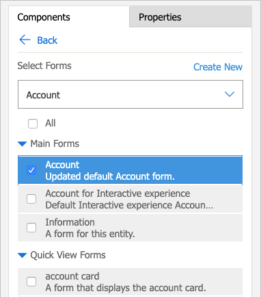
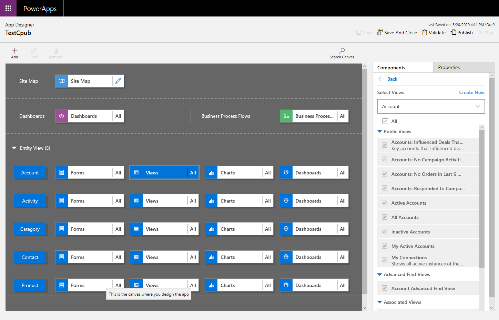
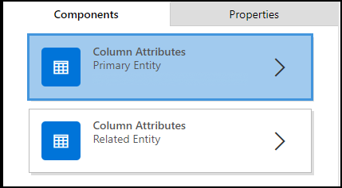
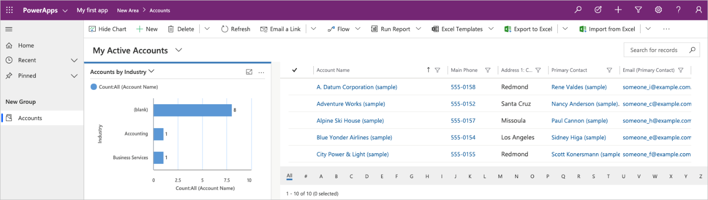

In this unit, you will create a model-driven app by using one of the standard
entities that is available in your Microsoft Power Apps environment.

## Create a model-driven app

1.  Sign in to [Power Apps](https://make.powerapps.com/) by using your
    organizational account.

2.  Select the environment you want, or go to the [Power Apps admin
    center](https://admin.powerapps.com/) to create a new one.

3.  On the **Home** page, select **Model-driven app from blank**.

4.  Click **Create**.

    

5.  On the **Create a New App** page, enter a name and description for the app.

6.  Select **Done**. Your new app appears in the App Designer, and you can now
    add components to it.

## Add components to your app

You add components to your app by using the App Designer.

1.  Select the **Open the Site Map Designer** pencil icon to open the site map
    designer.

    

2.  In the site map designer, select **New Subarea**, and then, in the right
    pane on the **Properties** tab, select the following properties:

    -   **Type**: *Entity*

    -   **Entity**: *Account*

        

3.  Select **Save And Close**.

4.  In the App Designer, select **Forms**, and then, in the right pane
    under **Main Forms**, select the **Account** form.

    

5.  In the App Designer, select **Views**, then select the following properties:

    -   Active Accounts

    -   All Accounts

    -   My Active Accounts

6.  In the App Designer, select **Charts**, then select the **Accounts by Industry** chart.

7.  On the App Designer toolbar, select **Save And Close**.

## Create a form

1.	On the left navigation pane, expand **Data**, and then select **Tables**.

2.	Select a table, such as the account table, and then select the **Forms** tab.

3.	Select **Add form**, and then select one of the following
    *	**Main form**
            The contents of the new form are filled using the existing main form definition. If multiple main forms exist, the form at the top of the list in the form order is used to fill the new form.
    
    *   **Quick create form**
 	
    *   **Quick view form**

4.	When you are done making changes to the form, select **Save** to save the form.

## Edit a form

1.	On the left navigation pane, expand **Data**, and then select **Tables**.

2.	Select a table, such as the account table, and then select the **Forms** tab.

3.	Select the form name that you want to edit.

    *   You can also select the row for a form, and then in the command bar, select **Edit form**

    *   Another alternative is to select **...** next to the form name, and then in the menu, select **Edit form**.
    
4.	When you are done making changes to the form, select **Save** to save the form.

## Open and add a view in the app designer
The following steps explain how to open and add a view in the app designer.

1.	In the app designer **Entity View** section, select **Views**.
    *   In this example, we have selected **Views** from the **Account** table.

    

2.	To add a view, select it by using view types such as Public, Advanced Find, Associated, and Lookup. The view is automatically added to the **Views** list.

    > [!NOTE]
    > Views are displayed based on the table that you have selected. For example, when you select Account, views that are related to the Account table are displayed.

For more information about the app designer visit [Design custom business apps by using the app designer](https://docs.microsoft.com/powerapps/maker/model-driven-apps/design-custom-business-apps-using-app-designer)

## Add a column to your view in app designer

Views display rows and columns in a table. Each row is a record with columns you add to the view.

1.	In app designer, select the entity view that you want and then on the right pane next to the view that you want select edit (pencil button).

2.	On the **Components** tab, select the **Column Attributes** list for either the **Primary Entity** or **Related Entity**.

    

3.	From the list, select the column you want and drag it to the column heading. You can also add the column by double-clicking it.

4.	Repeat step 3 until you have added all the columns you want to display in your view.

As you add columns, you can drag them to any position among existing column headings. You can also move columns around after you add them to your view.

For more detailed options on creating and editing views visit https://docs.microsoft.com/powerapps/maker/model-driven-apps/create-edit-views-app-designer 

## Publish your app

On the App Designer toolbar, select **Publish**. After you publish the app, it
is ready for you to run or share with others.

Above My Active Accounts, select **Show Chart**.

If the sample data for your accounts does not have an Industry populated, go
into a few accounts and add an Industry. Once you have updated a few accounts
with an industry, the chart will update as well.

