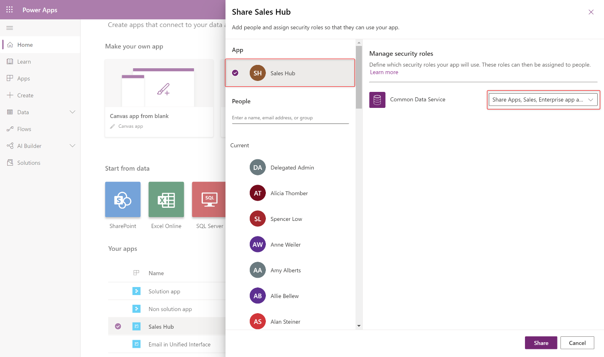
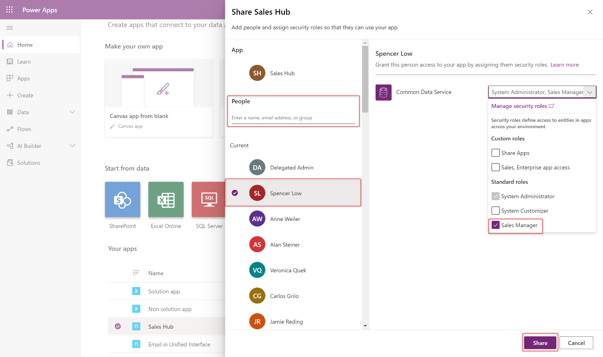
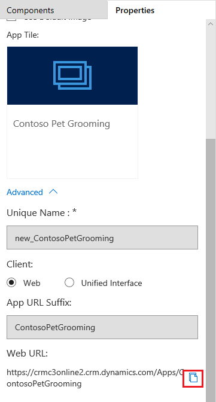

Microsoft Power Apps use role-based security for sharing. A security role
includes privileges that define a set of actions that can be performed in the
app. All app users must be assigned to one or more predefined or custom security
roles.

Roles can be assigned to individual users or to teams. When a user or a team is
assigned to a role, that user or all members of that team are granted the set of
privileges associated with the role.

To share an app, you must have the Environment Admin or System Admin role.

## Create or set up a security role

The Power Apps environment includes predefined security roles. These roles
reflect common user tasks, and the access levels that are defined follow the
security best practice of providing access to the minimum amount of business
data that is required to use the app.

Apps can be based on a custom table. Because
the table is custom, privileges must be explicitly specified before users can
work in it. To do this, you can use either of the following approaches:

-   Expand an existing predefined security role so that it includes privileges
    for rows that are in the custom table.

-   Create a custom security role to manage privileges for users of the app.

Security roles control a user's access to data through a set of access levels
and permissions. The combination of access levels and permissions that are
included in a specific security role sets limits on the user's view of data and
interactions with that data.

One or more security roles must be assigned to the app. The apps that users can
use depend on the security roles they are assigned to.

The following predefined roles are available with a Power Apps environment.
Unless otherwise noted, all the privileges have global scope.

| **ABOUT PREDEFINED SECURITY ROLES** |                                                                         |                                                                                                                                                                                                                                                                                                                                                                                                                           |
|-------------------------------------|-------------------------------------------------------------------------|---------------------------------------------------------------------------------------------------------------------------------------------------------------------------------------------------------------------------------------------------------------------------------------------------------------------------------------------------------------------------------------------------------------------------|
| **Security role**                   | **Privileges**                                                          | **Description**                                                                                                                                                                                                                                                                                                                                                                                                           |
| Environment Maker                   | None                                                                    | Users who have this role can create new resources that are associated with an environment, including apps, connections, custom application programming interfaces (APIs), gateways, and flows that use Power Automate. But these users can't access the data in an environment. To learn more about environments, see [Announcing Power Apps environments](https://powerapps.microsoft.com/blog/powerapps-environments/). |
| System Administrator                | Create, Read, Write, Delete, Customize                                  | This role has full permission to customize or administer the environment, including creating, changing, and assigning security roles. User who have this role can view all data in the environment. To learn more, see [Privileges required for customization](/dynamics365/customer-engagement/customize/privileges-required-customization).                                             |
| System Customizer                   | Create (self), Read (self), Write (self), Delete (self), Customizations | This role has full permission to customize the environment. But users who have this role can view rows only for environment tables that they create. To learn more, see [Privileges required for customization](/dynamics365/customer-engagement/customize/privileges-required-customization).                                                                                       |
| Microsoft Dataverse User            | Read, Create (self), write (self), delete (self)                        | Users who have this role can run an app in the environment and perform common tasks for the rows they own.                                                                                                                                                                                                                                                                                                             |
| Delegate                            | Act on behalf of another user                                           | This role lets code run as or impersonate another user. This role is typically used with another security role to provide access to rows. To learn more, see [Impersonate another user](/powerapps/developer/data-platform/impersonate-another-user).                                                                                                              |

## Share the link to your app

Sharing a model-driven app involves two primary steps. First, associate one or
more security role(s) with the app, then assign the security role(s) to users.

1.  Visit [https://make.powerapps.com](https://make.powerapps.com/)

2.  Select a model-driven app and click **Share**.

3.  Select the app then choose a security role from the list.

    

4.  Search for a user

5.  Select the user, then select a role from the list.

    

6.  Click **Share**.

7.  Share the link to your app by following the steps below.

> [!NOTE] 
> Unlike sharing canvas apps, sharing model-driven apps does not currently send an email with a link to the app.

## Get the direct link to an app:

1.  Edit the app and click the **Properties** tab

2.  Copy the **Unified Interface URL.**

3.  Paste the app URL in a location so that your users can access it, such as by
    posting it on a SharePoint site or sending via email.

    