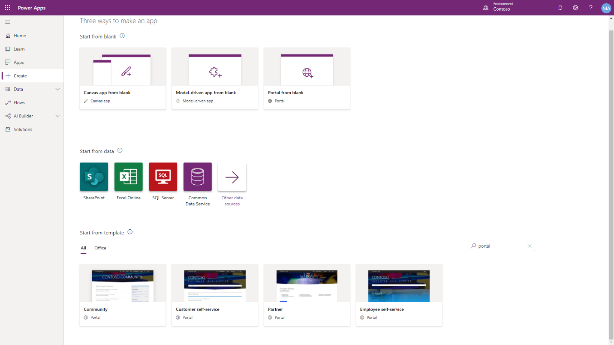

Businesses that have Dynamics 365 or a custom Microsoft Dataverse solution
already in place can quickly build portals that are more secure and build their
entire website, all without requiring developers.

A Power Apps portal is not automatically provisioned when a new Dataverse 
environment is created. You will need to provision a Power Apps portal
and determine the name, default URL, language, and template.

>[!IMPORTANT]
>   To provision a portal, you must be assigned the System Administrator role of the Microsoft Dataverse environment that is selected for the portal.

## Portal templates

When provisioning a Power Apps portal, the most important choices to consider
are the audience, workload, and choosing a specific portal template that would
best align with the business requirements.

Several portal templates are available that can be provisioned. These templates
will accelerate the configuration of portals based on the intended audience and
workload.

If you are building a custom business application by using Microsoft Dataverse
without Dynamics 365 apps enabled, your only choice is the **Portal from blank** option.

If you are using Microsoft Dynamics 365 apps such as Dynamics 365 Sales or
Dynamics 365 Service, you have a choice of five additional portal templates:

-   Community portal

-   Customer self-service portal

-   Employee self-service portal

-   Partner portal

-   Customer portal (Dynamics 365 Supply Chain Management)

>[!NOTE]
>Specific features and components a specific starter portal can be added to another starter portal, as required.

Make sure that you define the type of audience who will visit the new portal.
The audience will determine which options of portal you will be given.

**PORTAL TEMPLATES**

| **Portal template**   | **Audience**      | **Workload**                                                                                                                                                                                                                                                                                                                                                                                          |
|--|--|--|
| Community             | Partner, Customer | Choose this option to provision a portal that is focused on an online community. This portal will contain features such as forums, ideas, blogs, and case management.                                                                                                                                                                                                                                 |
| Customer self-service | Partner, Customer | This option provides the ability for portal users to search knowledge articles, submit cases, and participate in discussion forums to resolve issues.                                                                                                                                                                                                                                                 |
| Employee self-service | Employee          | This portal allows employees to access a centralized knowledge article and to also submit cases.                                                                                                                                                                                                                                                                                                      |
| Partner               | Partner           | Choose this option to build a portal where external partners can manage and collaborate on accounts and opportunities. Add-ons are available for Dynamics 365 Field Service or Dynamics 365 Project Service.                                                                                                                                                                                          |
| Customer portal       | Enterprise B2B    | The Dynamics 365 Supply Chain Management Customer portal is a template that provides portal access to Dynamics 365 Supply Chain Management data by using dual-write Microsoft Dataverse tables.                                                                                                                                                                                                       |
| Portal from blank     | Other             | The **Portal from blank** option is meant for unique line-of-business scenarios where the other templates are not a good fit. The portal can be configured to address a variety of requirements. If **Portal from blank** is provisioned within a Microsoft Dataverse environment, specific features from the other portals can be incorporated into the portal later. |

## Provision a portal

Only one Power Apps portals can be provisioned for each Microsoft Dataverse
environment.

The high-level steps to provision a starter portal are:

1.  Go to [https://make.powerapps.com](https://make.powerapps.com/).

2.  Select a target environment by using the environment selector in the upper-right corner.

3.  On the left menu, select **+ Create**.

4.  Select **Portal from blank**. If you have Dynamics 365 apps deployed in your Microsoft Dataverse environment, additional portal templates, such as Customer self-service, will be available.

5.  Provide a name for the portal.

6.  Provide a unique address (URL) for the portal.

7.  Select the language.

8.  Select **Create** to start the portal provisioning process. After portal provisioning has completed, the portal will appear in the list as an app of type Portal.

9.  Select the ellipsis (**...**) next to the portal app name and then select **Browse** to open the portal website.
