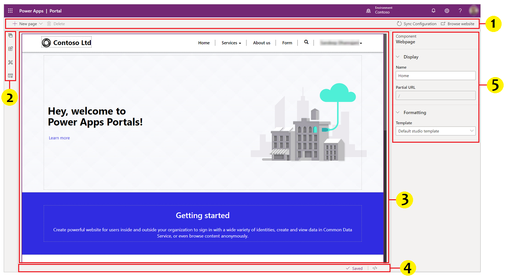
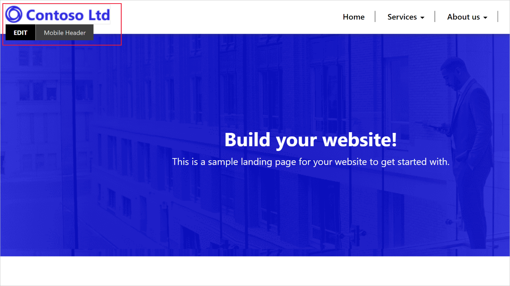
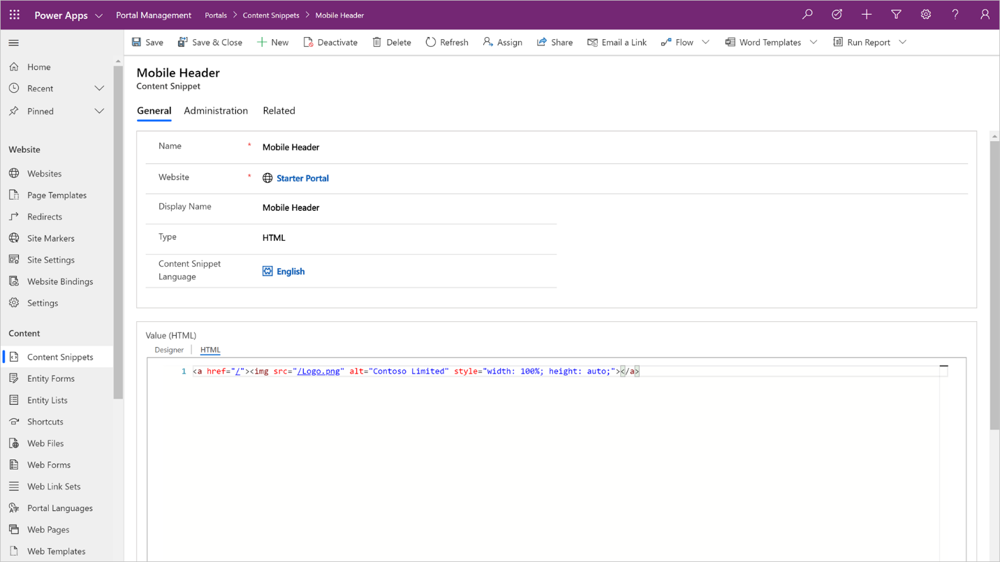
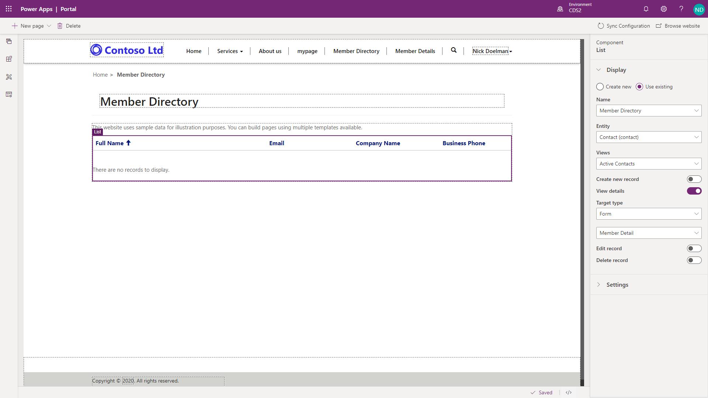

## Power Apps portals Studio
You can use Power Apps portals Studio to create and customize your website. It
contains various options to add and configure webpages, components, forms, and
lists. The anatomy of Power Apps portals Studio is as follows:

Power Apps portals Studio components:
1.  **Command bar** - Allows you to:
    -   Create a webpage.
    -   Delete a component.
    -   Sync Configuration - synchronizes the latest portal configuration
        changes in Common Data Service database with your current Studio
        session. For example, use Sync Configuration to reflect the changes in
        Studio when using the Portal Management app to change the configuration
        of pages, forms or any other objects.
    -   Browse website - clears the portal cache and opens the current portal
        page.
2.  **Toolbelt** - Allows you to:
    -   View and manage webpages
    -   Add components
    -   Edit templates
3.  **Canvas** - Contains components that build a webpage.
4.  **Footer** - Displays autosave status and allows you to open-source code editor.
5.  **Properties pane** - Displays properties of webpage and selected components
    and lets you edit them as required.

## Webpages

Most of a portal's content is represented by webpages. A webpage is a document
that is identified by a unique URL in a website. Through parent and child relationships 
to other webpages, webpages form the hierarchy of a website, that is, its site map. 
Webpages can be added and edited by using the Portal Studio, the portal front-side editor, 
or directly in Common Data Service by using the Portal Management app.

## Page templates

A webpage record does not define how the page looks when it is rendered on the
portal. Instead, it is linked to the **Page template** record that defines the
layout and the behavior. Think of the webpage as the exact URL and the Page
template as the blueprint for displaying the content.

## Content snippets

Content snippets are reusable fragments of editable content that can be placed
within a web template. Using snippets allows for targeted editing of parts of a
page without affecting the overall content.

Content snippets can include plain text, HTML layout, or template processing
instructions, which helps enable dynamic content. In the example below, **Mobile Header** 
is a content snippet that can be updated with your company’s logo to quickly and easily tailor the portal to your needs.

Snippets can be edited by using Portal Studio and Common Data Service records by
using the Portal Management app. Here is where you would replace the image source in the **Value** field 
with your company's logo. 

## Entity lists and entity forms

The strength of Power Apps portals is the ability to interact with information
and data that is stored in Common Data Service. Entity lists and entity forms are used 
in Power Apps portals to define what data should render on the portal from Common Data Service,
such as a list of records from an entity or a form to capture and display data for a specific record. 

A webpage record can be linked to an **entity list** or an **entity form**. The linked
list or form will be used by the template to render the page layout with data
from Common Data Service, such as a list of all *Active Contacts* to form the above 
*Member Directory* list. In the **Properties** pane on the right of the above example, you
see that this entity list was created to display the *Active Contacts* view
from the *contacts* entity.

Entity lists can include functionality like filtering and sorting and can also have
actions associated with them to enable Create/Edit/Read abilities and to trigger
workflows. With this, App Makers can determine what will happen when a user
opens a record from a list, such as taking them to a form displaying the details
of the selected record.

In the above example, the App Maker has dictated that the user will be taken to
the **Entity Form** if they want to *create* or view *details* for a specific record
from a list.
