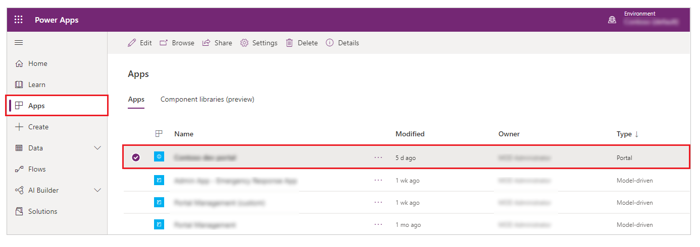
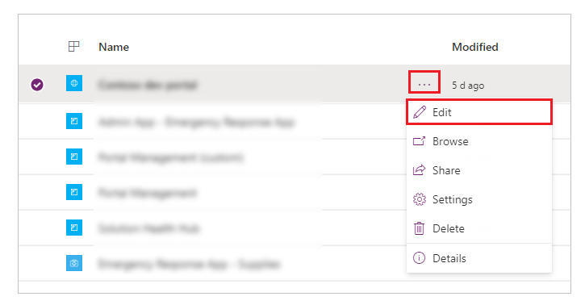
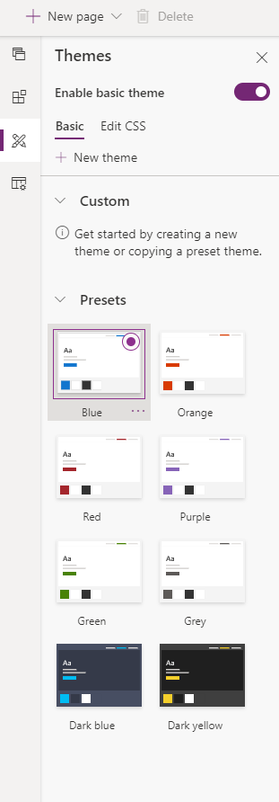
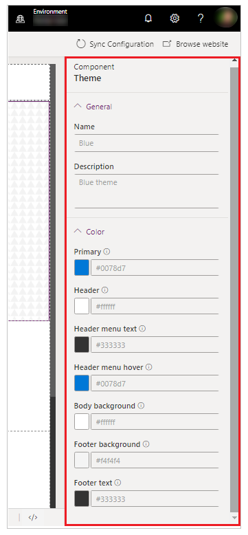

In Power Apps portals, the **Enable basic theme** feature is set to **Off**.
When you turn on this feature, you can use default themes called **Presets**.
You can also create copies of the preset themes for additional customization.

1.  Sign in to Power Apps by navigating to make.powerapps.com

2.  Select **Apps** from the left navigation pane, and then select your portal.

    

3.  Select **More Commands (...)**, and then select **Edit**.

    

4.  Select Themes from the left navigation pane, and then turn on the Enable
    basic theme toggle.

    

## Change theme for your portal

You can set any existing theme in your portal to the default theme.

1.  Sign in to Power Apps by navigating to make.powerapps.com

2.  Select **Apps** from the left navigation pane, and then select your portal.

3.  Select **More Commands (...)**, and then select **Edit**.

4.  Select **Theme** from the components pane.

    

5.  Select any default theme from the available presets (in this example, we selected Blue).

    >[!div class="mx-imgBorder"]
    >

The selected theme is applied to your portal.

## Create a new theme

1.  Sign in to Power Apps by navigating to make.powerapps.com

2.  Select **Apps** from the left navigation pane, and then select your portal.

3.  Select **More Commands (...)**, and then select **Edit**.

4.  Select **Theme** from the components pane.

5.  Select **New Theme**.

    >[!div class="mx-imgBorder"]
    >

## Edit theme details

You can update theme name, description, color, and other typography settings in
Power Apps Studio.

1.  Sign in to Power Apps by navigating to make.powerapps.com

2.  Select **Apps** from the left navigation pane, and then select your portal.

3.  Select **More Commands (...)**, and then select **Edit**.

4.  Select **Theme** from the components pane.

5.  Select the theme that's currently applied or select a new theme from the
    presets. Selecting a theme opens the details pane on the right side of your
    workspace.

    >[!div class="mx-imgBorder"]
    >

6.  Edit theme details such as name, description, and color for different areas.

7.  Save and publish the changes.
