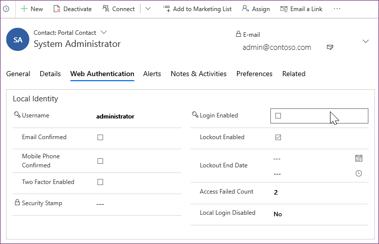
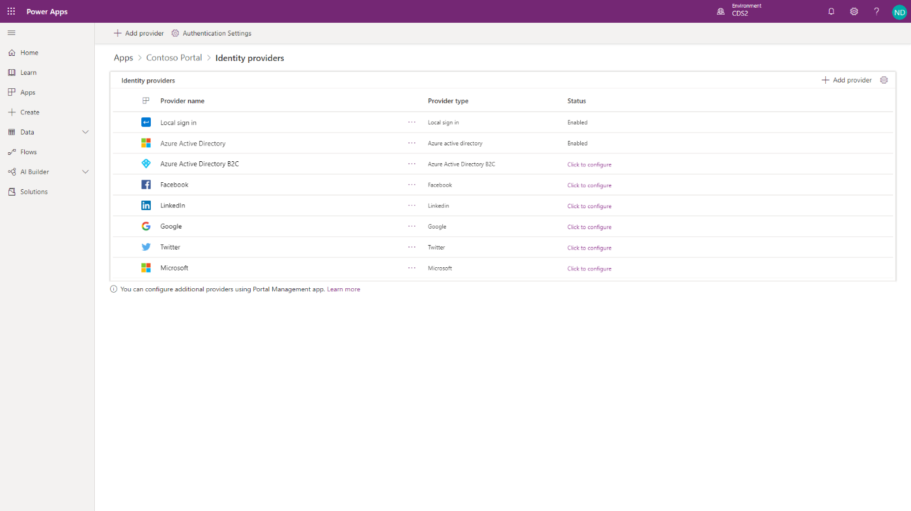
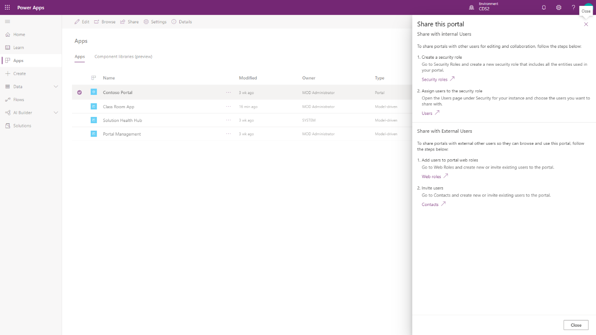
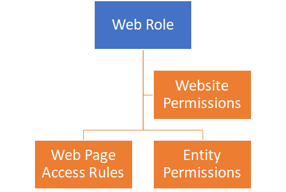

Users of Power Apps portals are tracked in Microsoft Dataverse as contacts.

The Portal Management model-driven app provides access to the contact table and
has forms to manage passwords, view portal-specific contact information, and
provide registration and profile management forms for the portal.

All interactions and actions that a portal user takes (for example, leaving a
comment on a page) are tied to their contact row in Microsoft Dataverse.

## Authentication

Portal users can authenticate by using the following methods:

-   **Local authentication** - Basic authentication with usernames and passwords
    are stored in the Microsoft Dataverse contact row internally.

-   **External authentication** - Credentials and password management are
    handled by other identity providers. Supported authentication providers
    include:

    -   OAuth2 (Microsoft, Twitter, Facebook, Google, LinkedIn, Yahoo)

    -   Open ID (Azure Active Directory, Azure Active Directory B2C)

    -   WS-Federation and SAML 2.0 (used for integration
        with on-premises Active Directory and other identity services)

Portal administrators can choose to enable or disable any combination of
authentication options through portal **Authentication Settings**.

>[!IMPORTANT]
>   Azure Active Directory B2C is the recommended identity provider for
>   authentication. If another provider support is required, then it can be
>   configured in Azure Active Directory B2C.

## Authorization

After the user is authenticated and associated with a contact, Power Apps
portals use numerous tables to define authorization, that is, what a user is
allowed to do. Selecting **Share** from the portal app options will provide
information on how to share the portal app with internal and external users.

**Web roles** allow an administrator to control user access to portal content
and Microsoft Dataverse rows.

A web role can be associated with the following table rows:

-   **Website permissions** - Define what (if any) front-side editing
    permissions that a web role should have.

-   **Webpage access rules** - Define what pages are visible to a web role and
    what actions can be taken.

-   **Table permissions** - Define what access a web role has to individual
    Microsoft Dataverse tables.

A portal contact might be assigned to one or more web roles at a time. Access
rules and permissions of individual roles are combined to determine the
resulting permissions set.

One of the web roles in the portal can be marked as **Anonymous** and all of the
others are **Authenticated**. These roles allow you to apply permissions and
access rules to all portal users based on whether they are signed in. 
If a user is not signed in, they will view the portal with the Anonymous web role permissions, 
which should be the most restrictive permissions.
