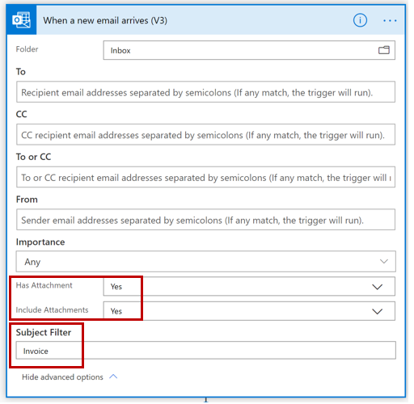
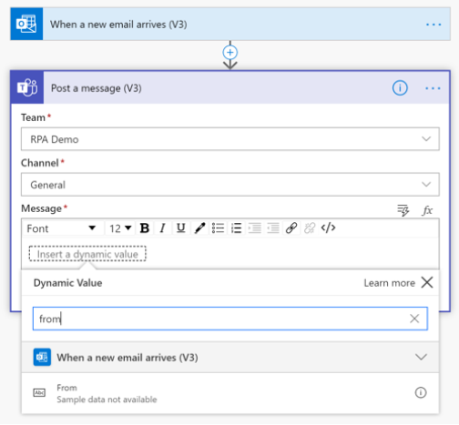

Power Automate provides a low code platform for workflow and process automation.

Watch this video to create the basic flow to route an invoice to a Teams channel.  

>[!VIDEO https://www.microsoft.com/videoplayer/embed/RE4uTVj]

This will be the foundation upon which you will add additional functionality.

To recap, the steps to build the basic flow to route an invoice to a Teams channel are as follows.  You can download a sample pdf invoice file, by going to [download sample invoices](https://github.com/MicrosoftDocs/mslearn-developer-tools-power-platform/tree/master/implement-robotic-process-automation-power-automate-ui-flows-ai-builder?azure-portal=true).

1. Login to [Power Automate](https://powerautomate.com/?azure-portal=true).

1. Select **+ Create** from the left navigation bar.

1. Select **Automated flow**.

1. In the dialog box that appears:

    1. Enter a name for the flow, **Invoice Processing**.

    1. In the search box for selecting a trigger, type **email**, then select **When an email arrives (V3)**.

    1. Select **Create**.

1. Create a connection to the inbox where you will receive the invoices.  For the purpose of this exercise, if you don’t have a shared inbox, you can select your own inbox.

   1. Select the **ellipses** on the top right corner of the trigger action box.

   1. Under **My connections**, select your own inbox or add a new connection.

   1. Select the email folder where invoices will arrive.

   1. Select **Show advanced options**.

   1. From the **Has Attachment** drop-down box, select **Yes**.

   1. From the **Include Attachments** drop-down box, select **Yes**.

   1. Under **Subject Filter**, in the String to look for in the subject line field, type **Invoice**.

   1. Select **Hide advanced options** to collapse the trigger box.

      

      *Advanced Options for the Outlook 365 action When an email arrives*
   

1. Select **+ New step**, to add a new action.

1. For the new action you will need to select the required connector and action for that connector.

   1. Since the flow needs to route and post the invoice to a Teams channel, you will need to connect your flow to Teams (enables integration with Teams).  Select the **Teams** connector.

   1. From the list of actions available for the Teams connector, select **Post a message (V3)**.

1. In the Teams action box:

   1. Select the team, where you want to post the message.

   1. Select the channel.

   1. Compose the message to post.  You can use information from previous steps by selecting the **dynamic values** icon (Control+Space).  Use the **From** field from the email step.  If you do not see this option in the list, enter it search box, then select it.

      
   
      *Teams action to Post a message*

1. Select Save

1. To test the flow, select Test from the top right corner of the page.

   1. Select, I’ll preform the trigger action.

   1. Create an email, with an attachment, and send it to the same inbox you configured in the flow.

   1. Check the Team channel to verify the message was posted.

