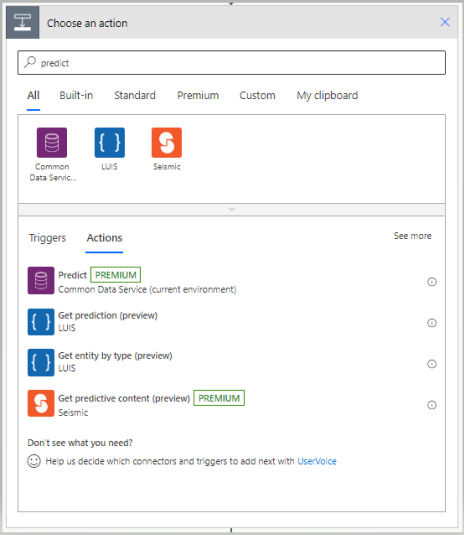
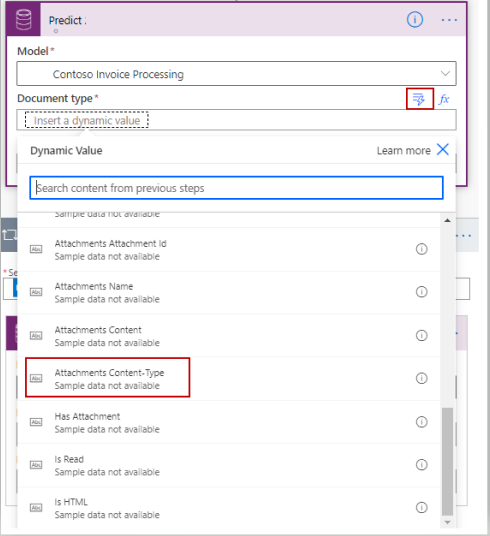
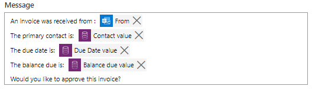
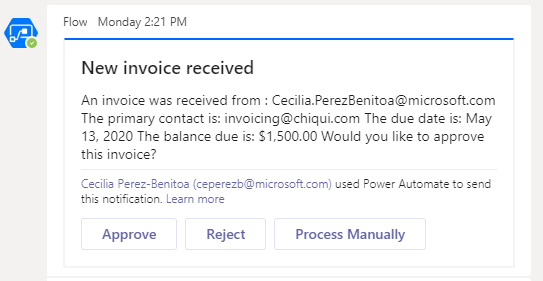

Power Automate flows can be enhanced by using prebuilt or custom AI Builder models.

Watch this video to learn how you can use the forms processing model that was developed in the previous unit, to further simplify the invoice approval process.

>[!VIDEO https://www.microsoft.com/videoplayer/embed/RE4uGU3]

To recap, here are the steps to incorporate the forms processing model, in to the flow created in unit 1; and automate the routing and approval of the invoice.

>[!NOTE]
> The predict action, which is based on AI Builder and requires the use of Common Data Service, is a premium connector.  Refer to the Summary and Resources section of this module for links to additional information.

1. Open the flow you created in unit 1

   1. Login to [Power Automate](https://powerautomate.com/?azure-portal=true).

   1. Select **My flows** from the left navigation panel and then click on the edit icon (or select the ellipses and then select Edit) for flow previously created, **Invoice Processing**.

1. Click the arrow beneath the trigger statement to Insert a new step and select **Add an action**.

1. In the search bar, enter **predict**, then select **Predict (Premium) Common Data Service (current environment)**.

   

   *Choose an action and search for a Predict action*

1. To select the model you created in the previous unit:

   1. In field labeled Model, select the drop-down and in the search box enter the name of the model you created in the previous unit, **Contoso Invoice Processing**.

   1. For Document type, enter the type of data to send to the predict model.  Use the dynamic value selection, from the previous step, by selecting **Attachments Content-Type**.

        

        *Predict action search for dynamic values*
   
   1. For Document, select the add dynamic value icon and select Attachments Content.

   1. Click Predict to collapse the box.

1. Drag the **Post a message (V3)** action into the **Apply to each** box, so that it sits under the predict action.

1. Select the arrow underneath the Predict action and select **Add an action**.

1. Select the **Teams** connector.

   1. From the set of Microsoft Teams actions, select **Post a choice of options as the Flow bot to a user**.

   1. In the Options Item – 1 field, enter, **Approve**.

   1. Select **Add new item**.

   1. In the Options Item – 2 field, enter, **Reject**.

   1. Select **Add new item**.

   1. In the Options Item – 3 field, enter, **Approve Manually**.

   1. In the Headlines field, enter **New invoice received**.

   1. Enter the recipient's email (this person who will approve/reject invoices).  For test purposes, you may choose to enter your email.

   1. In the message field, compose the message you want to send.  The message will include information from the previous steps, specifically the information from AI Builder and from the email.  Type the text you want followed by the values from the previous steps:

      1. In the message box, type **An invoice was received from:**

      1. Select the **Add a dynamic value** icon.  You want to select dynamic content from When a new email arrives (V3). In the search box, type **from**, and select **From**.

      1. Press **Enter** then type **The contact is:**

      1. Select the **Add a dynamic value** icon.  You want to select dynamic content from AI builder that represents the contact.  Select **Contact value**.

      1. Press **Enter** then type **The due date is:**

      1. Select the **Add a dynamic value** icon.  You want to select dynamic content from AI builder that represents the Due Date.  Select **Due Date value**.

      1. Press **Enter** then type **The balance due is:**

      1. Select the **Add a dynamic value** icon.  You want to select dynamic content from AI builder that represents the  Balance due.  Select **Balance due value**.

      1. Press **Enter** then type **Would you like to approve this invoice?**

         

         *The composition of a message using dynamic values*

      1. Click **Post a choice of options as the Flow bot to a user** to collapse the box.

1. Now add the switch statements to define how the invoice is routed, based on the selected option. Select **Add an action** (you are adding this action inside the Apply to each box, as you want to this action to happen with each invoice attachment received).

1. Select **Control**.

1. From the set of control actions, select **Switch**.  Here you define the actions for each of the three cases (approve, reject, manually approve).

   1. For the Approve case:

      1. For the On field, select the **Add a dynamic value** icon and select **selectedOption**.

      1. For the first Case, set the Equals field to **Approve**.

      1. Select **Add an action**.

      1. In the search box, type **Outlook**, and select the **Office 365 Outlook** connector.

      1. In the search box for the Office 365 Outlook actions, type **Reply** and select **Reply to email (V3)**.

      1. In the Message Id field, select the **Add a dynamic value** icon (if you don't see it, click on the field).

      1. From the list of dynamic values associated with When a new email arrives (V3). Select **Message Id**.

      1. In the Body field, enter the desired message.  For simplicity type **Invoice approved**.

      1. To collapse the box, click on **Reply to email (V3)**.

   1. For the Reject case:

      1. Select the **Add Case** Icon (plus sign in the circle).

      1. In the Case 2 equals box, enter **Reject**.

      1. Select **Add an action**.

      1. In the search box, type **Outlook,** and select the **Office 365 Outlook** connector.

      1. In the search box for the Office 365 Outlook actions, type **Reply** and select **Reply to email (V3)**.

      1. In the Message Id field, select the Add a dynamic value icon (if you don't see it, click on the field).

      1. From the list of dynamic values associated with When a new email arrives (V3). Select **Message Id**.

      1. In the Body field, enter the desired message.  For simplicity type **Invoice rejected**.

      1. To collapse the box, click on **Reply to email (V3)**.

   1. For the Default case (Process Manually), you will use the Post a message (V3) action that was created in the original flow created in unit 1.  Simply drag the box Post a message (V3) into the default case.

1. **Save** the flow.

1. Select **Test** from the top right of the page.

    1. choose, **I'll perform the trigger action**.

    1. Select **Test**.

1. Send an email to the Inbox used to receive the emails with the attached invoices, for approval.

1. Teams will send a notification **Flow sent a card**.

    

    *A flow card received in Teams*

With the routing approval process automated, the last step is to automate the entry of information into the legacy business application.

