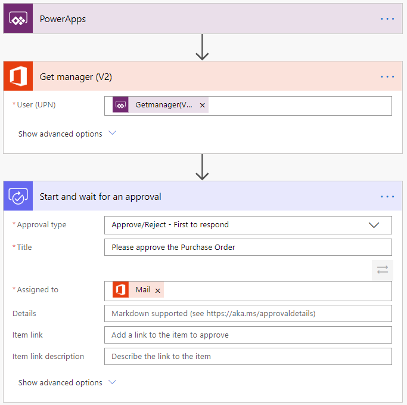
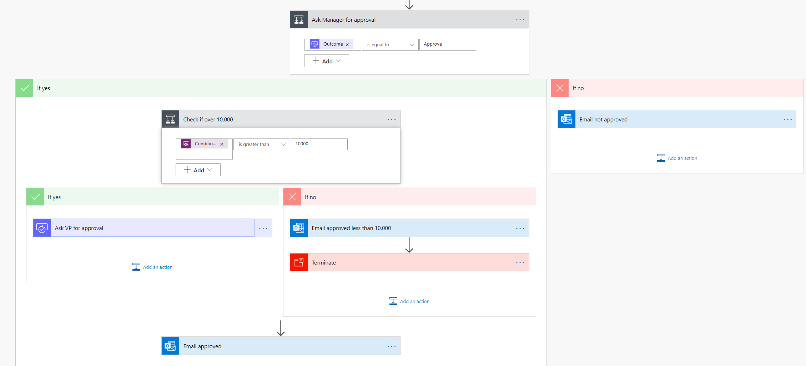

Do you find yourself downloading email attachments and then uploading the file to the database? Power Automate can help. Does the process of getting a new purchase order approved involve you taking a form from desk to desk to get sign off? Power Automate can help. Do you have to log into a website every morning, find the daily numbers, and then save those into another system? Power Automate can help.

Power Automate is all about having computers manage repetitive tasks. Power Automate allows anyone with knowledge of the business process to create a repeatable flow that when triggered, leaps into action and performs the process. 

Common scenarios and capabilities of Power Automate:

- Automating of repetitive tasks like moving data from one system to another

- Guiding a user through a process so they can complete the different stages

- Connecting to external data sources via one of the hundreds of connectors or directly via an API

- Automating desktop based processes with robotic process automation (RPA) capabilities

### Example: a purchase order approval

Approvals are a great process to build in Power Automate. They are often - defined yet manual. Check out the following scenario for an example:

A user starts the process by going into a Power Apps app and creating a purchase order request. Once they submit the request the information is sent to a Power Automate flow.

The flow can be built to evaluate the request and then route the request based on criteria such as submitting user and request amount. The first action could be to send the request to the user's manager. The manager could be automatically retrieved from Azure AD avoiding prompting for duplicate information.

Here is the starting point of the flow.
    

After the manager receives the approval and approves, the flow can then provide conditional logic. Typically this might be something like if the purchase order request is greater than $10,000 send it to VP if not then automatically approve the purchase order.

Here is an example of what this flow may look like.
    

As you can see even the business process has many decision points. Your flow easily handles the decisions without you writing any code.

## Work with your data where it lives

When building an app, access to your data is very important. Power Automate offers you choices; through over 275 connectors you can easily connect to data and services across the web and even on-premises. Some common data sources include:

- Common Data Service

- Salesforce

- Dynamics 365

- Google Drive

- Office 365

You don't have to choose just one data source either. Power Platform easily supports multiple data connections allowing you to bring data together from many platforms into a single automation. 

Finally, if your data isn't retrievable by one of the 275 plus connectors, then Power Automate also allows you to create custom connectors, letting you talk to any data source via a swagger file.  

## The three types of flows you can create with Power Automate

Power Automate works by creating flows, of which there are three types:

- Event driven flows - These are flows that you build with a trigger and then one or more actions. There are  a multitude of triggers and actions available, thanks to the existing connectors. You will see these as My flows and Team flows in Power Automate. The only difference between a My flow and a Team flow is ownership. With a My flow you are the sole owner, while a Team flow has more than one owner. 

- Business process flows - These flows are built to augment the experience when using Model-driven apps and the Common Data Service. Use these to create a guided experience in your Model-driven apps. 

- UI flows - These robotic process automation (RPA) flows allow you to record yourself performing actions on your desktop or within a web browser. You can then trigger a flow to perform that process for you. You can also pass data in or get data out of the process, letting you automate even "manual" business processes.

## Add artificial intelligence to your flow without writing code

Before the Power Platform adding functionality such as image or text processing required an advanced computer  or coding knowledge. There was code to write, data models to design and train, and a lot of complicated logic. The Power Platform, however, has "democratized" artificial intelligence by providing a wizard-based interface for building and training your model. This unlocks the power of Azure Machine Learning and Cognitive services without writing a single line of code.

To take advantage of these AI capabilities you must first build a model. From [https://make.PowerApps.com](https://make.PowerApps.com) a wizard guides you through building and training the model. Currently, there are four available AI models available to build:

- Form processor -  This model extracts text from an uploaded image or taken photo. 

- Object detector -  This model identifies objects from an uploaded image or taken photo and then provides a count of the number objects present. 

- Prediction - This model predicts whether something will happen or not based on previous data history. More details in the following section.

- Text classification - This model categorizes text by its meaning, making it is easier to analyze. 

### The prediction model

The AI Builder prediction model allows you to create a model that can predict a yes or no outcome based on historical data. You train the model by providing historical data which includes the yes/no outcome and then artificial intelligence does the rest. 

You can build prediction models to solve business problems such as:

- Will your customer be satisfied with the project outcome?

- Will a project be profitable?

- Will a customer churn based on activity?

Once you have a trained model then you can interact with the model in your flow to send and receive information to the AI system. Unlocking business value previously out of grasp without complex code.

## Security and Administration

To manage security for Power Automate log into [https://admin.flow.microsoft.com/](https://admin.flow.microsoft.com/) From the Power Platform admin center you have full access to Power Automate tenant wide. You have the ability to create and manage environments, implement Data Loss Prevention policies, work with Data integrations, manage user licenses, and quotas. The admin center gives you management capabilities across Power Automate.

Power Automate also offers a full set of PowerShell cmdlets. These cmdlets allow you deeper controls and to work better in large-scale scenarios. Using the cmdlets for auditing gives you more control and insight on Power Automate's usage throughout your tenant.

In addition, because Power Automate is all about automation, there are built in flow actions for managing both Power Automate and Power Apps. An example of a helpful flow is you could create one that runs everyday at 8 AM to discover all of the flows and Power Apps that have been created and then add someone from IT as a co-owner of each. That way IT has access and awareness of the solutions within the organization. Just another way that Power Automate is helping to automate common business processes. 

## Driving business value

Power Automate flows are built with triggers and actions.  Triggers determine what starts the flows, while actions determine what happens. With Power Automate you even have the ability to specify the business logic to determine the necessary conditions.  For many businesses that means these automations do not have to be driven from IT but instead directly from the business. The same way that the Sales department builds its manual processes today by emailing spreadsheets between people, they can build their flow to automate the process going forward.

If you are in IT or otherwise responsible for governance, Power Automate has plenty to offer for you. With Power Automate there are many security, governance, and reporting capabilities to provide the necessary oversight. You can even write a flow to manage all of the other flows. Also, Power Automate doesn't circumvent security in any way. Users cannot build flows to do things they don't already have permission to do today. 

In the next unit, you'll learn about how Tru Green is using Power Automate to better run their business. 
