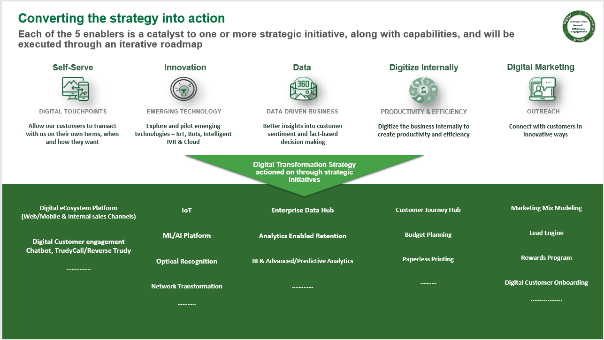

Now that you have an overview of Power Automate and how it drives business value, this unit will explore how TruGreen is improving customer experience by incorporating chat bots, artificial intelligence, and the Power Platform.

## TruGreen embarks on an all-up digital transformation

As part of TruGreen's commitment to provide customers with, they need to "live life outside" they've teamed up with Microsoft. One step toward that goal was incorporating the Power Platform, including Power Automate to provide proactive and predictive services to their customers. 

Below you can see an infographic of their digital transformation strategy:
    

To provide better services, they built a new artificial intelligence enabled virtual agent bot. The virtual agent was built without writing any code and instead used Power Virtual Agents to facilitate handling routine customer requests and to take action based on customer intent. To expose and interact with the back-end data required they used Power Automate.

Tru Green used some of the hundreds of connectors available for the Power Platform to connect to traditional data sources. Using these capabilities they had their first protype running in two days, once again without a single line of code. 

In addition, they had systems that didn't have APIs to be used by the connectors. For these systems, they leveraged UI flows. With UI flows they were able to mimic onscreen actions that customer service associates used to perform manually via robotic process automation (RPA). 

Now they have a fully functional virtual agent for interacting with their customers that can take action on the customers' intent in a meaningful way. This is just the first step as they continue to drive better customer experiences and more business value using these tools. 

To read more about the virtual agents TruGreen has built and what they have planned next, see the full case study [here](https://customers.microsoft.com/en-us/story/759484-trugreen-partner-professional-services-power-virtual-agents).

In the next unit, you will get an overview of some of these solutions in Power Automate and learn how you can get started with building your own flows.
