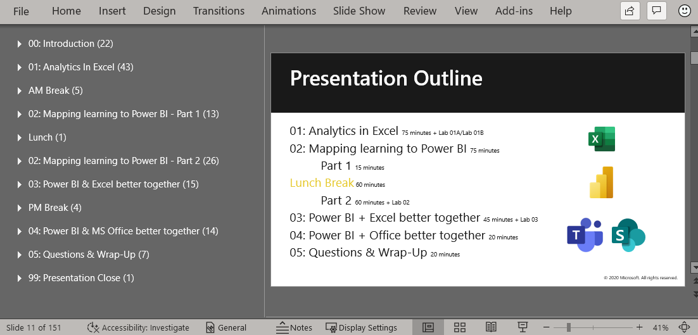

## Introduction
To help your customers gain the full power of Excel and Power BI, you may need to provide some of them with technical training on how to use modern Excel analytics. 

This train-the-trainer course will prepare you to deliver all or some of the **Modern Excel Analyst in a day** instructor-led course. 
That course will take your customers on a journey from Excel to Power BI Desktop and then to Power BI Service. 
By the end you will have alleviated some of their data analysis concerns and moved your sales forward.  

Delivering this course will give your customers a better understanding of advanced capabilities available in Excel. It will help them see what’s possible for modern Excel analysts. They will explore how Excel & Power BI are best used together, and how Excel & Power BI can be integrated in Microsoft Teams & SharePoint Online. 

On completion of this Power BI train-the-trainer course, you will have the skills, knowledge, and resources to explain and demonstrate how to:
- Setup Power Query & Power Pivot in Excel
- Use Power Query & Power Pivot in Excel to improve efficiency, provide reusable seamless solutions and transform existing manual reporting into actionable insights
- Understand how Excel maps into Power BI Desktop
- Identify opportunities to use Excel & Power BI together
- Integrate Excel & Power BI solutions into Microsoft Teams & SharePoint

## How to take this course

This train-the-trainer course is a mix of text, videos, labs, resources, and knowledge check questions that will help you deliver the **Modern Excel Analyst in a day** instructor-led course to your customers: 
- In the text, you will see tips and guidance on how to deliver this course.
- In the videos, Krissy Dyess from Power Pivot Pro, takes you through the course and shows you how to explain and demonstrate the content.
- The labs will help you practice using Excel and Power BI so you can better demo to your customers.
- The resources will help you guide your customers to additional information during and after the sales process.
- The knowledge check questions will help you test your knowledge of key messages and possible disconnects for your customers.

> [!NOTE]
> This train-the-trainer course does not cover every side in the deck. Delivery guidance is only provided on the critical sides. Watch the full course recordings to see how an experienced instructor delivers every slide, the demonstrations, and the labs.

## Module timing in Modern Excel Analyst in a day 
1. The instructor-led course starts with a long **Analytics in Excel** module including 48 slides for 2 hours and 15 minutes including labs. 
1. Next it shifts to the **Mapping the student’s knowledge of Excel onto Power BI** module with a total of 39 slides for 2 hours with labs. 
1. Then it covers the **Power BI and Excel better together** module with 15 slides for 1 hour and 5 minutes with lab. 
1. Followed by the **Power BI and MS Office better together** module with 14 slides for 20 minutes of lecture including multiple demos.  
1. The course ends with a **Questions & Wrap-Up** module with 7 slides that last for 20 minutes and focuses on helping your students transfer their newly gained knowledge and skills to their work and career future.

## Course breaks
The course is scheduled for a morning, lunch, and afternoon break. 
If you are delivering it online, you may prefer to use a 5-minute break at the top of every hour.

## To receive credit for this train-the-trainer course
Watch the videos, practice the labs, visit the resources, and complete all the knowledge check questions to receive credit for this course.

## Course files
The files required to teach the instructor-led course **Modern Excel Analyst in a day** are located here:  
- [Instructor](https://assetsprod.microsoft.com/mpn/maiad-instructor.zip)
- [Attendee](https://assetsprod.microsoft.com/mpn/maiad-attendee.zip)

### Lab setup
The setup instructions are available in the **attendee > Lab materials > Lab01A** folder.

> [!IMPORTANT]
> Remember to send a copy of the Attendee folder to your students at least a day early so they can have the materials installed before class starts.

#### Setup instructions:
1.	Download the self-study kit (.zip) locally
2.	Edit the file properties, and “unblock”
3.	Extract the file contents to your file system. The lab documents will refer to this location as \<CourseFolder>

### Power BI account
You are responsible for having your own Power BI account.

Check that you have Power BI Desktop installed  
- Power BI Desktop is free to download
- Most recent monthly release is best!

Launch Power BI Desktop
- Sign in to the Power BI Service

### Copy paste snippets
To improve accuracy and reduce typing, many labs involve copying and pasting from snippet files. 
- Avoid the temptation to just copy-and-paste
- Take the time to understand the intention of each snippet

> [!TIP]
> When snippet files are available use them in your labs. 
> Do not copy from the lab guide as the rich-formatted text blocks often paste incorrectly and you’re likely to get a strange result in your code.

## Video 
> [!VIDEO https://www.microsoft.com/videoplayer/embed/RE4Ix0F]
> In this 14-minute video Krissy Dyess from Power Pivot Pro, introduces you to the course goals, outline, labs, and the course folder structure.
