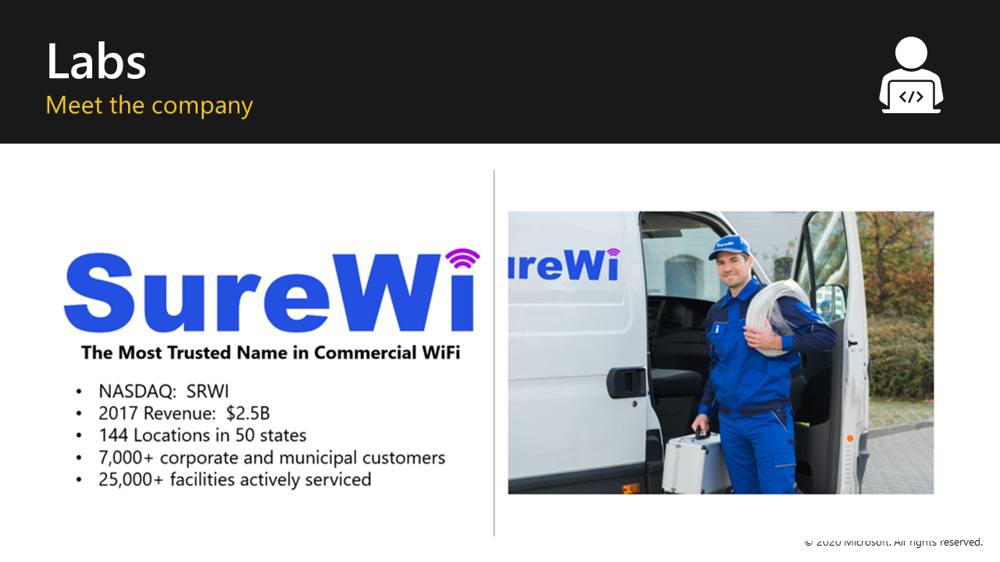

## The biography slide
How you start the course sets the tone for the entire day. 

> [!IMPORTANT]
> By emphasizing your background skills and experience you will establish your expertise in the eyes of your students. When you share your personal experiences during the course, you reinforce your expertise and make it clear that you know what you’re talking about.

## The lab scenario
Throughout the presentation & labs are examples based on the sales activities of the fictitious Wi-Fi company called SureWi.

SureWi is a fictitious company that represents the most Trusted Name in Commercial Wi-fi.
Think of SureWi as being similar to Microsoft’s Contoso or AdventureWorks example data sources!

The SureWi company:
- Represents the most trusted name in commercial Wi-Fi
- Accumulates operational data in an Azure SQL database
- Needs to explore and discover deeper insights from their data

## Course labs
In the 3 labs, your students will act as a report author, and develop several sales performance reports.  
Lab 01B is optional for students who can complete Lab 01A in less than the allotted 45 minutes. 

> [!TIP]
> Remind your students that the SureWi company scenario is for background only. It’s not very important to understand what the company does.  

## Video
> [!VIDEO <embedded_video_link>]
In this 17-minute video you’ll see Krissy Dyess from Power Pivot Pro explain how to deliver the initial sides in the deck.

## Optional video
> [!VIDEO <embedded_video_link>]
In this video you’ll see ___ deliver the entire Module 1, “Analytics in Excel”.  

> [!TIP]
> In addition to taking notes on the content, take notes on what worked with Krissy Dyess’ and ___’s deliveries, and where you would do things differently. 
Here and in all the modules, you have the option of delivering this section yourself, or using the recorded version as a co-instructor.

