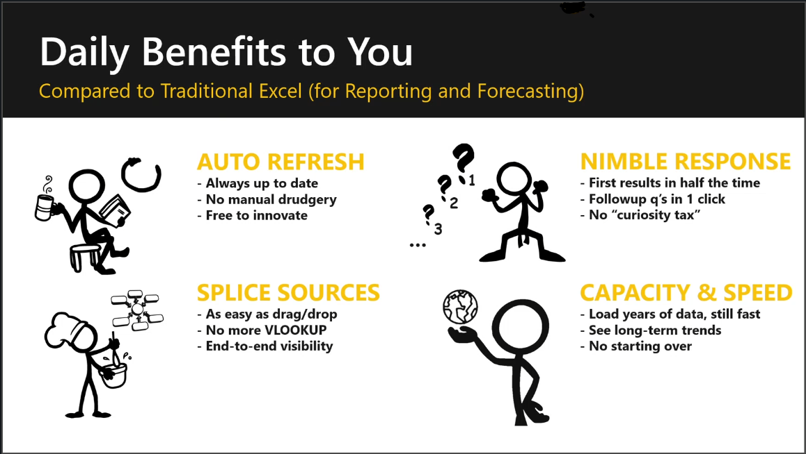

In this first section, you'll explain that Modern Excel is a major upgrade to Excel’s reporting and forecasting capabilities.

The combination of two technologies and Excel:
- Power Query, where you will get and transform data.
- Power Pivot, where you will create data models.

## Benefits
Some of the benefits of Modern Excel include:
- Auto refresh, so it’s always up to date
- Splice sources together, to integrate data
- Nimble response, producing fist results in half the time
- Capacity & speed, to handle years of data

> [!TIP]
> Push the “Daily benefits to you” to motivate your students to pay attention to this course. This slide isn’t a hard sell of the product, but a set of personal advantages that you are giving your students by teaching them how to use the product.

## Ecosystem: Overlap
The important point of this slide is to show that Modern Excel and Power BI share many features but produce different visuals. 
This review will lower your student's fears and resistance to the new and unknown Power BI. 

> [!TIP]
> The Sargent Prepper and Captain Crunch characters may sound overly cute but will help your students quickly remember the roles of Power Query and Power Pivot. 

## Video
> [!VIDEO <embedded_video_link>] In this 8-minute video you’ll see Krissy Dyess explain how to teach the first part of Analytics in Excel.

## Modern tools

This section is a short side trip into XLOOKUP and FILTER() to start your students thinking about finding and sorting data. These tools will also give your students a quick example of some of the new updates thta they may have missed in Excel. 

### XLOOKUP() 
The key message here is that this is a more robust and easier lookup that replaces:
- VLOOKUP 
- HLOOKUP
- INDEX()
- Match()

### FILTER()
Is a quick and easy tool for retrieving data.

## Video
> [!VIDEO <embedded_video_link>] In this 11-minute video Krissy Dyess shows you how to explain and give examples of XLOOKUP() and FILTER() in Excel.

