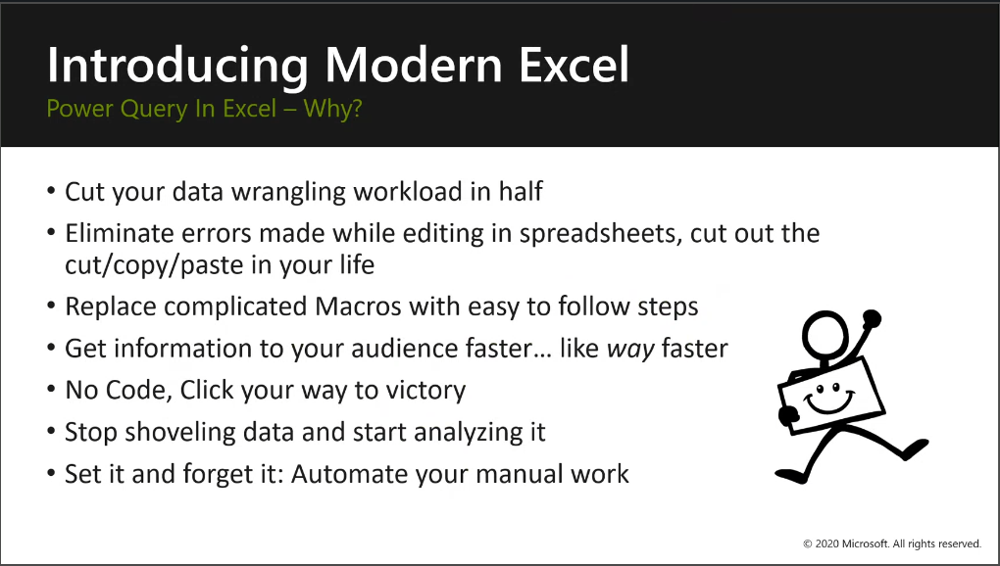

Now we start the dive into Power Query. 
## Power Query in Excel – Why?
This slide is the value proposition for your students to adopt Power Query. These are the &#8220;I’m never going back&#8221; reasons to adopt Power Query. 

> [!TIP]
> Check with your class to see which reasons resonate with them and promise to highlight that feature in the next slides and demos. 

### Video
> [!VIDEO <embedded_video_link>] 
> In this 3-minute video Krissy Dyess explains how to teach this section where you begin with messy data, and then use Power Query to clean, transform, and load to create a Data Model.

## Power Query in Excel – How to launch
As you deliver this demonstration, encourage your students to launch it on their own machines and follow along as you tour the UI. This shared review of the UI will help them become comfortable navigating the product.

Use this order while presenting the Power Query Editor:
1.	Opens in a new UI Window
1.	Saved within the XLSX file
1.	The 5 Key UI Areas:
    1.	Menu
    1.	Queries Pane
    1.	Preview
    1.	Query Settings
    1.	Formula Bar

> [!TIP]
> Stress that you don’t need to learn M to use Power Query effectively. Unless you are doing highly complex queries, you should be able to do whatever you need with buttons or macros.

### Video
> [!VIDEO <embedded_video_link>] 
> In this 6-minute video Krissy Dyess explains how to teach this section where you introduce the advantages of Power Query and then the UI.

## Combining Multiple Files 
Now that you’ve reviewed the UI with your class it’s time to explain how to start collecting data. 

First you need to combine files, and then fill in missing data.

### From Folder: 
The key message with combining multiple files in a folder is that they need to be the same file types and structure.  This works best with regularly created files like weekly numbers or status reports.

### Fill down/up: 
highlight the cost of the “old ways” in effort, time, and the potential for errors.

> [!TIP]
> Emphasize the manual work and time saved  with Power Query that allows you to focus on analyzing your data.

### Video
> [!VIDEO <embedded_video_link>] 
> In this 7-minute video Krissy Dyess explains how to teach this section where you show how to combine files and fill up or down where there is missing data.

## Unpivot
Pivot, or crosstab’ formatting is very common but not always helpful for analysis.
The key point here is that your students can now unpivot columns from something that’s very wide to very long, which is our preferred structure.

Other great cleaning and formatting options that are available in Power Query include:
- Remove rows, duplicates
- Split columns by delimiter, position, number of characters, and more
- Filter: Number filters, Date filters, Text Filters
- Columns from Examples
- Conditional columns
- Custom columns

> [!TIP]
> For some of your students these will be new options, so be prepared to dive into any of them at your student’s request. Remember that the goal of this course is to bring awareness, so you’ll need to avoid getting too deep on how to clean up very messy data. 

### Video
> [!VIDEO <embedded_video_link>] 
> In this 10-minute video Krissy Dyess explains how to teach this section where you show how to unpivot, clean, and format data.
