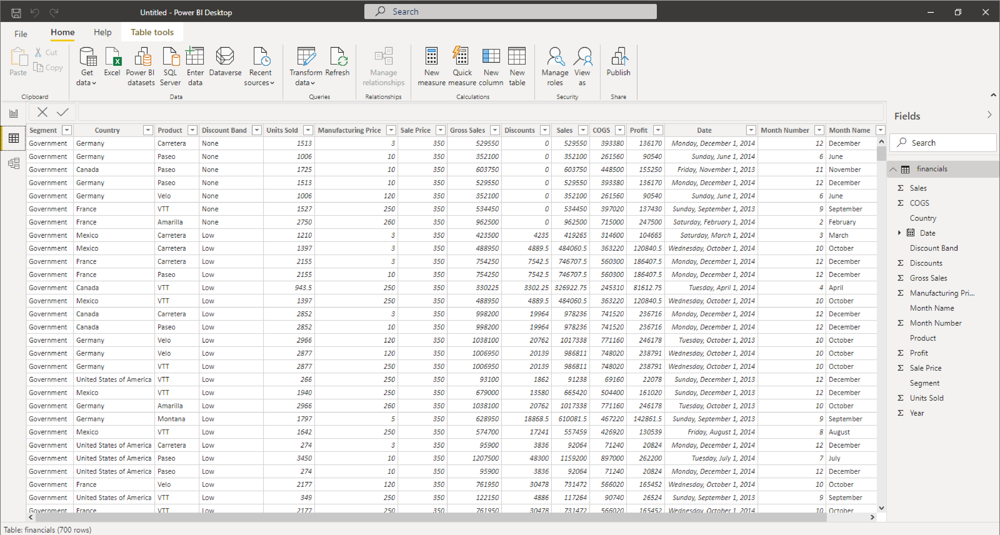

Power BI Desktop connects to many types of data sources, including local databases, worksheets, and data on cloud services. Sometimes when you gather data, it's not quite as structured, or clean, as you want it to be. To structure data, you can transform it, meaning that you can split and rename columns, change data types, and create relationships between columns.

You can connect Power BI Desktop to many types of data sources, including on-premises databases, Microsoft Excel workbooks, and cloud services. Currently, there are over 110 Power BI-specific connectors to cloud services such as GitHub and Marketo. You can also connect to generic sources through XML, CSV, text, and ODBC. Power BI will even extract tabular data directly from a website URL.

In this module, we will build out a dashboard for Contoso Manufacturing displaying their sales data for various products. To follow along with the next steps, visit [https://docs.microsoft.com/power-bi/create-reports/sample-financial-download](/power-bi/create-reports/sample-financial-download) and download the financial sample workbook to your local files or One Drive.  If this is your first time using Power BI Desktop, please visit [https://docs.microsoft.com/power-bi/fundamentals/desktop-get-the-desktop](/power-bi/fundamentals/desktop-get-the-desktop) for download instructions.

1. Start Power BI Desktop, and choose **Get Data** from the ribbon on the **Home** tab.

2. Choose **Excel** and press **Connect**.

3. Find the financial sample workbook which you downloaded and saved locally or to your OneDrive. Select the file and click **Open**.

4. A dialogue box with the tables in your data should open. Click the box next to the financials table. You will see a preview of the data displayed. Select **Load**.

You can now see that the fields have populated on the farthest right pane. You are currently in the report building tab. Select the **data tab** to see a preview of your data.
    

Now you have loaded your data and will shortly be ready to build visuals, but first, let's transform our data into exactly what we want.