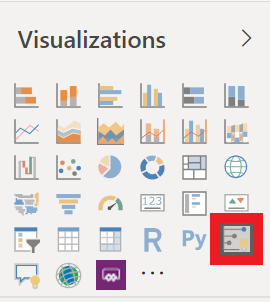
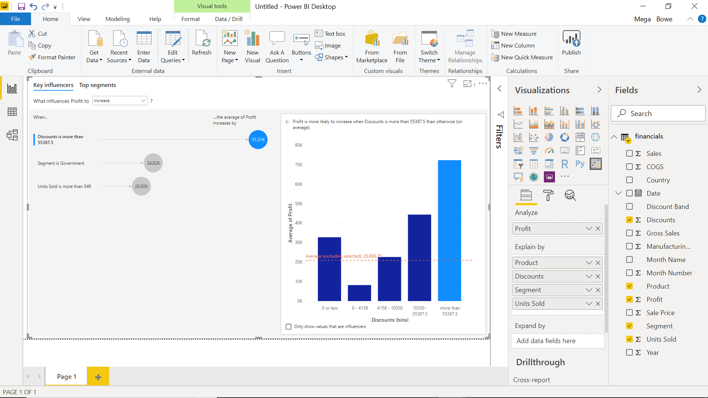

Now that you have connected and cleaned up your data, it's time to create visuals. Visuals allow you to present data in a compelling and insightful way and help you to highlight the important components. Power BI has many compelling visuals and many more are released frequently.

1.	Navigate back to the **Reports** tab and click on the **Key Influencers** in the Visualizations pane.
    

2. Click and drag **Profit** from the Fields pane to Analyze By in the Visualizations pane.

3. Click on the box beside the following columns to add them to your visual: **Product**, **Discounts**, **Segment**, and **Units Sold**.

4. Drag the corner of your visual to make it larger and click on the first item "Discounts is more than 55387.5"
    

The visual you just built, key influencers, works to analyze a set of data to explain variations in a field against others. It automatically builds out charts and graphs to demonstrate these variations. You can see here what influences Profit to increase or decrease by changing the selection in the top of the visual. Take a moment to play around with the options in this visual and learn from the data.

Now let's build a more classic visual.

5. Select the yellow **+** at the bottom of your report to create a new page.

6. Select the **Line and clustered column chart** visual from the Visualizations pane.
    

7. Click on the box beside the following columns in the following order to select them: **Product**, **Manufacturing Price**, **Sales Prices**, **Profit**.

8. Note that Power BI automatically assigns each column to an appropriate field of the visual. In this case, however, we want to click and drag **Profit** from Column Values to Line Values.

9. Lastly, drag out the corner of your visual so you can better see the information being displayed.
    

> [!NOTE]
> Two ways to create a new visualization in Power BI Desktop are:
> - Drag field names from the Fields pane and then drop them on the report canvas. By default, your visualization appears as a table of data.
> - In the Visualizations pane, select the type of visualization that you want to create. With this method, the default visual is a blank placeholder that resembles the type of visual that you selected.

Now that we've learned how to craft simple visuals, go ahead and create a few more to test your new skills and better learn how Power BI works. Finally, save your report locally and select **Publish** on the Home tab. You can publish this to My Workspace, which is the default for all new accounts. This step is necessary in order to create a dashboard. Once you have published your report, you will have the option to open your report in Power BI, go ahead and do so.