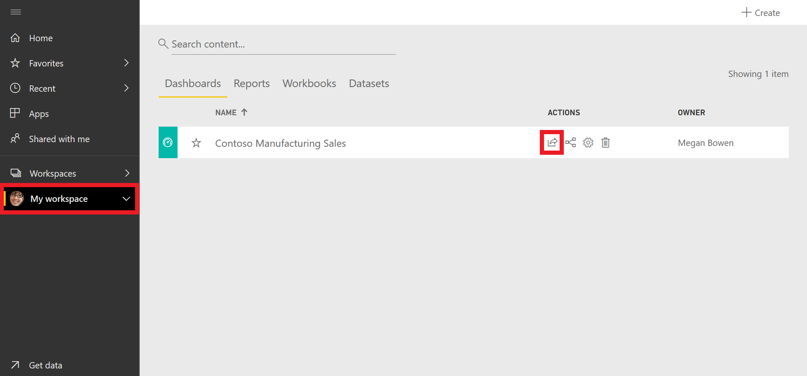

Power BI service makes it easy to share your datasets, dashboards, and reports with your colleagues. Power BI simplifies collaboration and improves the outcome by allowing you and your colleagues to work simultaneously on the same dashboards and reports. And, while you and your colleagues explore the data and make changes to the reports and dashboards, the underlying data is not affected.

1. Click **My Workspace** on the left side Navigation pane. If you have multiple workspaces, you can click on Workspaces and make the appropriate selection from the dropdown.

2. Click the **share** button by the Contoso Manufacturing Sales dashboard.

3. Type in the names or emails of those you wish to share your dashboard with and set the options to determine the user permissions.

4. Select **Share**.

> [!TIP]
> If you are unable to share with a colleague, it might be because of the type of Power BI license that you or your colleague have. Check with your Power BI administrator for help.