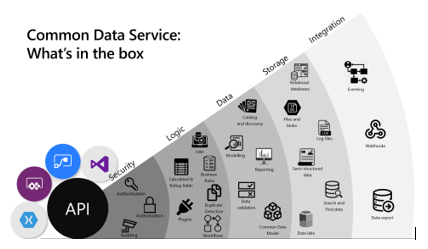

The Common Data Service is a cloud-based solution that easily structures a variety of data and business logic to support interconnected applications and processes in a secure and compliant manner. Managed and maintained by Microsoft, Common Data Service is available globally but deployed geographically to comply with your potential data residency. It is not designed for stand-alone use on your servers, so you will need an internet connection to access and use it. 

The Common Data Service is designed to be your central data repository for business data and you might even be using it already. Behind the scenes it powers many Microsoft Dynamics 365 solutions such as Field Service, Marketing, Customer Service, and Sales. It is also available as part of Power Apps and Power Automate with native connectivity built right in. The AI Builder and Portals features of the Power Platform also utilize the Common Data Service.

Below is visualization to bring together the many offerings of Common Data Service.
    

As you can see, Common Data Service offers a great deal of functionality. Below is a brief explanation of each category of features.

**Security**: Common Data Service handles authentication with Azure Active Directory (AAD) to allow for conditional access and multi-factor authentication. It supports authorization down to the row and field level and provides rich auditing capabilities. 

**Logic**: Common Data Service allows you to easily apply business logic at the data level. Regardless of how a user is interacting with the data, the same rules apply. These rules could be related to duplicate detection, business rules, workflows, or more.

**Data**: Common Data Service offers you the control to shape your data, allowing you to discover, model, validate, and report on your data. This control ensures your data looks the way you want regardless of how it is used.

**Storage**: Common Data Service stores your physical data in the Azure cloud. This cloud-based storage removes the burden of worrying about where your data lives or how it scales. These concerns are all handled for you.

**Integration**: Common Data Service connects in different ways to support your business needs. APIs, webhooks, eventing, and data exports give you flexibility to get data in and out.

As you can see Common Data Service is a very powerful cloud-based solution for storing and working with your business data. In the following sections you will look at Common Data Service from the lense of data storage for the Power Platform, where you will start your journey. Keep in mind the additional rich capabilities discussed above which you can explore further as your usage increases. 

To get started, Common Data Service lets you create one or many cloud-based instances of a standardized database. The database includes predefined tables and fields which store data commonly found across nearly all organizations and businesses. You can customize and extend what is stored by adding new fields or tables (called entities in Common Data Service). The ease of setting up a Common Data Service database and standardized data model under it simplifies your ability to concentrate your efforts on building solutions without worrying about infrastructure, storage, and data integration.
With your data stored in Common Data Service there are many different ways to access it. You can work with the data natively with tools such as Power Apps or Power Automate. Or through connectors and APIs you can connect to the Common Data Service from any business solution. With the power of features such as role-based security and business rules you can trust your data is safe no matter how it is accessed. 

## Common Data Service defined

A Common Data Service database is a single instance of Common Data Service which stores data in a set of standard and custom data structures called entities. An entity is a logical set of records that is used to store data. Entities are like tables in a relational database, but there are subtle differences. Records within an entity contain many fields to manage individual pieces of information about a single record.

You can create one or many database instances in Common Data Service to host data behind your business solutions. Each instance of a Common Data Service will start with the same set of entities to store data, but you can always extend and customize a Common Data Service database to meet specific business needs. This means that you can share business solutions that reference standard entities in Common Data Service across your organization or with any other organization by using it anywhere in the world.

## Scalability

A Common Data Service database supports large data sets and complex data models. Entities can hold millions of items, and you can extend the storage in each instance of a Common Data Service database to four (4) terabytes per instance. The amount of data that is available in your instance of Common Data Service is based upon the number and type of licenses that are associated with it. Data storage is pooled between all licensed users, so you can allocate storage as needed for each solution that you build. Additional storage can be purchased if you need more storage than what is offered within standard licensing. 

> [!TIP]
> Common Data Service supports transactional multi-user applications, where quick response to user demand is the priority. It is not intended to be a platform for long running or batch processing.

## Common Data Model vs. Common Data Service

The standard entity design in a Common Data Service database is based upon an open data model standard called Common Data Model. Common Data Model is a logical design that includes a set of open-sourced, standardized, extensible data entities and relationships that Microsoft and its partners have published in an industry-wide initiative called the Open Data Initiative. This collection of predefined entities, attributes, semantic metadata, and relationships form the basis of the Common Data Model.

## Open Data Initiative

The Common Data Model is the output of the Open Data Initiative. It provides a platform for a single, comprehensive view of your data, bringing together and enriching data from all your lines of business, across all your systems, to deliver real-time intelligence back into your applications and services. Microsoft has partnered with SAP and Adobe on the Open Data Initiative.

## Common Data Service structure and benefits

The structure of a Common Data Service database is based upon the definitions and schema in the Common Data Model. The key benefit of using Common Data Model as the basis of a Common Data Service database is simplified integration of any solutions that use a Common Data Model schema because the standard entities of the solution are the same. You will also be able to take advantage of a rich ecosystem of solutions that vendors have built from using Common Data Model. Best of all, there is practically no limit to how far you can extend a Common Data Service database.

