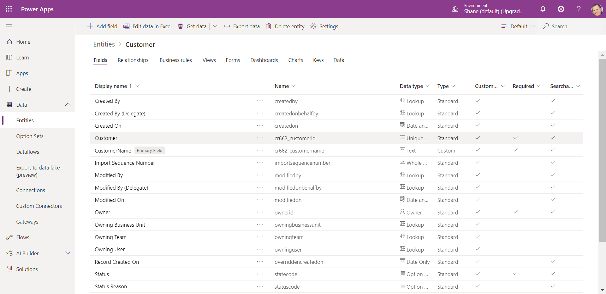

An entity is similar to a table in a database or in an Excel workbook in the way it stores data. It is a logical structure containing records that are made up of fields or put more simply, rows and columns.  

Below you can see a screenshot of the standard Customer entity and various types of fields it includes.
    

## Types of entities

The two types of entities are:

- **Standard** - The base set of entities that are created for every instance of a Common Data Service database. You can add more fields to any entity, but you can only delete fields from a custom entity.

- **Complex** - Entities that contain complex, server-side business logic, including real-time workflows or plug-ins. Some of the entities that are used in Dynamics 365 applications are complex. Care must be taken if you add server-side logic to ensure that users have the proper license to use the complex entity. Additional information about complex entities can be accessed by following the link within the summary unit of this module.

## Fields

Fields are a way to store a discrete piece of information within a record in an entity. You might think of them as a column in Excel. Fields have types, meaning that you can store data of a certain type in a field that matches that data type. For example, if you have a solution that requires dates, then you would store the date in a field with the type of Date. Similarly, if you want to store a number, then you store the number in a field with the type of Number.

The number of fields within an entity varies from a few fields to a hundred or more. If you need more than a few hundred fields in an entity, you might want to reconsider how you are structuring data storage for your solution because, likely, there is a better way.

Every database in Common Data Service starts with a standard set of entities and each standard entity has a standard set of fields.

> [!TIP]
> Always use standard entities and fields when possible. You can rename an entity if that makes the entity more understandable in the context of your solution. Always review the list of standard entities and make sure a standard entity will not meet your needs before you create a new entity.