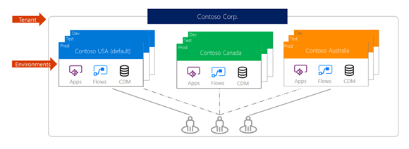

Environments are used to store, manage, and share your organization's business data, apps, and flows in the Power Platform. Each environment allows you to provision one Common Data Service database for use within that environment.  Common Data Service environments allow you to manage user access, security settings, and the storage that is associated with that database. 

Each environment is created under a Microsoft Azure Active Directory (Azure AD) tenant, and its resources can only be accessed by users within that tenant. An environment is also bound to a geographic location, like the United States. When you create a Common Data Service database in an environment, that database is created within datacenters in that geographic location. Any items that you create in that environment (including connections, gateways, flows that are using Power Automate, and more) are also bound to their environment's location.
    

You can create more than one environment to manage solution development and data storage by setting up one environment for development, another for testing, and another for production use. Also, you can set up an environment based on a geographical location. For example, you might set up an environment for Europe and another for Asia. Each of these environments will have zero or only one instance of Common Data Service.
