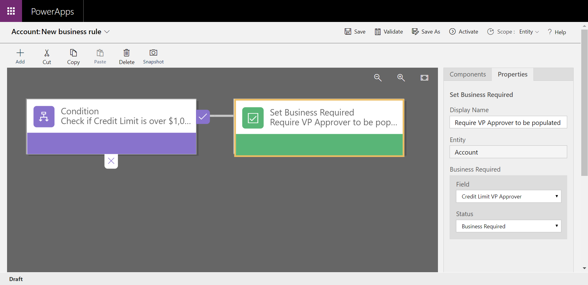

In Common Data Service you can define business rules. Business rules allow you to apply and maintain business logic at the data layer instead of the app layer. Put more simply, if you create business rules in Common Data Service, they are in affect regardless of how you interact with the data. 

An example business rule usage is when they are in canvas or model-driven apps to set or clear values in one or many fields in an entity. They can also be used to validate stored data or show error messages. Model-driven apps can use business rules to show or hide fields, enable or disable fields, and create recommendations based on business intelligence.

> [!TIP]
> Business rules are usually defined for an entity and apply to all forms, but you can define a business rule for a specific model-driven form. Canvas apps cannot have a business rule applied to a specific form, but they are still enforced when interacting with the data.

Business rules give you a powerful way to enforce rules, set values, or validate data regardless of the form that is used to input data. Additionally, business rules are effective in helping to increase the accuracy of data, simplify application development, and streamline the forms presented to end users.

Business rules can be used by canvas apps or model-driven apps to do the following:

- Set field values

- 	Clear field values

- 	Validate data and show error messages

Model-driven apps can also use business rules to:

- Show or hide fields (model-driven apps only)

- Enable or disable fields (model-driven apps only)

- Create business recommendations based on business intelligence (model-driven apps only)
Below is an example of a simple, yet powerful use of business rules. The business rule is configured to change the field Credit Limit VP Approver to be a required field if the Credit limit is set to greater than $1,000,000. If the credit limit is less than $1,000,000 then the field is optional. 
    

By applying this business rule at the data level, instead of the app level, you have better control of your data and it can confirm it follows your business logic whether it is being accessed directly from Power Apps or Power Automate or even via an API. The rules are tied to the data, not the app.
