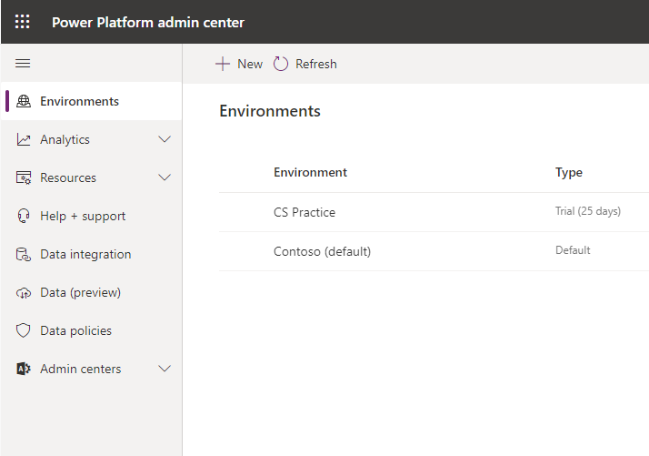
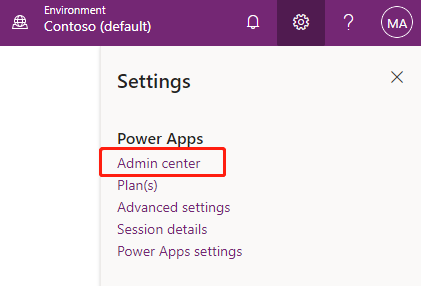
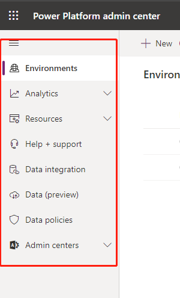

Common Data Service has a rich set of administrative options that you can use
to create new instances of a database or tailor access and features
that are available for users of each Common Data Service database instance.
Several administrative portals are available for you to use to
administer Common Data Service settings. 

The Power Apps Admin center is discussed in this unit because it will satisfy most of 
your administrative needs. However, a few other administrative options are available, 
which are covered in the Manage permissions and administration for Common Data Service 
learning path. 

### Power Apps Admin center

Most of the administration settings that you will need are available in the
Power Apps Admin center. You should always check for administration
settings as your first step when looking to administer Common Data
Service.

Settings are grouped into the following broad categories and are accessible
by selecting the link on the left-hand side of the portal, as shown
in the following figure.

-   **Environments** - This section lists all instances of Common
    Data Service.

-   **Data policies** - This section lets you set up policies to restrict
    which data connectors can be used with Common Data Service to limit
    what data can flow into or out of Common Data Service entities.

-   **Data integration** - This section lets you create or add pre-defined
    connections and monitor these connections between Common Data
    Service and other data stores like Salesforce or SQL Server.

-   **Tenant** - This section lets you monitor licenses and quotas.

Take a few moments to explore the options by going to the Admin center
and opening each section on the left-hand side of the portal:

1.  Go to [Power Apps](https://www.powerapps.com) and sign in.

2.  Select **Admin center** under the gear, as shown.

    > [!TIP]
    > You can go directly to the Power Apps Admin center at <https://admin.powerapps.com> and then sign in.

       

3.  Select the options on the left-hand side of the admin center portal.

    

The Power Apps Admin center lets you manage the tasks of setting up users, permissions, and many other important features and
capabilities of Common Data Service. 
