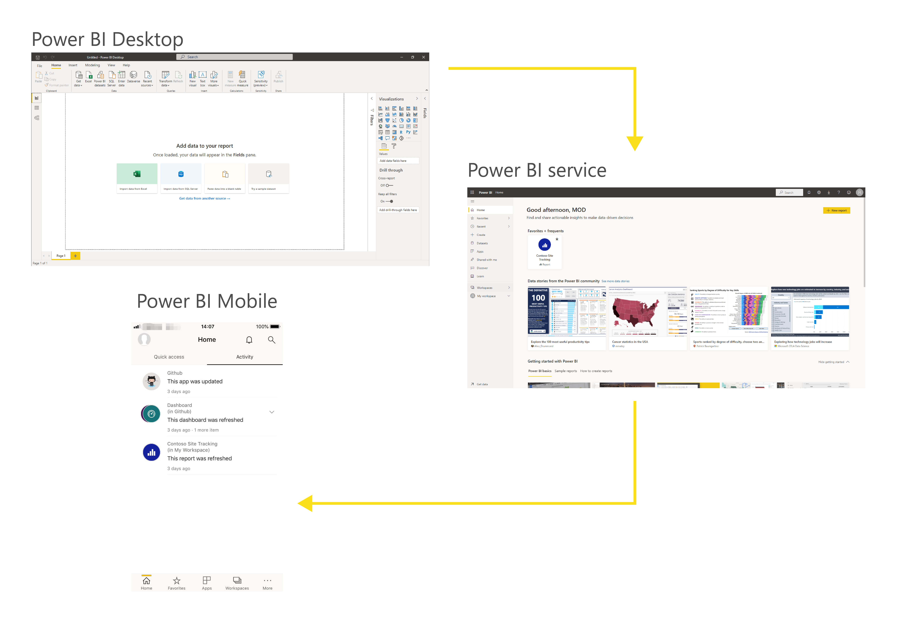

From customer and employee data, metrics for company goals, to sales and acquisitions, business are drowning in data, but this data is only as good as your ability to interpret and communicate its meaning. That's where Power BI (Business Intelligence) comes into play. 

Microsoft Power BI is a collection of software services, apps, and connectors that work together to turn your unrelated sources of data into coherent, visually immersive, and interactive insights. Whether your data is a simple Microsoft Excel workbook, or a collection of cloud-based and on-premises hybrid data warehouses, Power BI lets you easily connect to your data sources, clean, and model your data without affecting the underlying source, visualize (or discover) what's important, and share that with anyone or everyone you want.

Power BI can be simple and fast, capable of creating quick insights from an Excel workbook or a local database. But Power BI is also robust and enterprise-grade, ready not only for extensive modeling and real-time analytics, but also for custom development. Therefore, it can be your personal report and visualization tool, but can also serve as the analytics and decision engine behind group projects, divisions, or entire corporations.

## The parts of Power BI

Power BI consists of a Microsoft Windows desktop application called Power BI Desktop, an online SaaS (Software as a Service) service called the Power BI service, and mobile Power BI apps that are available on phones and tablets.
    

These three elements—Desktop, the service, and Mobile apps—are designed to let people create, share, and consume business insights in the way that serves them, or their role, most effectively.

## How Power BI matches your role

How you use Power BI might depend on your role on a project or a team. And other people, in other roles, might also use Power BI differently.

For example, you might view reports and dashboards in the Power BI service, and that might be all you do with Power BI. But your number-crunching, business-report-creating coworker might make extensive use of Power BI Desktop (and publish Power BI Desktop reports to the Power BI service, which you then use to view them). And another coworker, in sales, might mainly use her Power BI phone app to monitor progress on her sales quotas and drill into new sales lead details.

You also might use each element of Power BI at different times, depending on what you're trying to achieve, or what your role is for a given project or effort.

Perhaps you view inventory and manufacturing progress in a real-time dashboard in the service, and also use Power BI Desktop to create reports for your own team about customer engagement statistics. How you use Power BI can depend on which feature or service of Power BI is the best tool for your situation. 

We will discuss these three elements—Desktop, the service, and Mobile apps—in more detail later. In upcoming units and modules, we'll also create reports in Power BI Desktop, share them in the service, and eventually drill into them on our mobile device.
